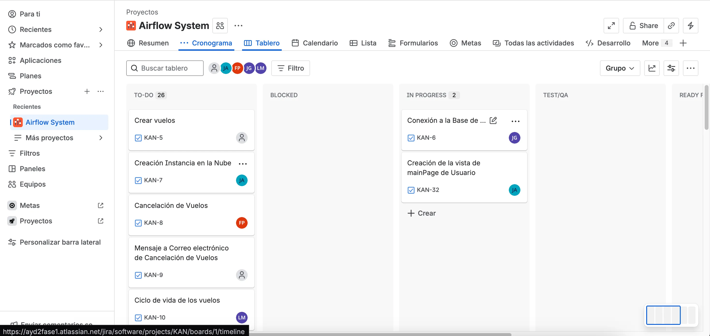
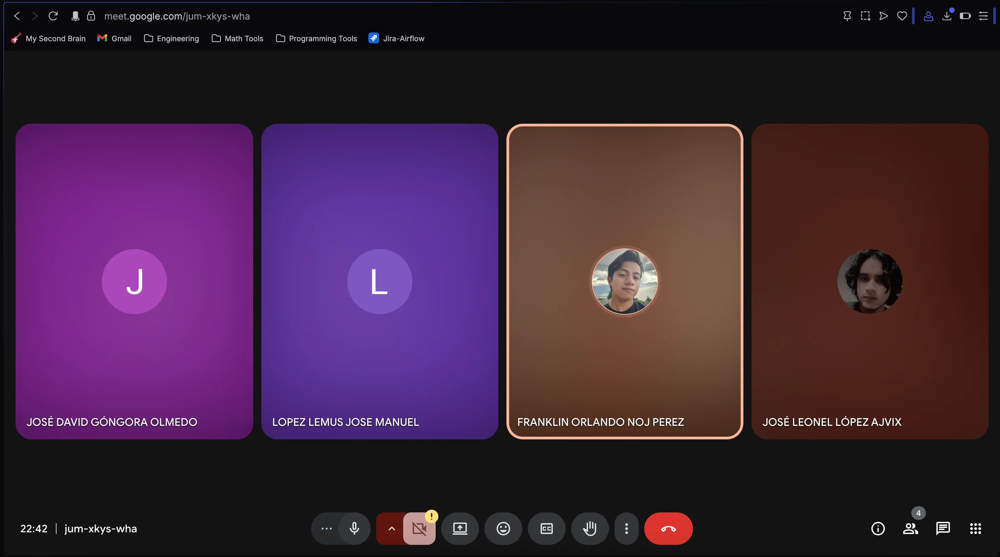
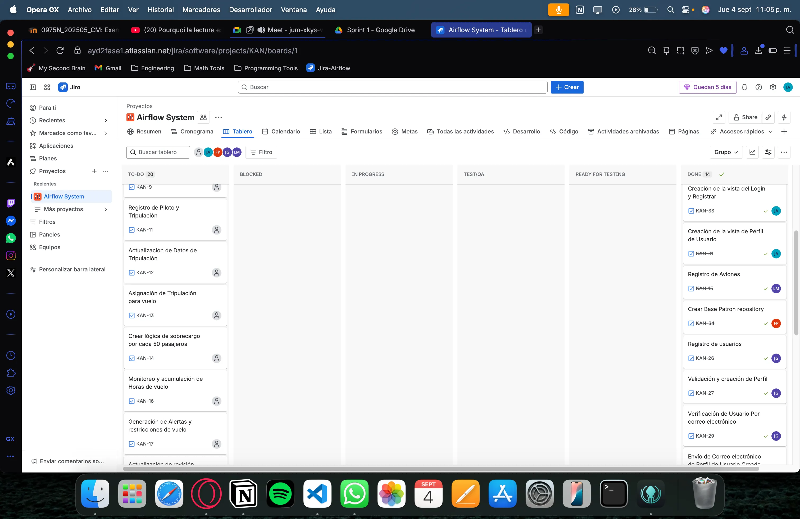
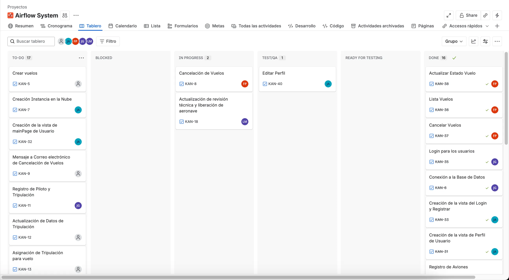
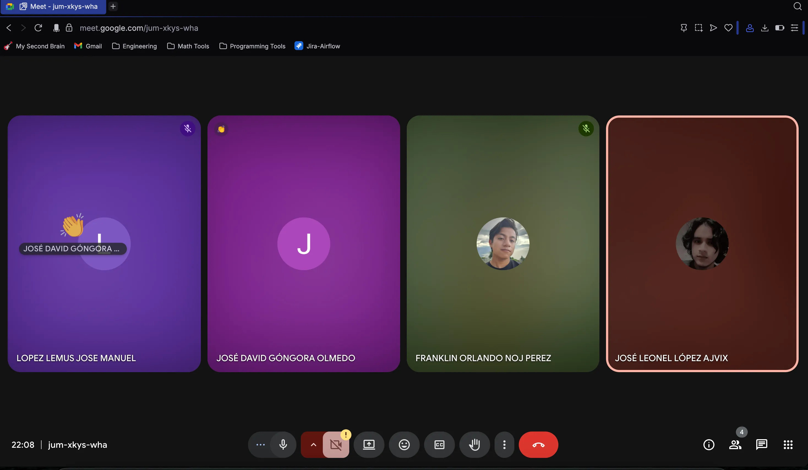
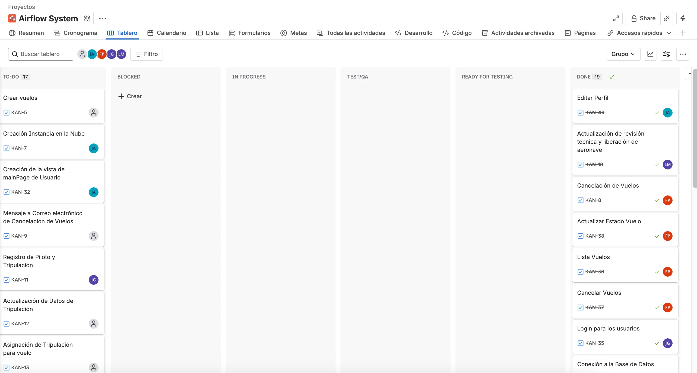
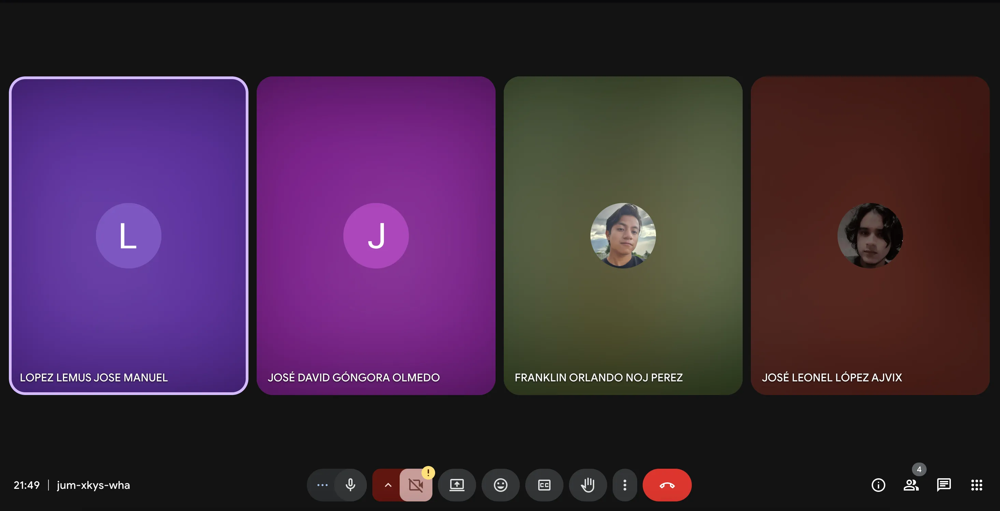
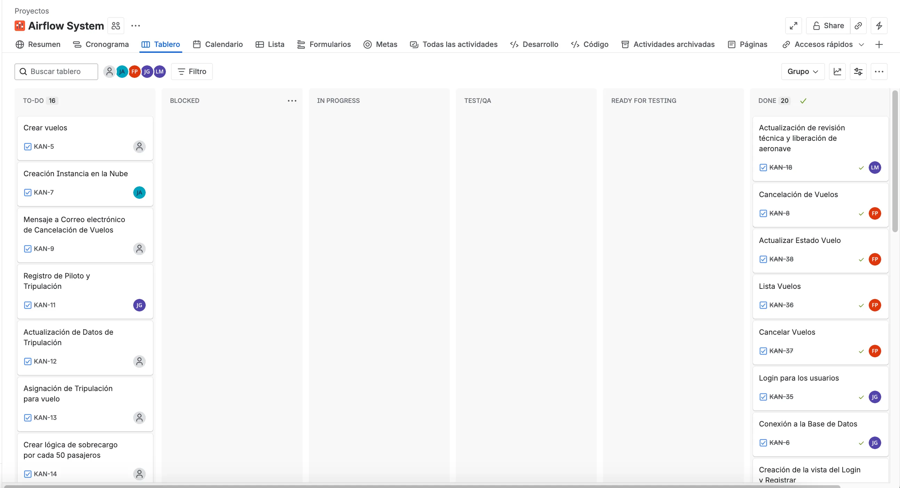

# Sprint 1:

### Sprint Plannig:

https://drive.google.com/file/d/1USXH3H7VpnqVYCb4b7yyWKqLyllEpZIM/view?usp=drive_link

## Daily 1:

### Link:

https://drive.google.com/file/d/1yeJH9UA_-WnjmKmVVLl9g23b-uiuh0BO/view?usp=drive_link

### José Leonel López:

- **¿Qué se hizo el día anterior?:** El día de ayer se dividió el trabajo y se creó las bases para que el equipo de desarrollo pudiera trabajar
- **¿Qué se hará el día actual?:** Se corregirán los errores de la fase anterior. Se agregará la justificación de la arquitectura, utilizando el modelo cliente-servidor.
- **Se tiene algún impedimento:** Por el momento no existe algún impedimento para trabajar el día de hoy.

### José David Góngora Olmedo:

- **¿Qué se hizo el día anterior?:** El día anterior se crearon las estructuras para el frontend y backend, en el backend se crearon las carpetas y el como vamos a organizarlo y en el frontend se creo la estructura usando Vite y React, también se instalaron librerías que vamos a utilizar.
- **¿Qué se hará el día actual?:** Se empezará a implementar el patrón factory para la creación de usuarios.
- **Se tiene algún impedimento:** Por el momento no existe algún impedimento para trabajar el día de hoy.

### José Manuel López Lemus:

- **¿Qué se hizo el día anterior?:** El día de hoy corregí los cambios solicitados del diagrama de Despliegue y también realice la corrección de las discrepancias en el diagrama de Distribución
- **¿Qué se hará el día actual?:** Apoyare en la realización del patrón repository junto con mi buen amigo Franklin Orlando para el apartado de vuelos
- **Se tiene algún impedimento:** Por el momento no existe algún impedimento más que trabajar en conjunto con mi compañero.

### Franklin Orlando Noj Perez

- **¿Qué se hizo el día anterior?** Corregi el diagrama de casos de uso, profundice en cada caso de uso que debia ser profundizado y revise lo demas para dejar el reporte de manera correcta.
- **¿Qué se hará el día actual?:** Iniciare con la implementacion con el patron repository para la parte de vuelos, lo hare conjuntamente con mi companero Jose Manuel Lopes.
- **Se tiene algún impedimento:** Por el momento no tengo ningun impedimento.

## Daily 2:

### Link:

https://drive.google.com/file/d/1KnLxD6v0n79_B3Vj3pUb-izFT7aWMH-8/view?usp=drive_link

### Jira En el Daily:

### Captura del Meet:

### José Leonel López Ajvix

- **¿Qué se hizo el día anterior?:** El día anterior se arregló la documentación, se tiene todo listo para poder trabajar.
- **¿Qué se hará el día actual?:** El día actual se trabajarán las vistas del usuario, se trabajarán las más básicas, el registrar y login, además de la vista principal de usuario y visualizar el perfil de usuario.
- **Se tiene algún impedimento:** Por el momento todo claro. Quedaría de coordinar con los encargados de la lógica de los usuarios y vuelos para poder integrar los endpoints y la lógica del frontend a la vista.

### Franklin Orlando Noj Perez

- **¿Qué se hizo el día anterior? Implemente el patron repository para el schema Vuelos, se implementaron tambien las funciones de esa funcionalidad como el crear vuelo, cancelar vuelo, actualizar vuelo, listar vuelos.**
- **¿Qué se hará el día actual?:** Voy a implementar los mockups de vuelos, introduciendo los endpoints que ya hice en el backend.
- **Se tiene algún impedimento:** Por el momento no tengo ningun impedimento y puedo seguir avanzando libremente.

### José Manuel López Lemus

- **¿Qué se hizo el día anterior?:** Implemente el patrón repository para el apartado de Vuelos, lo implemente junto al compañero Franklin Noj, y realice el CRUD para poder agregar, actualizar, eliminar y mostrar
- **¿Qué se hará el día actual?:** Apoyare en los mockups de vuelos para poder asegurar que los endpoints trabajados funcionan correctamente
- **Se tiene algún impedimento:** Por el momento no hay ningún impedimento

### José David Góngora Olmedo:

- **¿Qué se hizo el día anterior?:** El día anterior se comenzó a implementar el patron repository con usuarios. Como el registrar y la verificacion de correo y de datos.
- **¿Qué se hará el día actual?:** Se terminara de implementar el repository de usuarios, y hacer validaciones faltantes, tambien el login para los usuarios y que devuelva el token.
- **Se tiene algún impedimento:** Por el momento no existe algún impedimento para trabajar el día de hoy.

### Jira después del Daily:

## Daily 3:

### Link:

https://drive.google.com/file/d/1j2HVVDsGefFhRNjJyJLNnsg2Z0Dhw5es/view?usp=sharing

### Jira En el Daily:

### Captura del Meet:

### Jira después del Daily:

### José Leonel López Ajvix

- **¿Qué se hizo el día anterior?:** El día anterior se hizo la lógica en el backend, y se hizo solamente el diseño de editar perfil.
- **¿Qué se hará el día actual?:** El día actual se hará la lógica en el frontend con editar usuario y se hará la vista principal en el frontend
- **Se tiene algún impedimento:** Por el momento todo claro. Quedaría ponerse de acuerdo con el diseño en el backend de las personas encargadas.

### José David Góngora Olmedo:

- **¿Qué se hizo el día anterior?:** Terminé de ajustar el login y registrar del backend y lo junte con el frontend. Hice todo el flujo de registrar en el frontend. Tambien hice en el backend el endpoint para editar perfil para que mi compañero pueda continuar con esa parte.
- **¿Qué se hará el día actual?:** Implementare en el frontend la creaciones de pilotos y sobrecargos para que sean agregados como tripulación.
- **Se tiene algún impedimento:** Por el momento no existe algún impedimento para trabajar el día de hoy.

### José Manuel López Lemus

- **¿Qué se hizo el día anterior?:** Implemente las vistas para el apartado de vuelos siguiendo la paleta de colores, y las indicaciones acordadas
- **¿Qué se hará el día actual?:** Conectare los endpoints con la vista de vuelos, para comenzar a probar que todo este funcionando correctamente
- **Se tiene algún impedimento:** Por el momento no hay ningún impedimento

### Franklin Orlando Noj Perez

- **¿Qué se hizo el día anterior? Implemente el mockup de gestion de vuelos, hice el sidbar de la vista del administrador, y a la vista de gestion de vuelos ya esta conectada con el backend.**
- **¿Qué se hará el día actual?:** Voy a realizar las validaciones en la gestion de vuelos, como que el piloto no este en mas de 1 vuela a la misma hora que algun otro vuelo.
- **Se tiene algún impedimento:** Por el momento no tengo ningun impedimento y puedo seguir avanzando libremente.

## Sprint Retrospective:

### Link:

https://drive.google.com/file/d/1OdvlsKBAns9_BO7jEkrlR8qCR3LGltu_/view?usp=drive_link

### Captura del Meet:

### Tablero Kanban al final del Sprint:

### José Leonel López Ajvix

- **¿Qué se hizo bien durante el Sprint?:** El sprint tuvimos muy buena comunicación y entendimiento sobre las tareas de cada uno, logramos coordinarnos de una buena manera y marcar de buena manera el primer sprint.
- **¿Qué se hizo mal durante el Sprint?:** En el sprint hubo pequeños fallos, como poder llevar un mejor control en el Kanban y una mejor especificación de trabajo.
- **¿Qué mejoras se deben implementar en el próximo Sprint?:** Se podría trabajar mejor los tiempos y tener más fechas límites en las tareas.

### José David Góngora Olmedo

- **¿Qué se hizo bien durante el Sprint?:** Siento que varias cosas se hicieron bien y una de ellas (para mi la mas importante) es que pudimos implementar de buena manera los patrones de diseño.
- **¿Qué se hizo mal durante el Sprint?:** No fueron tantas las cosas que se hicieron mal, pero una de ellas fue que falto ser mas especificos en las tareas de cada uno en el tablero.
- **¿Qué mejoras se deben implementar en el próximo Sprint?:** Tal vez controlar mas los tiempos para mantener las entregas a buena fecha y especificar de mejor manera las tareas para cada integrante.

### Franklin Orlando Noj Perez

- **¿Qué se hizo bien durante el sprint? Hubo mucha comuniacion y sobre todo mucha compresion, todos nos brindamos ayuda cuando alguien lo necesitaba.**
- **¿Qué se hizo mal durante el sprint?:** A mi criterio todo se manejo y se hizo muy bien, unicamente que aveces postergabamos un poco las reuniones.
- **¿Qué mejoras se deben implementar en el proximo sprint?: A mi criterio ser un poco mas rigurosos, estrictos con nosotros mismos para hacer los deilys.**

### José Manuel López Lemus

- **¿Qué se hizo bien durante el Sprint?:** En el sprint la mayoria de cosas se hicieron bien, como la comunicación, la distribución de tareas de forma equitativa, y la efectividad de todos al cumplir con las tareas
- **¿Qué se hizo mal durante el Sprint?:** Las pocas cosas que se fallaron del sprint, es que al tener otros cursos y compromisos, costaba ponerse de acuerdo para realizar las reuniones.
- **¿Qué mejoras se deben implementar en el próximo Sprint?:** Establecer dias y tiempos fijos para las reuniones para reservar fechas y horarios