# Sprint 2:

## Link de Reuniones:

[Sprint 2 - Google Drive](https://drive.google.com/drive/folders/13Rs3regnHIYeGJuVHxOdH2Ky8yRbyVAK?usp=sharing)

## Sprint Planning:

**Escala de puntos utilizada:** Escala de Fibonacci: 1,2,3,5,8

| ID | Casos de Uso | Prioridad | Estimación (Story Points) |
| --- | --- | --- | --- |
| 9 | CDU002.3: Actualizar Experiencia Post-Vuelo | Media | 3 |
| 10 | CDU003.2: Monitorear y Acumular Horas de Vuelo | Media | 5 |
| 11 | CDU003.3: Verificar y Certificar Mantenimiento | Media | 5 |
| 12 | CDU004.3: Reservar Vuelo y Asiento | Alta | 8 |
| 13 | CDU005.1: Realizar Check-in | Baja | 5 |
| 14 | CDU005.2: Realizar Embarque | Alta | 8 |
| 15 | CDU005.3: Seguimiento de Vuelo | Baja | 3 |
| 16 | CDU006.1: Comprar Maletas Extra | Media | 3 |
| 17 | CDU006.2: Otorgar Puntos de Fidelización | Baja | 2 |
| 18 | CDU006.3: Gestionar Historial y Notificaciones | Baja | 3 |

### Link de Reunión:

https://drive.google.com/file/d/1iMaYPjF-mzpILaVkTjVqkc5kIbhvD3pw/view?usp=drive_link

### Captura de Sprint Planning:

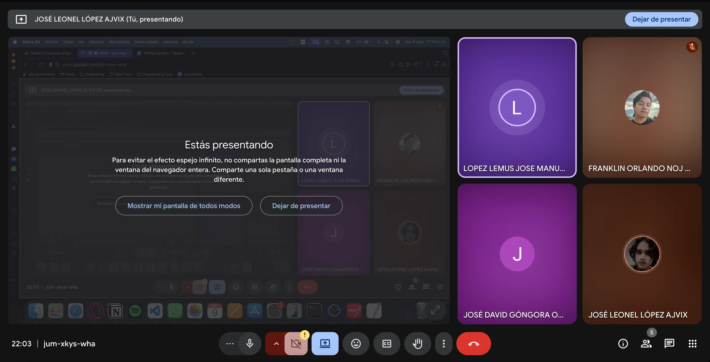

### Captura del Kanban:
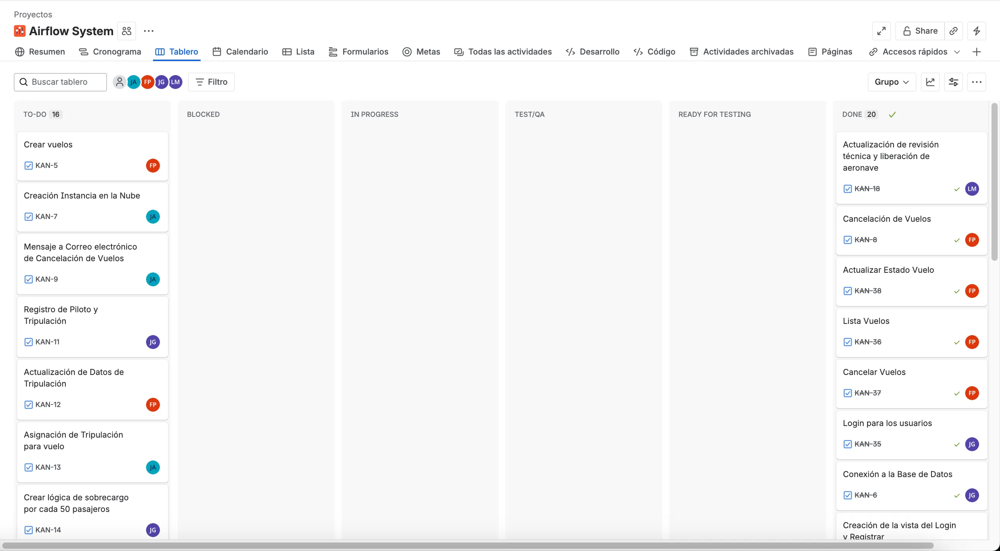

## Daily 1:

### Kanban en el transcurso del Daily:

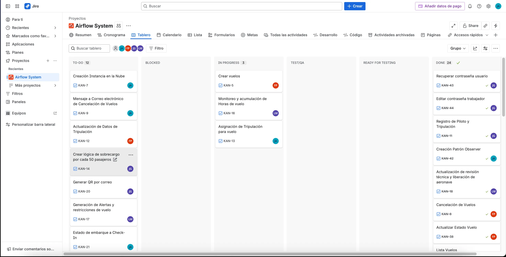

### Captura del Meet:

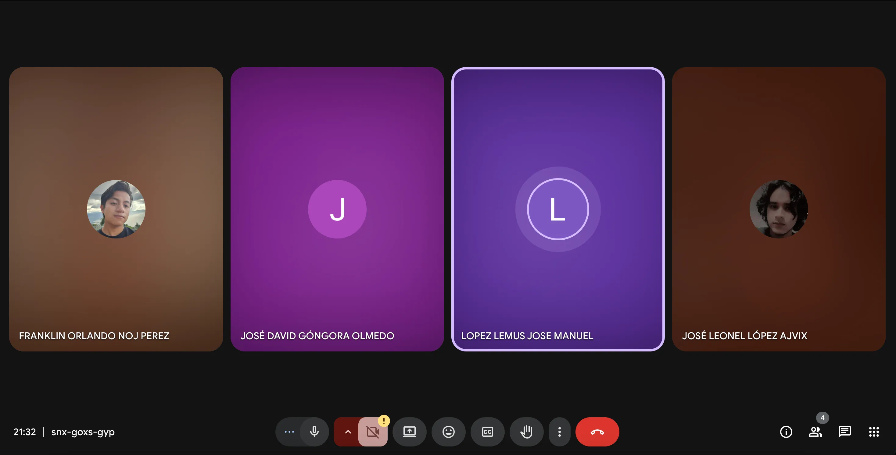

### José Leonel López Ajvix

- **¿Qué se hizo el día anterior?:** El día anterior se planificó todo para poder trabajar en este sprint
- **¿Qué se hará el día actual?:** El día de hoy se hará la lógica de agregar tripulación a los vuelos, con las restricciones de ver los horarios de cada piloto
- **Se tiene algún impedimento:** Por el momento todo bien.

### José David Góngora Olmedo

- **¿Qué se hizo el día anterior?:** Ayer empece a implementar y entender la logica de como crear trabajadores
- **¿Qué se hará el día actual?:** Hoy terminaré de implementar el CRUD de trabajadores para que asi puedan ser agregados a un vuelo. También haré el recuperar contraseña de un pasajero.
- **Se tiene algún impedimento:** No, todo bien por el momento.

### Franklin Orlando Noj Perez

- **¿Qué se hizo el día anterior? Inicie con las creacion del frontend para vuelos, inicie con el esqueleto y a ver como se va conectar con el backend.**
- **¿Qué se hará el día actual?:** Terminar el frontend de vuelos y hacer las validaciones que se necesitan como que el piloto no este en mas de un vuelo a la vez, el origen y destino de vuelo debe ser difente.
- **Se tiene algún impedimento:** Por el momento no tengo ningun impedimento y puedo seguir avanzando libremente.

### José Manuel López Lemus

- **¿Qué se hizo el día anterior?:** Ayer solo investigue acerca de las tareas que me habían asignado, organizándome y buscando información de como las iba a realizar
- **¿Qué se hará el día actual?:** Hoy realizare el monitoreo y acumulación de horas de vuelo para poder validar las restricciones de los vuelos
- **Se tiene algún impedimento:** No hay ningún inconveniente

### Kanban al final del Daily:

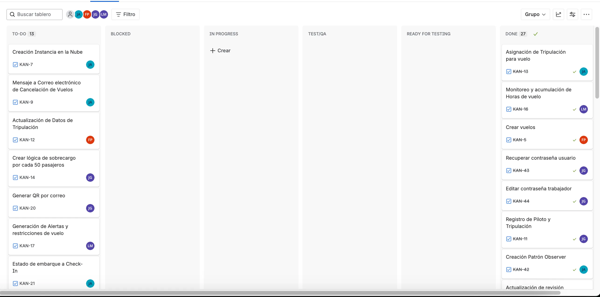

## Daily 2:

### Grabación del Daily:

https://drive.google.com/file/d/1YmEyXaWsYLadL6oT6nzm5b-01skORyEs/view?usp=drive_link

### José Leonel López Ajvix

- **¿Qué se hizo el día anterior?:** Se terminó con las verificaciones de los vuelos, como si el avión está disponible y la tripulación no está en un vuelo a esa hora.
- **¿Qué se hará el día actual?:** Se hará el envío de los estados del vuelo por correo electrónico.
- **Se tiene algún impedimento:** Por el momento no tengo ningun impedimento y puedo seguir avanzando.

### Franklin Orlando Noj Perez

- **¿Qué se hizo el día anterior?: Termine con el frontend de la parte de vuelos, hice las validaciones necesarias para el manejo de errores y verifique cada enpoint que ya tenia hecho.**
- **¿Qué se hará el día actual?:** Actualizare algunos endpoint de la vista principal del cliente, especificamente el getVuelos debidos a que actualmente no muestra la informacion completa. Tambien hare la validacion de limite de sobrecargo en vuelo,
- **Se tiene algún impedimento:** Por el momento no tengo ningun impedimento y puedo seguir avanzando libremente.

### José Manuel López Lemus

- **¿Qué se hizo el día anterior?:** Ayer realice el monitoreo y la acumulación de horas de vuelos para poder validar las restricciones de los vuelos
- **¿Qué se hará el día actual?:** hoy realizare el frontend para poder cambiar lo de la acumulación de horas de vuelos y las restricciones de los vuelos
- **Se tiene algún impedimento:** Por el momento no

### José David Góngora Olmedo

- **¿Qué se hizo el día anterior?:** Ayer termine de hacer el CRUD para los trabajadores y la opcion de recuperar contraseña de un pasajero, enviando correo y por medio de un token.
- **¿Qué se hará el día actual?:** Hoy empezare a implementar la funcionalidad para crear una reserva con todas sus validaciones.
- **Se tiene algún impedimento:** No, todo bien por el momento.

### Kanban en el transcurso del Daily:
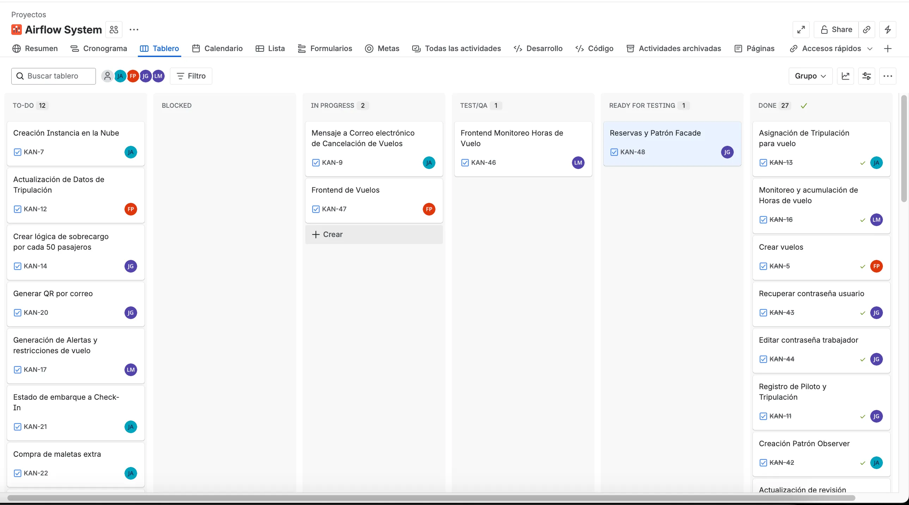

### Captura del Meet:
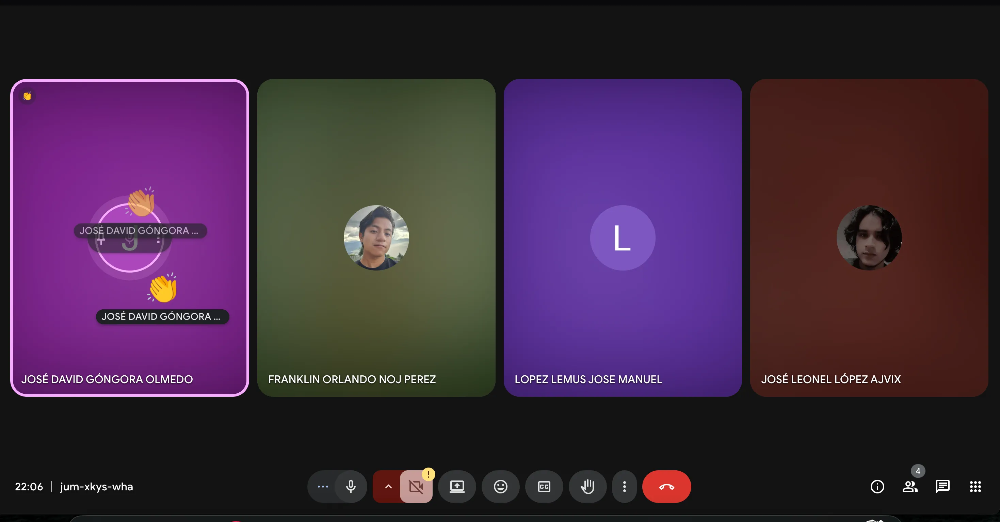

### Kanban al final del Daily:

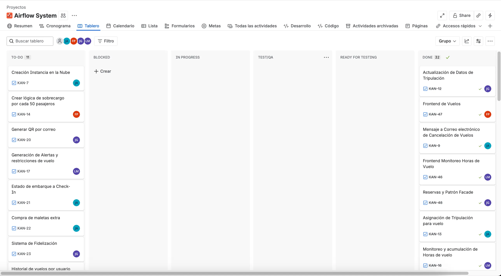

## Daily 3:

### Kanban durante el daily:

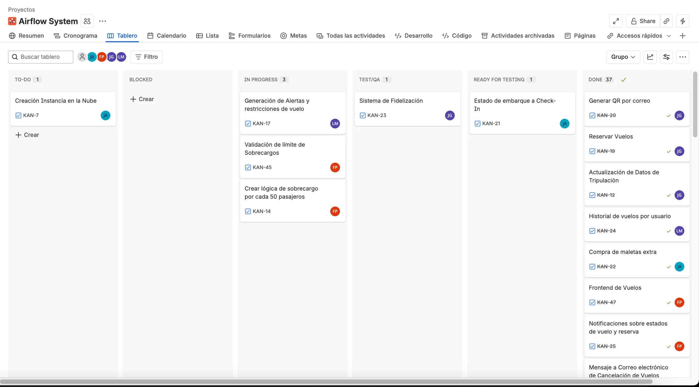

### Kanban al final del Daily:
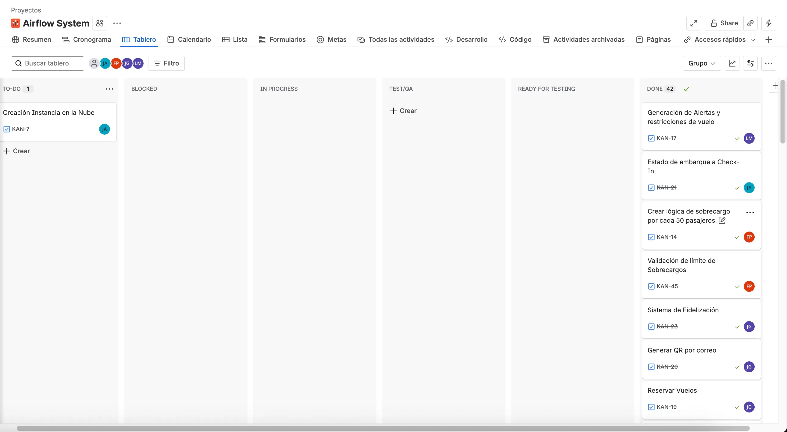

### Franklin Orlando Noj Perez

- **¿Qué se hizo el día anterior?:** Realice la validacion de limites de sobrecargos en cada avion segun su capaciadad, tambien actualice el get de vuelos de la vista principal, y realice algunas pruebas generales de vuelos para asegurarme que todo funcione correctamente.
- **¿Qué se hará el día actual?:** Realizare el sistema de fidelizacion en conjunto con el compañero Jose Manuel.
- **Se tiene algún impedimento:** Por el momento no tengo ningun impedimento y puedo seguir avanzando libremente.

### José Leonel López Ajvix:

- **¿Qué se hizo el día anterior?:** Se realizó el estado de envío por el correo electrónico por el lado del backend.
- **¿Qué se hará el día actual?:** El día de hoy empezaré a implementar las validaciones del patrón observer para que se envíen correctamente los correos, además de verificar las horas de vuelo si se finaliza un vuelo.
- **Se tiene algún impedimento:** Por el momento no tengo ningun impedimento y puedo seguir avanzando.

### José David Góngora Olmedo

- **¿Qué se hizo el día anterior?:** Implemente del lado del backend todo el flujo de las reservaciones, asi como los correos que se deben de enviar al usuario.
- **¿Qué se hará el día actual?:** Este dia empezare a implentar las reservas en el frontend.
- **Se tiene algún impedimento:** No, todo bien por el momento.

### José Manuel López Lemus

- **¿Qué se hizo el día anterior?:** ayer realice el frontend para poder cambiar lo de la acumulación de horas de vuelos y las restricciones de los vuelos
- **¿Qué se hará el día actual?:** Actualizare algunos endpoints que hicieron falta y lo unificare
- **Se tiene algún impedimento:** No, todo bien por el momento.

### Captura del meet:

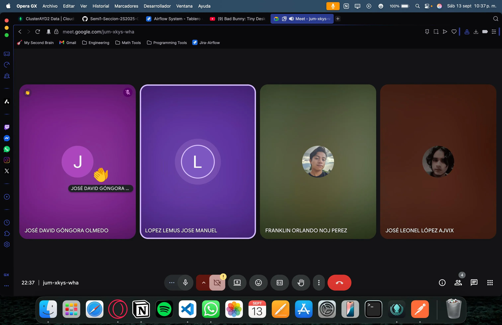

## Sprint Retrospective:

| ID | Story Points | Finalizado | Justificación |
| --- | --- | --- | --- |
| 9 | 3 | Sí |  |
| 10 | 5 | Sí |  |
| 11 | 5 | Sí |  |
| 12 | 8 | Sí |  |
| 13 | 5 | Sí |  |
| 14 | 8 | Sí |  |
| 15 | 3 | Sí |  |
| 16 | 3 | Sí |  |
| 17 | 2 | No | Cuestiones de tiempo y traslape en horarios de trabajo con el equipo de trabajo |
| 18 | 3 | Noi | Cuestiones de tiempo y traslape en horarios de trabajo con el equipo de trabajo |

### Link de la Grabación:

https://drive.google.com/file/d/1IbrEZRj-rOYvdu3bNUYB3U2vrtV8Vn9H/view?usp=drive_link

### Captura del Meet:

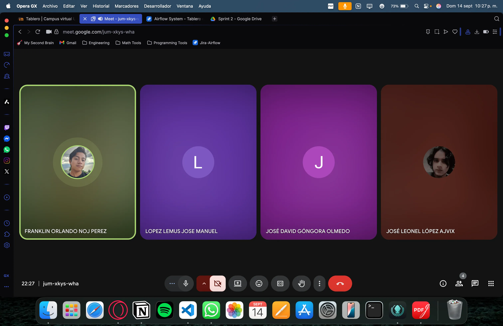

### José Leonel López Ajvix:

- **¿Qué se hizo bien durante el Sprint?** Se mejoró la planificación, y la división de tareas.
- **¿Qué se hizo mal durante el Sprint?** Se mejoró bastante en todo, sin embargo tal vez fue algo difícil la planificación de tiempos.
- **¿Qué mejoras se pueden implementar?** Por el momento creo que todo bien, solo organizarnos mejor para grabar los dailys.

### José Manuel López Lemus

- **¿Qué se hizo bien durante el Sprint?:** En este sprint aprendimos mucho del sprint pasado, supimos organizarnos mejor, repartimos las tareas de una manera más eficiente, y tuvimos una mejor comunicación
- **¿Qué se hizo mal durante el Sprint?:** Aunque supimos encontrar días para las reuniones, la hora sigue siendo un problema, no logramos encontrar una hora donde todos podamos ser puntuales
- **¿Qué mejoras se deben implementar en el próximo Sprint?:** Ser mas efectivos con el tiempo para no atrasarnos con entregas ni reuniones.

### Franklin Orlando Noj Perez

- **¿Qué se hizo bien durante el Sprint?:** Mantuvimos la buena comunicación efectiva, siempre nos brindamos apoyo si alguien lo necesitaba, cumplimos con lo que teníamos asignados cada uno sin problema.
- **¿Qué se hizo mal durante el Sprint?:** Nos costaba poder cumplir con los horarios para las reuniones mayormente, debido a que todos tenemos diferentes cursos en diferentes horarios, por lo que eso hace que se dificulte el poder cumplir al 100% siempre.
- **¿Qué mejoras se deben implementar en el próximo Sprint?.** Tratar de cumplir un poco mas con los establecido, mayormente en las reuniones que pleneamos, los daily, sprint, etc.

### José David Góngora Olmedo:

- **¿Qué se hizo bien durante el Sprint?** Creo que lo que hicimos bien fue la comunicación y el trabajo en equipo, porque nos apoyamos bastante para cumplir con las tareas. Si alguien tenia problemas pues nos apoyamos mutuamente.
- **¿Qué se hizo mal durante el Sprint?** Lo que se hizo mal fue que algunas tareas no se estimaron bien y nos tomaron más tiempo del que pensábamos.
- **¿Qué mejoras se pueden implementar?** Para el próximo Sprint deberíamos planificar mejor los tiempos y documentar más claramente lo que vamos avanzando.

### Captura del Jira:

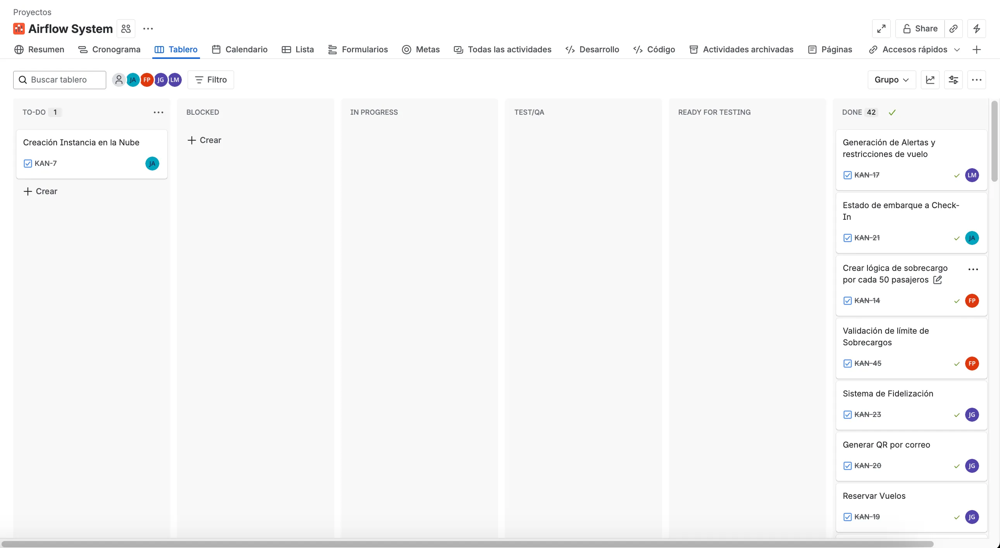