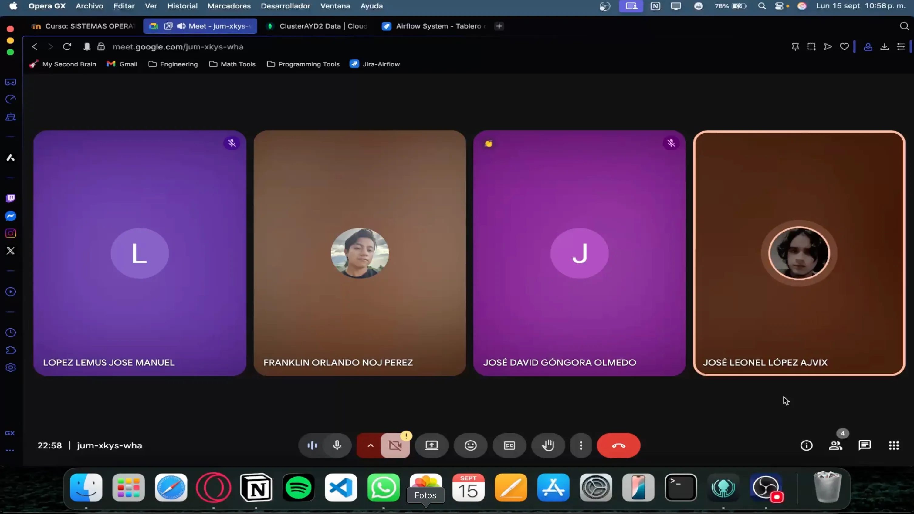
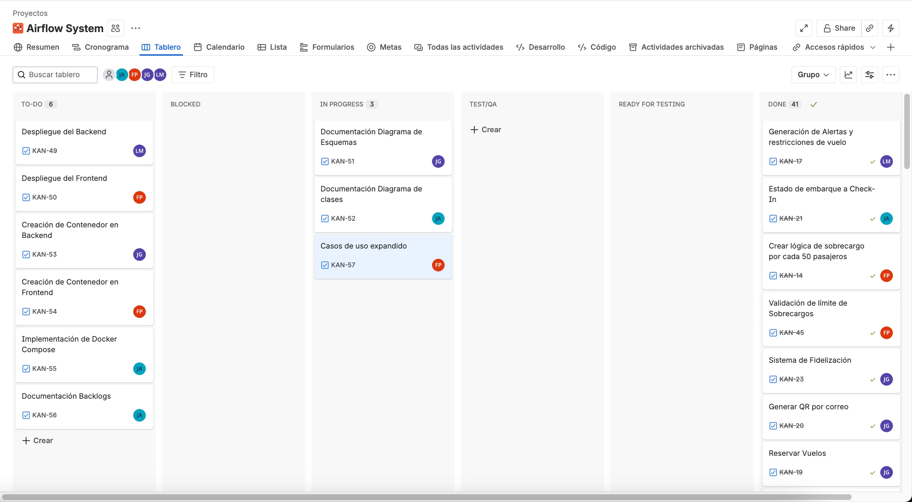
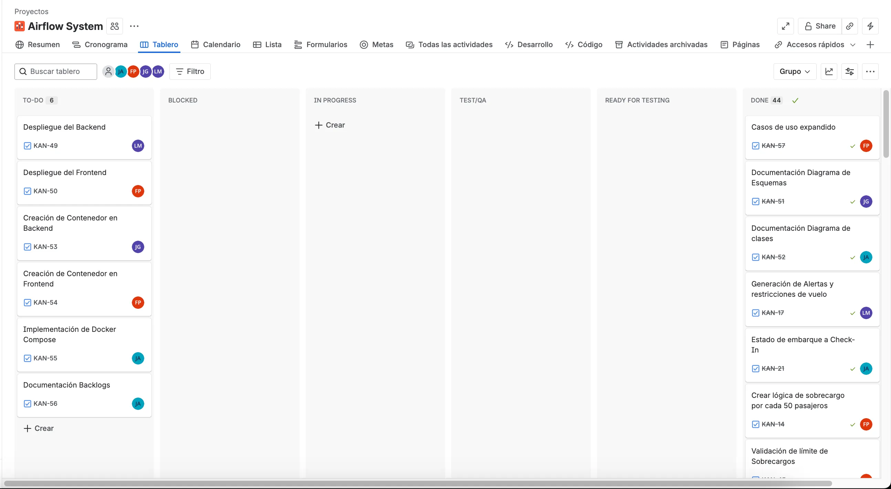
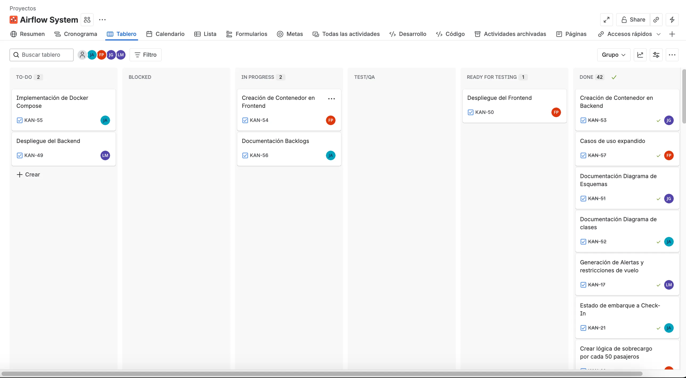
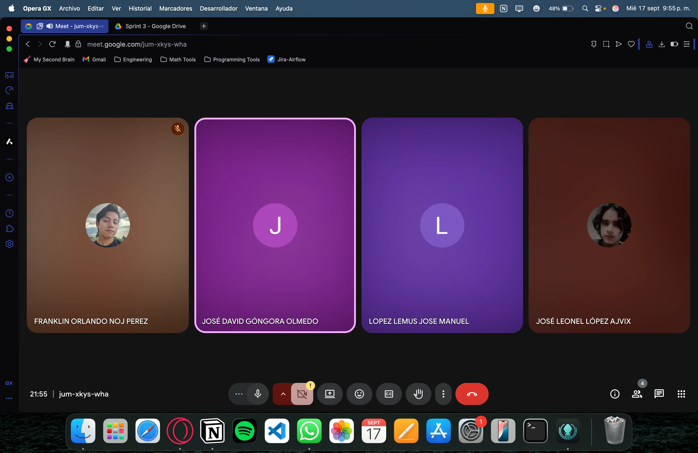
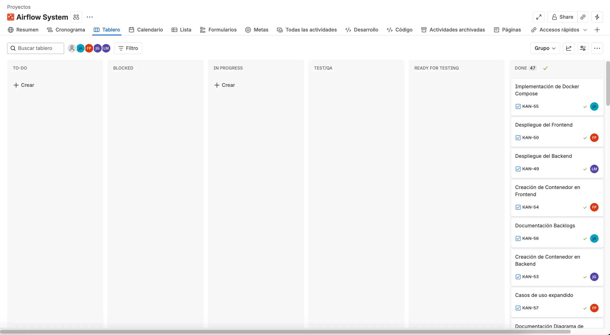
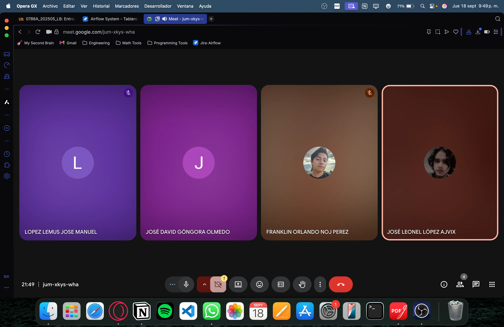
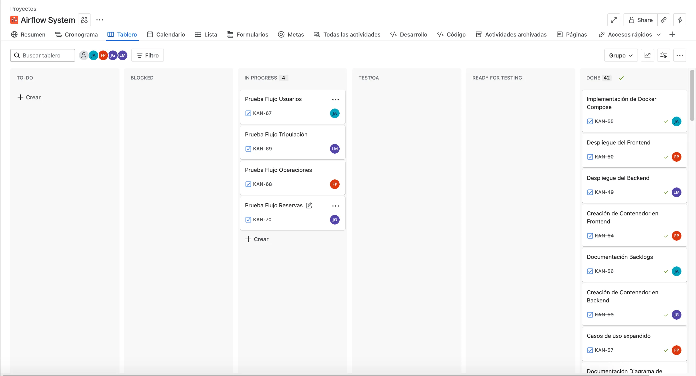
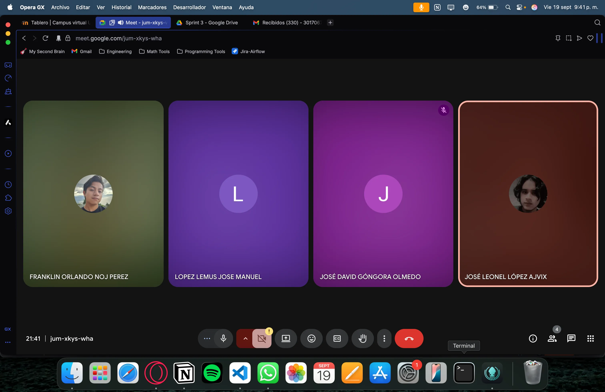
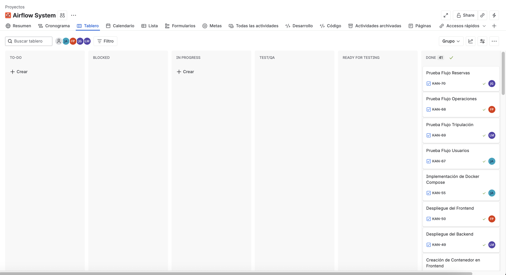

# Sprint 3:

## Sprint Planning:

https://drive.google.com/file/d/19iqsWOZ8GABfN_vPiUVUFC-S2GUtBDNp/view?usp=drive_link

**Escala de puntos utilizada:** Escala de Fibonacci: 1,2,3,5,8

| ID | Caso de Uso | Prioridad | Estimación |
| --- | --- | --- | --- |
| 19 | CDU006.2: Otorgar Puntos de Fidelización | Alta | 2 |
| 20 | CDU006.3: Gestionar Historial y Notificaciones | Alta | 3 |
| 21 | Actualización del Diagrama de Clases | Baja | 3 |
| 22 | Creación de Contenedor en Backend | Media | 2 |
| 23 | Creación de Contenedor en Frontend | Media | 2 |
| 24 | Implementación Docker Compose | Media | 3 |
| 25 | Despliegue del Frontend | Baja | 3 |
| 26 | Despliegue del Backend | Baja | 3 |

## Daily 1:

### Link de la grabación:

https://drive.google.com/file/d/1oEqA0SyvVl1bRpisEmMEVz6kAYOLAWda/view?usp=drive_link

### Captura del meet:

### Kanban durante el Daily:

### Kanban al final del Daily:

### José Leonel López Ajvix

- **¿Qué se hizo el día anterior?** El día anterior se empezó con el jira para el tercer y último sprint y además se hizo el diagrama de clases
- **¿Qué se hará el día de hoy?** El día de hoy se hará la contenerización para poder desplegar en la nube.
- **Se tiene algún impedimento:** No, por el momento se puede trabajar sin ningún problema.

### Franklin Orlando Noj Perez

- **¿Qué se hizo el día anterior?: Subi la documentacion que habia realizado al repositorio, tambien me empece a documentar para no tener problemas al contenerizar el frontend sin mayor problema**
- **¿Qué se hará el día actual?:** Voy a contenerizar todo el frontend
- **Se tiene algún impedimento:** Por el momento no tengo ningun impedimento y puedo seguir avanzando libremente.

### José Manuel López Lemus

- **¿Qué se hizo el día anterior?** El día de ayer realice las correcciones de los diagramas de despliegue y el de componentes, y los subí al apartado correspondiente en la documentación
- **¿Qué se hará el día de hoy?** Realizare el despliegue de la aplicación en la nube.
- **Se tiene algún impedimento:** Si, dependo que mis compañeros realicen la dockerización de los contenedores para poderlos subir

### José David Góngora Olmedo

- **¿Qué se hizo el día anterior?** El día de ayer termine de actualizar lo que es el diagrama de esquemas
- **¿Qué se hará el día de hoy?** Realizare el contenedor para el backend y asi lo pueda utilizar Jose Manuel
- **Se tiene algún impedimento:** No, todo bien

## Daily 2:

### Grabación:

https://drive.google.com/file/d/18E5_Qc77B1Q7bpVDvNtvHEWspuybvHRp/view?usp=sharing

### Kanban durante el Daily:

### José Leonel López Ajvix

- **¿Qué se hizo el día anterior?** El día de ayer se hizo el diagrama de clases, se expandió todo lo nuevo para que se tuviera la documentación actualizada y la contenerización.
- **¿Qué se hará el día de hoy?** El día de hoy se trabajarán los backlogs, se subirán a la documentación y se verán si se cumplieron.
- **Se tiene algún impedimento:** No, por el momento se puede trabajar sin ningún problema.

### Franklin Orlando Noj Perez

- **¿Qué se hizo el día anterior?:** Realice el contenedor del frontend, tambien corregi algunos errores en el frontend.
- **¿Qué se hará el día actual?:** Voy a juntarme con mis companeros para hacer el despliegue en la nube
- **Se tiene algún impedimento:** Por el momento no tengo ningun impedimento y puedo seguir avanzando libremente.

### José David Góngora Olmedo

- **¿Qué se hizo el día anterior?:** Hice el dockerfile para crear el contenedor para el backend y subi la imagen a dockerhub
- **¿Qué se hará el día actual?:** Apoyar a Jose Manuel a crear el docker-compose para subir todo a la nube
- **Se tiene algún impedimento:** No, todo bien.

### José Manuel López Lemus

- **¿Qué se hizo el día anterior?** El día de ayer realice la creación de la maquina virtual en azure para poder realizar el despliegue de la aplicación
- **¿Qué se hará el día de hoy?** Haré el despliegue de la aplicación para comenzar hacer pruebas en la nube
- **Se tiene algún impedimento:** Si, debo de esperar que esten listas las imagenes en docker hub para cargarlas a la maquina virtual y realizar el despliegue

### Captura del Meet:

### Kanban al Final del Daily:

## Daily 3:

### Enlace del Video:

https://drive.google.com/file/d/1OiF7MSZT9Ix_HIE6k6SqU5yvKcE6xtIR/view?usp=sharing

### Captura del Meet:

### Kanban durante el Sprint:

### Kanban al final del Sprint:

### José Leonel López Ajvix

- **¿Qué se hizo el día anterior?** El día de ayer se terminó la documentación entera de la aplicación, incluyendo los backlogs, además de apoyar en el despliegue de la App.
- **¿Qué se hará el día de hoy?** El día de hoy se harán pruebas del Flujo de Usuarios para ver si todo está correcto.
- **Se tiene algún impedimento:** No, por el momento se puede trabajar sin ningún problema.

### Franklin Orlando Noj Perez

- **¿Qué se hizo el día anterior?: Ayude al companero Jose Manuel a terminar de implementar el despliegue en la nube.**
- **¿Qué se hará el día actual?:** Testear lo que tenemos desplegado en la nube para asegurarnos que todo este bien.
- **Se tiene algún impedimento:** Por el momento no tengo ningun impedimento y puedo seguir avanzando libremente.

### José Manuel López Lemus

- **¿Qué se hizo el día anterior?** El día de ayer realice el docker-compose.yml con los contenedores del frontend y backend, y los desplegue en la maquina virtual
- **¿Qué se hará el día de hoy?** Hoy probaremos que toda la app funcione correctamente, y de haber un cambio re
- **Se tiene algún impedimento:** No, por el momento se puede trabajar sin ningún problema.

### José David Góngora Olmedo

- **¿Qué se hizo el día anterior?** Apoyé a Jose Manuel al momento de subir todo a la nube, por si tenia que modificar algo en la imagen del backend.
- **¿Qué se hará el día de hoy?** Comprobar que el flujo de las reservas esten bien y funcionando en la nube.
- **Se tiene algún impedimento:** No, por el momento no.

## Sprint Retrospective:

### Link de la Reunión

https://drive.google.com/file/d/1f9K8KlIuKUKB4R0PWYkFkUaaKgWJwZLn/view?usp=drive_link

### Captura del Meet:

### Franklin Orlando Noj Perez

- **¿Qué se hizo bien durante el Sprint?: Siempre estuvimos en comunicacion, siempre nos ayudamos, siempre hubo empetia, todos manejamos muy buenas habilidades blandas.**
- **¿Qué se hizo mal durante el Sprint?:** Creo que lo que ya venia sucediendo que es no cumplir con los horarios estableidos para cada daily, sprint planing, pero nada que fuera afectar de manera brusca el desarrollo el proyecto
- **¿Qué mejoras se deben implementar en el próximo Sprint?. Respetar un poco mas, ser un poco mas comprometidos con nuestros horarios que se establecen de cada reunion.**

### José Leonel López Ajvix

- **¿Qué se hizo bien durante el Sprint?:** Se llevó una mejor comunicación y un mejor control de los tiempos
- **¿Qué se hizo mal durante el Sprint?:** Aunque logramos mejorar en eso, aún quedaba ciertos conflictos con los horarios establecidos, pero era más que todo para las reuniones de los Dailys.
- **¿Qué mejoras se deben implementar en el próximo Sprint?.** Cumplir un poco más los horarios y ser un poco menos flexibles con ellos, solo para llevar un mejor orden.

### José Manuel López Lemus

- **¿Qué se hizo bien durante el Sprint?:** Mejoramos bastante, tuvimos una mejor comunicación trabajamos mas ordenado, y todos estuvimos muy dispuestos a trabajar si hacia falta algo
- **¿Qué se hizo mal durante el Sprint?:** Aunque logramos mejorar en los horarios de las dailys siempre seguiamos atrasandonos y no empezabamos las reuniones puntuales
- **¿Qué mejoras se deben implementar en el próximo Sprint?.** Ser más puntuales en las reuniones

### Tabla Baklogs:

| ID | Story Points | Finalizado | Justificación |
| --- | --- | --- | --- |
| 19 | 2 | Sí |  |
| 20 | 3 | Sí |  |
| 21 | 3 | Sí |  |
| 22 | 2 | Sí |  |
| 23 | 2 | Sí |  |
| 24 | 3 | Sí |  |
| 25 | 3 | Sí |  |
| 26 | 3 | Sí |  |

### Captura Kanban:

