# Manual de Usuario – AirFlow System

## 1. Introducción
El sistema **AirFlow System** es una plataforma para la gestión de vuelos, tripulación, flota aérea y pasajeros.  
Este manual tiene como objetivo guiar a los usuarios finales en las principales funcionalidades del sistema.  

---

## 2. Requisitos del Sistema
- Navegador web actualizado (Chrome, Firefox, Edge).  
- Conexión a internet.  
- Credenciales de acceso proporcionadas por la aerolínea.  

---

## 3. Acceso al Sistema
1. Ingresar a la URL del sistema.  
2. Escribir usuario y contraseña.  
3. Presionar **Iniciar Sesión**.  

**Captura:**  
- Login
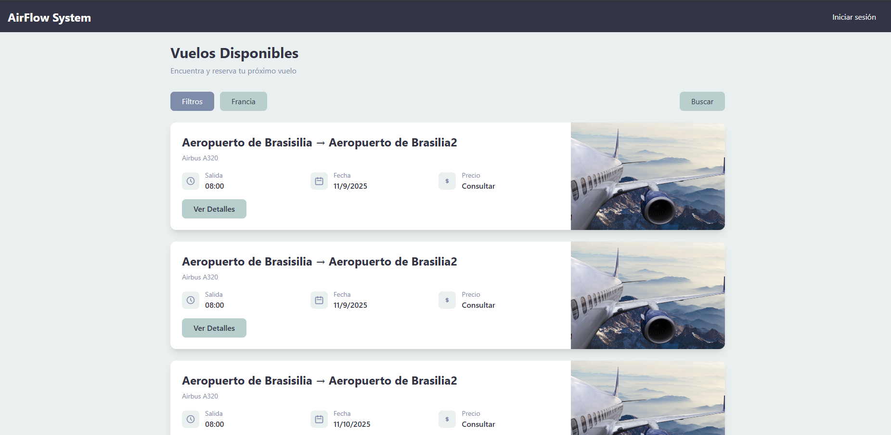  

- Vista del Registrarse
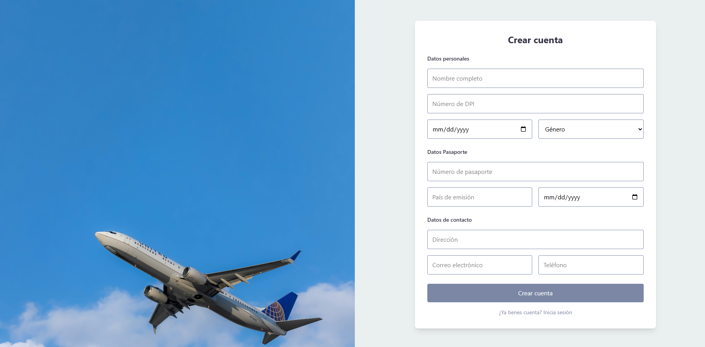

- Vista de Recuperar Contrasena
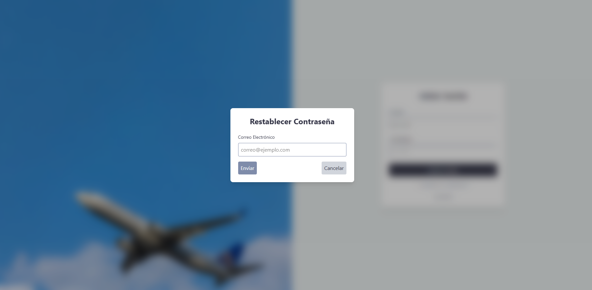

---

## 4. Gestión de Vuelos [admin]

### 4.1 Crear un Nuevo Vuelo
1. Ingresar al módulo **Vuelos**.  
2. Completar origen, destino, fecha, hora, aeronave y tripulación.  
3. Guardar el vuelo.  

**Captura:**  
- Vista general de Vuelos
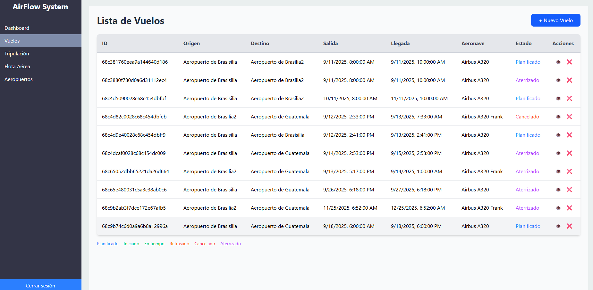

- Vista de crear vuelo
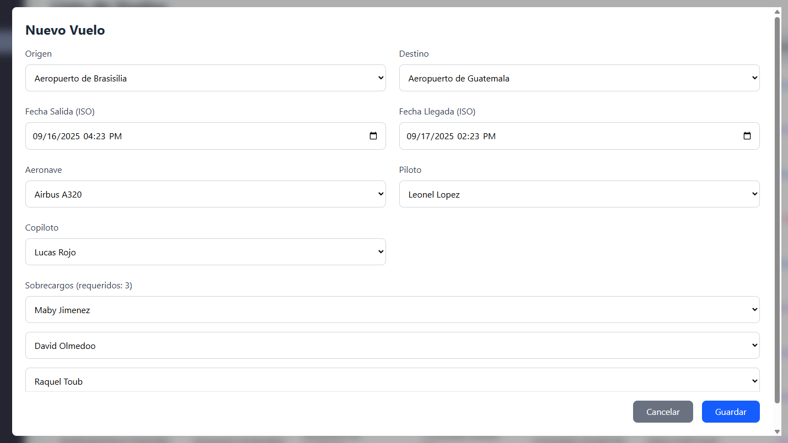

- Vista detalle vuelo
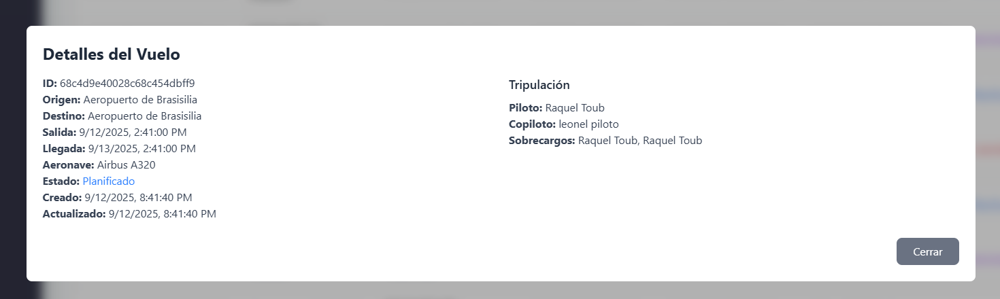

### 4.2 Estados del Vuelo
- **Planificado**  
- **Iniciado**  
- **En tiempo**  
- **Retrasado**  
- **Cancelado**  
- **Aterrizado**  

**Captura:**  
- Estados de Vuelo

---

## 5. Gestión de Tripulación [Admin]

- Vista General de la Gestion de Tribulacion
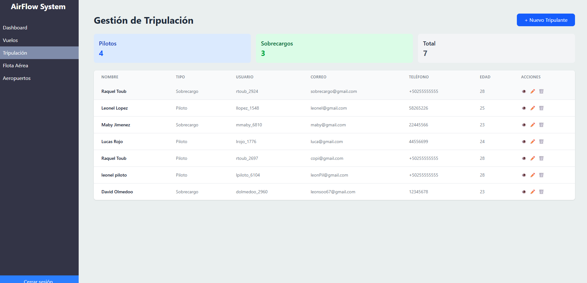

### 5.1 Registrar Pilotos y Copilotos
- Datos requeridos: nombre, fecha de nacimiento, identificación, horas de vuelo acumuladas.  

**Captura:**  
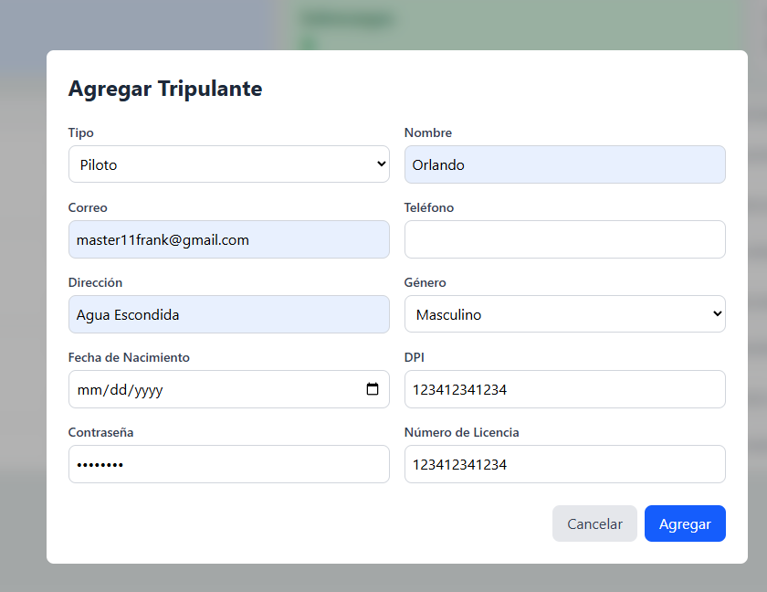

### 5.2 Registrar Sobrecargos
- Datos requeridos: nombre, fecha de nacimiento, identificación, vuelos completados.  

**Captura:**  
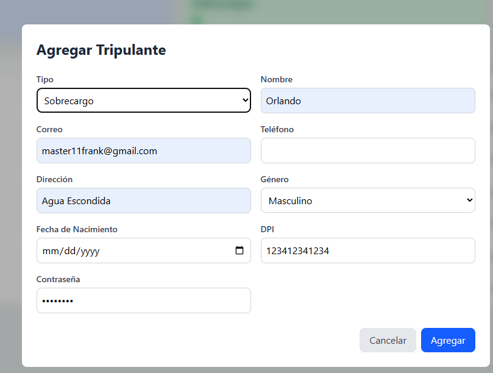
 

---

## 6. Gestión de Flota Aérea [Admin]

### 6.1 Registrar Aeronave
- Datos requeridos: modelo, capacidad, horas de vuelo acumuladas.  
- Vista General de la Gestion de Flota Aerea
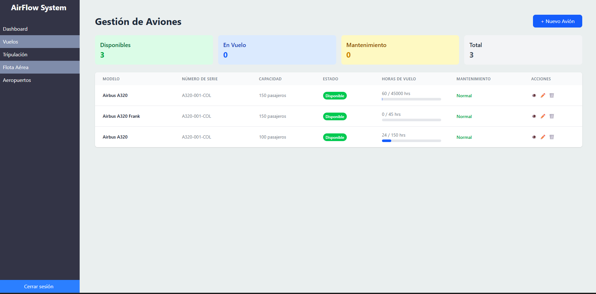

**Captura:**  
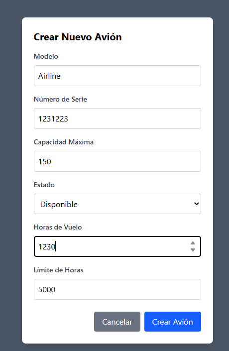

### 6.2 Mantenimiento de Aeronaves [Admin]
- El sistema genera alertas cuando se alcanza el límite de horas de vuelo.  
- Se bloquea la asignación del avión hasta que se certifique su mantenimiento.  

**Captura:**  
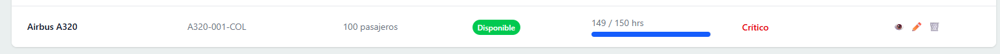

---

## 7. Registro de Pasajeros y Reservas [Pasajero]

### 7.1 Registro de Pasajeros
- Completar formulario con: nombre completo, fecha de nacimiento, pasaporte.  
- Confirmar correo electrónico.  

- Vista principal de un pasajero (vista de todos los vuelos para eleccion de x pasajero)
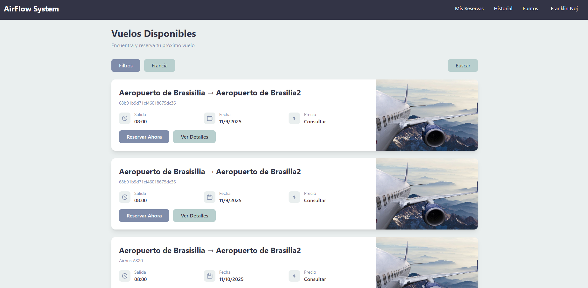

- Vista del Registrarse

### 7.2 Reservar Vuelo
- Seleccionar vuelo y asiento disponible.  
- Se genera un boleto con **código QR**.  

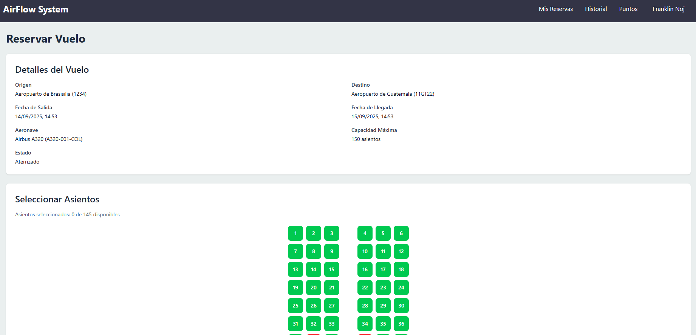
---

## 8. Historial [Pasajero]
- Historia de todos los vuelos del usuario logueado

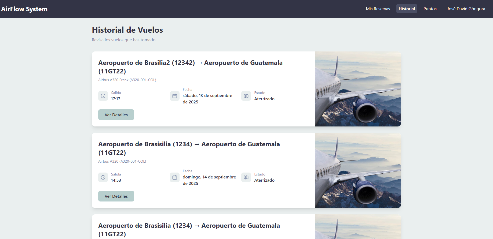

## 9. Puntos [Pasajero]
- Puntos de todos los vuelos del usuario logueado

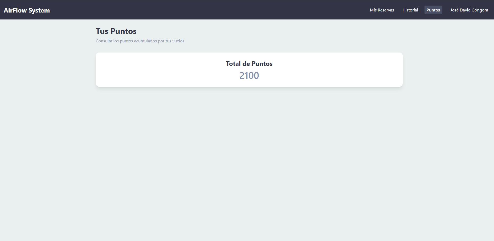

## 10. Editar mi Perfil [Pasajero]

- Se presiona sobre el nombre del usuario
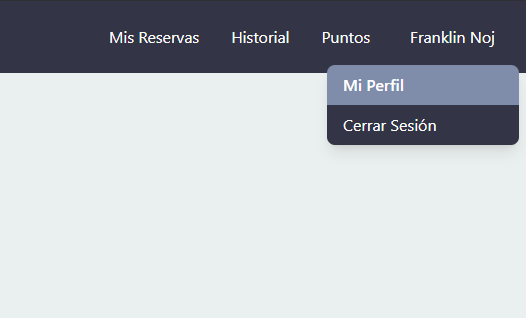

-Se selecciona Editar Perfil y tambien en ese menu se puede cerra sesion.
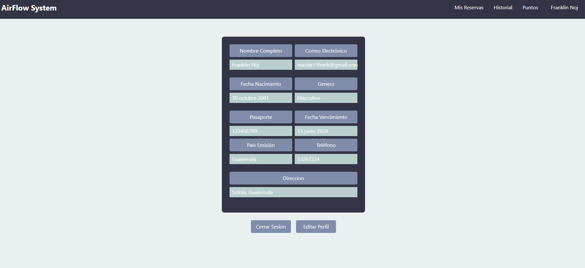
---
