# Sprint Planning:

## Link del Video:

https://drive.google.com/file/d/1avOrvJn6SZzsIW6TcyaXrt-40CzJff65/view?usp=sharing

## Captura del Meet:

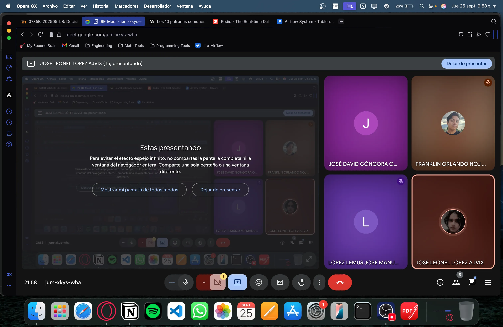

## Kanban al inicio del sprint:

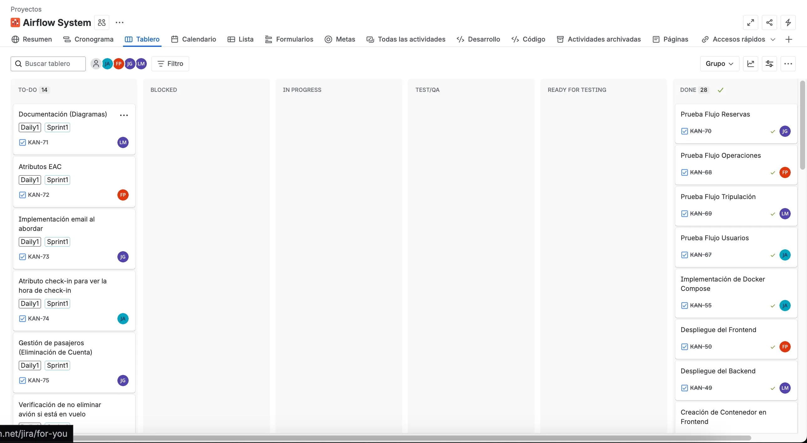

**Escala de puntos utilizada:** Escala de Fibonacci: 1,2,3,5,8

| ID | Caso de Uso | Prioridad | Estimación (Story Points) |
| --- | --- | --- | --- |
| 1 | Documentación (Diagramas) | Baja | 2 |
| 2 | Atributos EAC | Baja | 2 |
| 3 | Implementación email al abordar | Alta | 3 |
| 4 | Atributo check-in para ver la hora de check-in | Alta | 3 |
| 5 | Gestión de pasajeros (Eliminación de la cuenta) | Alta | 5 |
| 6 | No eliminar avión si está en vuelo | Alta | 5 |
| 7 | Aplicación de Nueva Arquitectura | Alta | 8 |
| 8 | Prueba unitaria Login | Media | 5 |
| 9 | Prueba unitaria Register | Media | 5 |
| 10 | Aplicación CI/CD | Media | 8 |
| 11 | Verificación Sistema asíncrono | Media | 3 |
| 12 | Prueba unitaria crear Vuelo | Media | 5 |
| 13 | Prueba Unitaria Reservar | Media | 5 |
| 14 | Prueba Unitaria mantenimiento del Avión | Media | 8 |
| 15 | Unión CI/CD con pruebas creadas | Media | 5 |

**Total: 72 Story Points**

# Daily 1:

## Link de la Grabación:

https://drive.google.com/file/d/10QCABLNkX7CJJrs8Sr1xbb4CoSZD8S0o/view?usp=sharing

## Kanban durante el Daily:

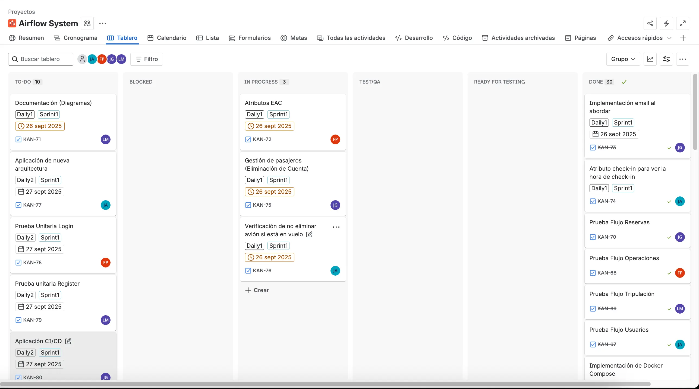

## Kanban después del Daily:

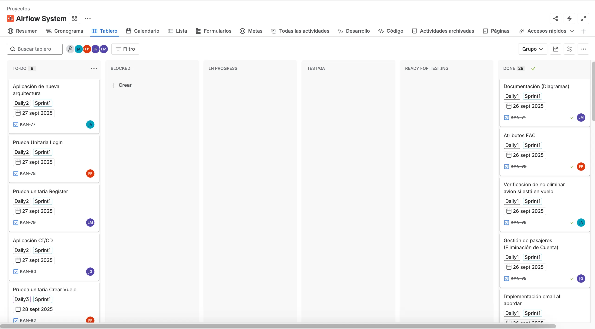

## Captura del Meet:

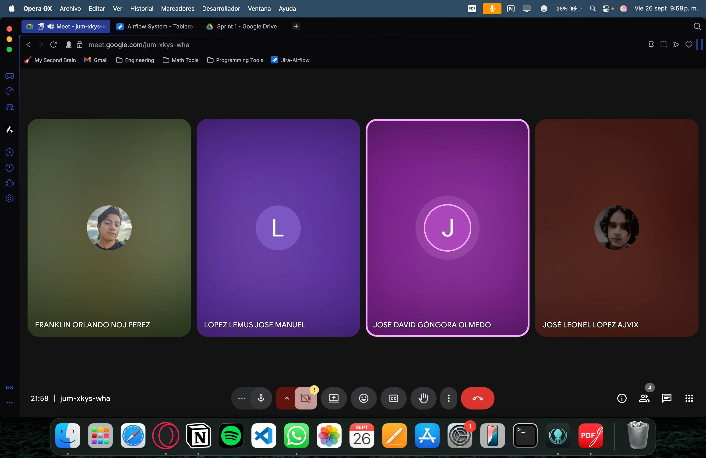

### José Leonel López Ajvix

- **Qué hice el día de ayer:** El día de ayer solamente se dividió el trabajo para poder trabajar este sprint.
- **Qué haré el día de hoy:** El día de hoy se hará lo que falta y se tomó de feedback de la fase pasada.
- **Se tiene algún de impedimento:** Por el momento no. Todo claro.

### Franklin Orlando Noj Perez

- **Qué hice el día de ayer:** Como el dia de ayer fue el sprint planning, hoy solamente agregue los requerimientos no funcionales y un borrador de los EAC acoplados a esta fase 3.
- **Qué haré el día de hoy:** Iniciare con la realizacion de la prueba unitaria de login.
- **Se tiene algún de impedimento:** Por el momento no tengo ningun inconveniente.

### José Manuel López Lemus

- Qué hice el día de ayer: Ayer fue el sprint planing y me asignaron las tareas de arreglar algunas partes de la documentación
- Qué haré el día de hoy: Hoy realizare la corrección del diagrama de despliegue y el de componentes siguiendo con la retroalimentación obtenida
- Se tiene algún de impedimento: No hay ningún impedimento para poder realizar mi tarea

### José David Góngora Olmedo

- **Qué hice el día de ayer:** Ayer hicimos el sprint planning donde ya me asignaron tareas asi que no hice mucho.
- **Qué haré el día de hoy:** Hoy hare todas las tareas que me asignaron, que seria agregar las cosas que nos faltaron en la Fase 2, como la gestión de pasajeros de parte del administrador, la opción para cancelar la cuenta de parte del pasajero, también las notificaciones por medio de correo por cualquier cambio en el estado de la reserva y las rutas protegidas de parte del frontend.
- **Se tiene algún de impedimento:** No, todo ha estado bien.

# Daily 2:

## Link de la grabación:

https://drive.google.com/file/d/1j12rOzOCACAfWpDPqed-KsmWQDthTFJF/view?usp=sharing

## Kanban durante el Daily:

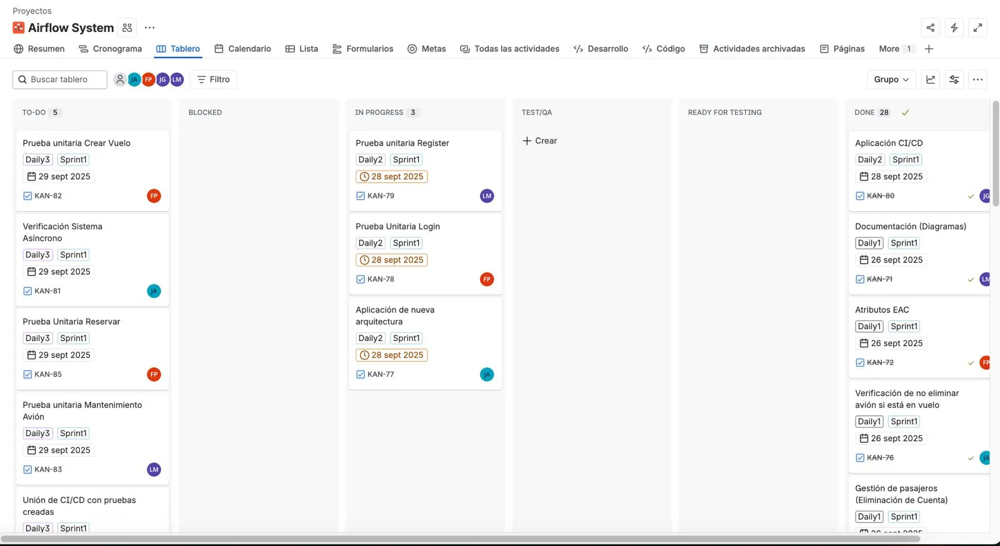

## Kanban después del Daily:

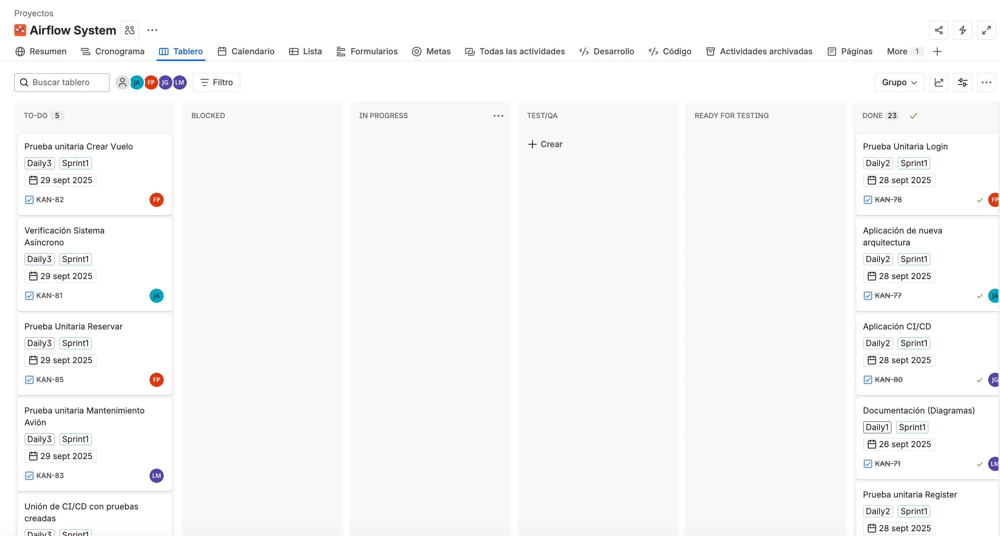

## Captura del Meet:

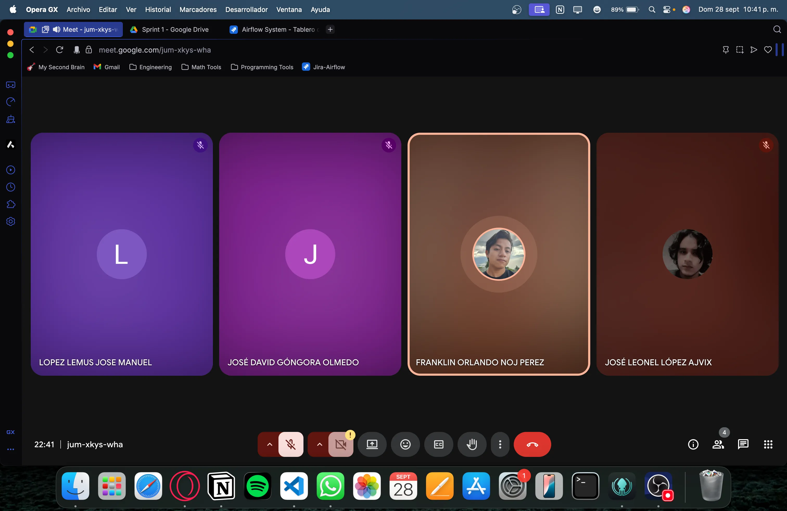

### José Manuel López Lemus

- Qué hice el día de ayer: Ayer corregí el diagrama de componentes con lo solicitado, lo envia para revision y fue aprobado
- Qué haré el día de hoy: Hoy realizare la prueba unitaria para el apartado de Registrar Usuarios
- Se tiene algún de impedimento: No hay ningún impedimento para poder realizar mi tarea

### Franklin Orlando Noj Perez

- Qué hice el día de ayer: Realice la prueba unitaria del login usando jest, los datos que utiliza la prueba son datos mockeados, por lo que mongo no se toca para nada.
- Qué haré el día de hoy: Hoy realizare la prueba unitaria de Crear Vuelo y tambien la de Reservar Vuelo.
- Se tiene algún de impedimento: Hasta el momento nada me impide poder seguir trabajando con mis tareas.

### José David Góngora Olmedo

- **Qué hice el día de ayer:** Ayer hice todos los arreglos de la fase 2, todo lo que teniamos que corregir, como la gestion de pasajeros de parte del administrador y la parte de cancelar la cuenta desde el pasajero. Tambien agregar mas notificaciones a los pasajeros por medio del correo cuando cambie el estado de su reserva y tambien agregar lo de las rutas protegidas del lado del frontend.
- **Qué haré el día de hoy:** Hoy hare lo que es la parte de ci/cd para ya empezar a automatizar lo que es la creación de las imágenes y los test.
- **Se tiene algún de impedimento:** No, todo ha estado bien.

### José Leonel López Ajvix

- **Qué hice el día de ayer:** El día de ayer se hizo la verificación para eliminar avión y pasarlo de estado en vez de eliminarlo, además de cambiar las cosas de retroalimentación
- **Qué haré el día de hoy:** El día de hoy se aplicará la nueva arquitectura, basado en redis para el sistema asíncrono.
- **Se tiene algún de impedimento:** Por el momento no. Todo está bien.

# Daily 3:

## Link de la Grabación:

https://drive.google.com/file/d/1bVoj6coGBO3aezMSJxf-g8R8msQ_igTp/view?usp=sharing

## Captura del Meet:

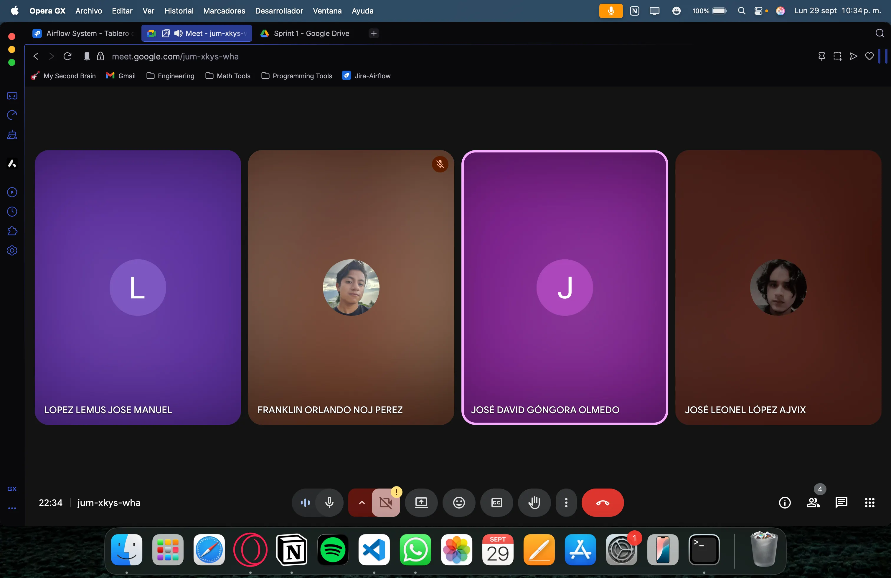

## Kanban durante el Daily:

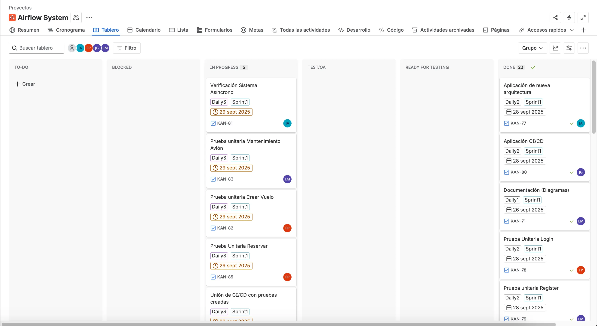

## Kanban al final del Daily:

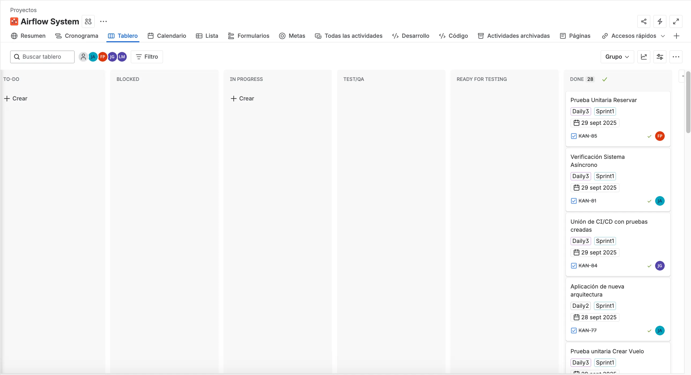

### José Manuel López Lemus

- **Qué hice el día de ayer:** Ayer realice las pruebas unitarias para el apartado de registrar usuarios todo mockeado y haciendo uso de jest
- **Qué haré el día de hoy:** Hoy realizare las pruebas unitarias para la parte de mantenimiento, que serian los cambios de estado, igualmente todo mockeado y haciendo uso de jest
- **Se tiene algún de impedimento:** No tengo ningún impedimento  para realizar mi tarea

### José Leonel López Ajvix:

- **Qué hice el día de ayer:** Ayer se realizó la arquitectura, se usó redis para la nueva arquitectura
- **Qué haré el día de hoy:** Hoy se verificará el flujo y funcionamiento correcto de la App con la nueva arquitectura.
- **Se tiene algún de impedimento:** No existe ningún impedimento.

### José David Góngora Olmedo

- **Qué hice el día de ayer:** Hice la implementación del ci/cd para la parte del build para que se creen las imágenes de los contenedores
- **Qué haré el día de hoy:** Hoy hare lo que es la parte de ci/cd pero la integración con los test que hicieron mis compañeros para que así pueda pasar por las etapas necesarias
- **Se tiene algún de impedimento:** No, todo ha estado bien.

### Franklin Orlando Noj Perez

- **Qué hice el día de ayer:** Realice la prueba unitaria de crear vuelo y el de reservar vuelo usando jest, los datos que utiliza la prueba son datos mockeados, por lo que mongo no se toca para nada.
- **Qué haré el día de hoy:** Revisare las pruebas unitarias anteriormente realizadas para asegurarme de su correcta implementacion.
- **Se tiene algún de impedimento:** Hasta el momento nada me impide poder seguir trabajando con mis tareas.

# Sprint Retrospective:

## Link de la Grabación:

https://drive.google.com/file/d/1-1HjUwjWZ6IxcMBrJbIyjZrAeCf-5YvT/view?usp=sharing

## Captura del Meet:

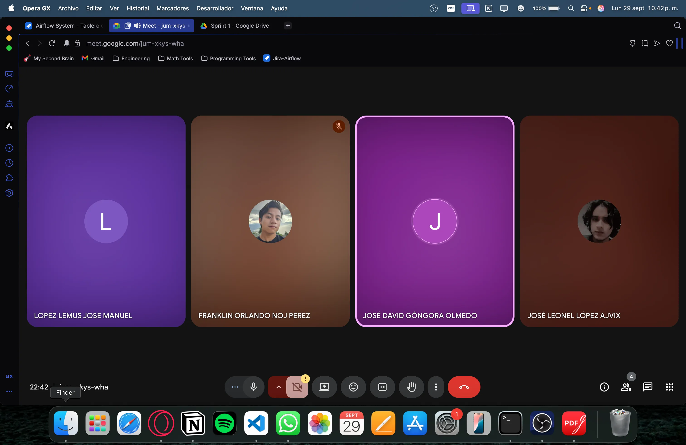

## Kanban al final del sprint:

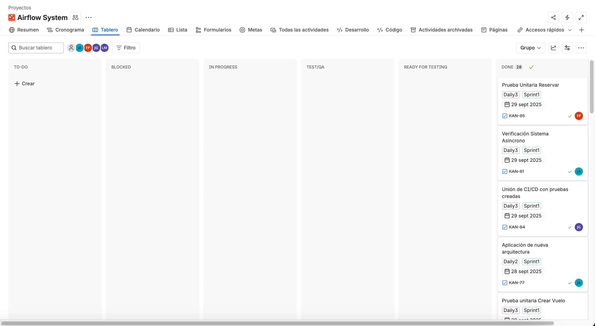

### José Manuel López Lemus:

- **¿Qué se hizo bien durante el Sprint?:** Mejoramos demasiado comparando el sprint anterior, estamos mas coordinados, realizando las tareas a la brevedad, lo cual nos da tiempo de probar y dejar todo al 100%
- **¿Qué se hizo mal durante el Sprint?:** Seguimos teniendo problemas con la puntualidad, pero es debido a que todos tenemos mas compromisos y es dificultoso establecer un horario fijo donde todos podamos estar
- **¿Qué mejoras se deben implementar para el próximo sprint?:** Abarcar mas tareas, las tareas abarcadas son muy cortas, lo cual se terminan en poco tiempo, se podria dar pasos más largos

### José David Góngora Olmedo:

- **¿Qué se hizo bien durante el Sprint?** Siento que este Sprint todo se hizo bien, logramos tener un kanban mas ordenado y con tareas especificas para que entendiéramos bien que nos correspondía hacer.
- **¿Qué se hizo mal durante el Sprint?** Siento que todo se hizo bien en este sprint ya que todo fue mejoras a comparación de los anteriores entonces pues todo bien.
- **¿Qué mejoras se deben implementar para el próximo sprint?** Como dije antes desde mi punto de vista todo se hizo bien logramos mejorar en muchos aspectos entonces lo único pues seria que siguiéramos así para sentir todo mas tranquilo y lograr terminar de mejor manera.

### Franklin Orlando Noj Perez:

- ¿**Qué se hizo bien durante el Sprint?** Todo estuvo muy bien organizado, con tareas bien especificadas y siempre hubo comunicacion efectiva
- **¿Qué se hizo mal durante el Sprint?** A mi criterio no tengo ninguna observacion sobre algo que se haya hecho mal.
- **¿Qué mejoras se deben implementar para el próximo sprint?** Creo que solo recomendar que se siga trabajando como se trabajo en este primer sprint para terminar todo a tiempo.

### José Leonel López Ajvix:

- **¿Qué se hizo bien durante el Sprint?:** Se mejoró mucho el tema de la puntualidad, el límite para las tareas y el trabajo en equipo.
- **¿Qué se hizo mal durante el Sprint?** En mi opinión siento que no hubo algún punto debil, en este Sprint se trabajó de una buena manera todo
- **¿Qué mejoras se deben implementar para el próximo sprint?** Seguir trabajando de la misma manera.

| ID | Story Points | Finalizado | Justificación |
| --- | --- | --- | --- |
| 1 | 2 | Sí |  |
| 2 | 2 | Sí |  |
| 3 | 3 | Sí |  |
| 4 | 3 | Sí |  |
| 5 | 5 | Sí |  |
| 6 | 5 | Sí |  |
| 7 | 8 | Sí |  |
| 8 | 5 | Sí |  |
| 9 | 5 | Sí |  |
| 10 | 8 | Sí |  |
| 11 | 3 | Sí |  |
| 12 | 5 | Sí |  |
| 13 | 5 | Sí |  |
| 14 | 8 | Sí |  |
| 15 | 5 | Sí |  |

**Total: 72 Story Points**