# Sprint Planning:

## Link de la Grabación:

https://drive.google.com/file/d/1RQnHjCGGo1xLFwCFDgs54FowhezwL6bk/view?usp=drive_link

## Captura del Meet:

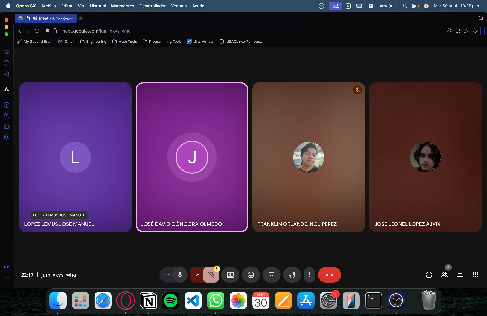

## Kanban al Inicio del Sprint:

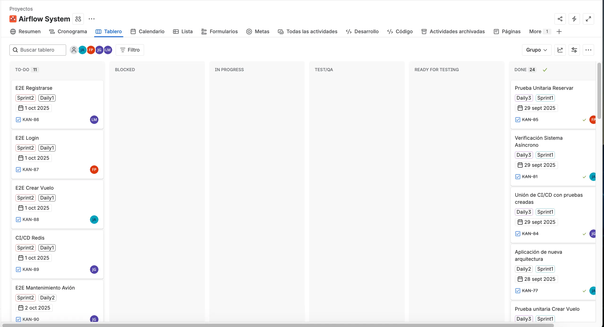

**Escala de puntuación:**

**Fibonacci:** 1,2,3,5,8

| ID | Caso de Uso | Prioridad | Estimación (Story Points) |
| --- | --- | --- | --- |
| 1 | E2E Login | Alta | 3 |
| 2 | E2E Crear Vuelo | Alta | 5 |
| 3 | E2E Registrarse | Alta | 3 |
| 4 | CI/CD Redis | Media | 3 |
| 5 | E2E Reservar Asiento | Alta | 5 |
| 6 | E2E Mantenimiento Avión | Mesdia | 5 |
| 7 | Búsqueda para P. Estrés | Media | 2 |
| 8 | Prueba Estrés Clásico | Media |  |
| 9 | Prueba Estrés (Spike Test) | Media |  |
| 10 | Prueba Estrés (Soak Testing) | Media |  |
| 11 | CI/CD Pruebas Estrés (Límite de recursos) | Baja |  |

# Daily 1:

## Link de la Grabación:

https://drive.google.com/file/d/16UDwKPUAbKIe5h9U_xo7ytZQ1Hkf1zwm/view?usp=sharing

## Kanban durante el Daily:

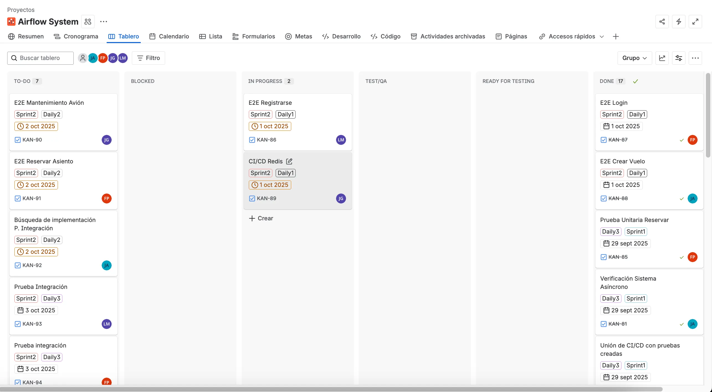

## Kanban después del Daily:

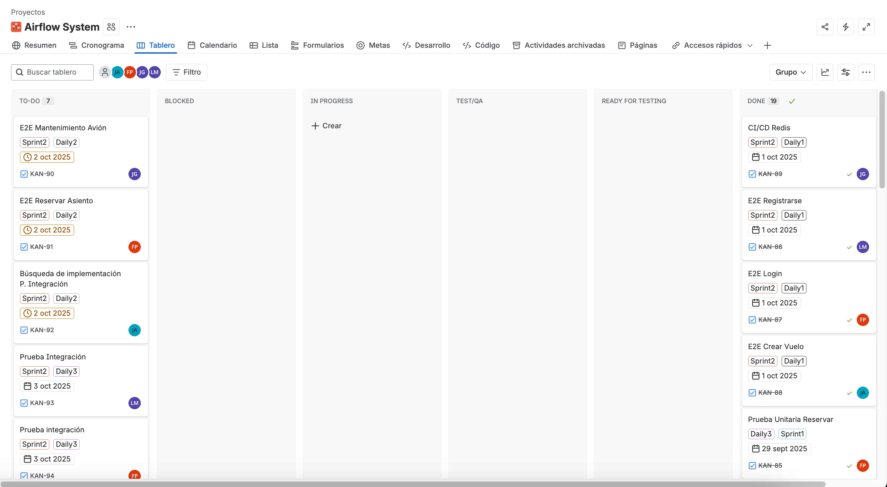

## Captura del Meet:

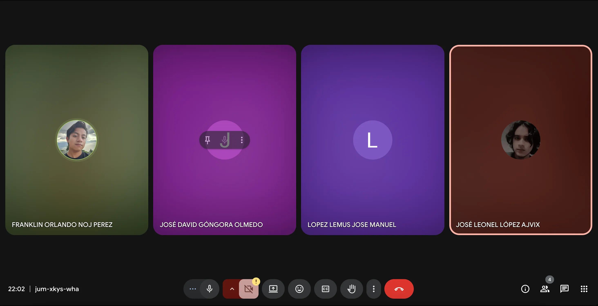

### José Leonel López Ajvix

- Qué hice el día de ayer: Ayer fue el sprint planing y se asignó tareas al equipo de desarrollo en el Jira.
- Qué haré el día de hoy: Hoy se realizará la prueba E2E de vuelos, con las verificaciones y errores en Cypress
- Se tiene algún de impedimento: No hay ningún impedimento para poder realizar mi tarea.

### José Manuel López Lemus

- Qué hice el día de ayer: Ayer fue el sprint planing y me asignaron las tareas de arreglar algunas partes de la documentación
- Qué haré el día de hoy: Hoy realizare la corrección del diagrama de despliegue y el de componentes siguiendo con la retroalimentación obtenida
- Se tiene algún de impedimento: No hay ningún impedimento para poder realizar mi tarea

### Franklin Orlando Noj Perez

- Qué hice el día de ayer: Empece a documentarme sobre como realizar las pruebas 2e2
- Qué haré el día de hoy: Realizare la primer prueba e2e del login
- Se tiene algún de impedimento: Por el momento ninguno

### José David Góngora Olmedo

- Qué hice el día de ayer: Pues ayer fue el sprint planning donde se me asignaron algunas tareas, entonces pues eso fue lo que hicimos ayer.
- Qué haré el día de hoy: Hoy hare lo que se me fue asignado de primero, que es lo de agregar el redis en el CI/CD para que funcione al momento de hacer deploy.
- Se tiene algún de impedimento: No, todo ha estado bien.

# Daily 2:

## Captura del Meet:

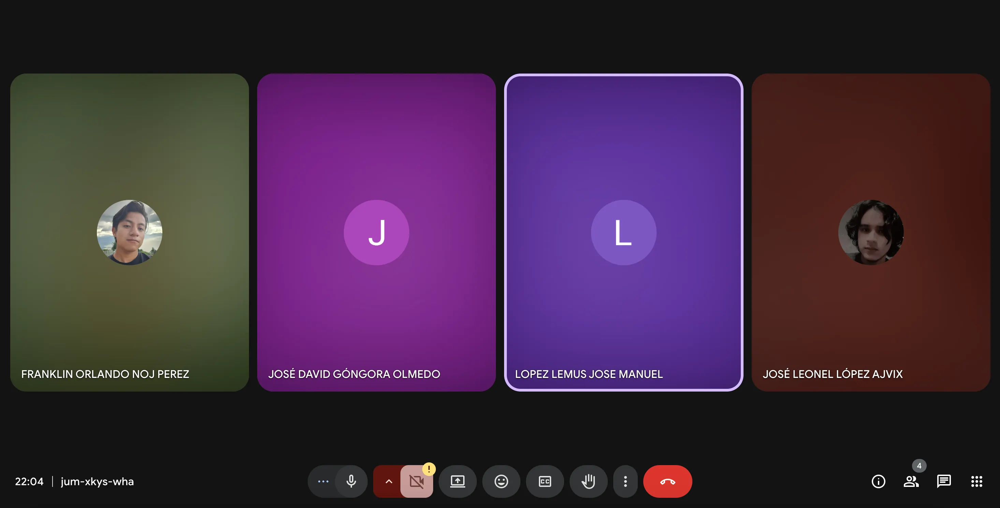

## Link de la Grabación:

https://drive.google.com/file/d/15gm5saI2omSDvPj7BDuPkcdkn6IR8G3N/view?usp=sharing

## Kanban durante el Daily:

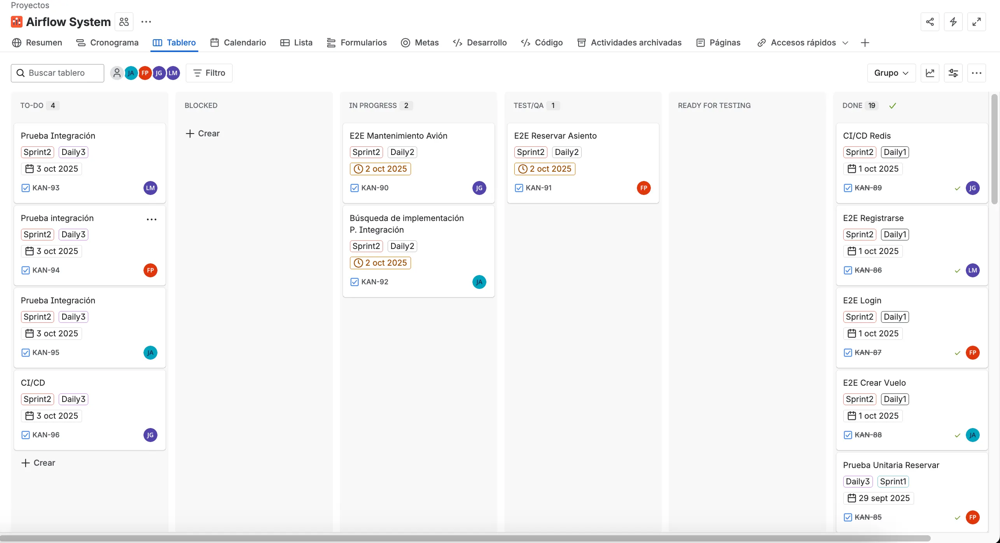

## Kanban después del Daily:

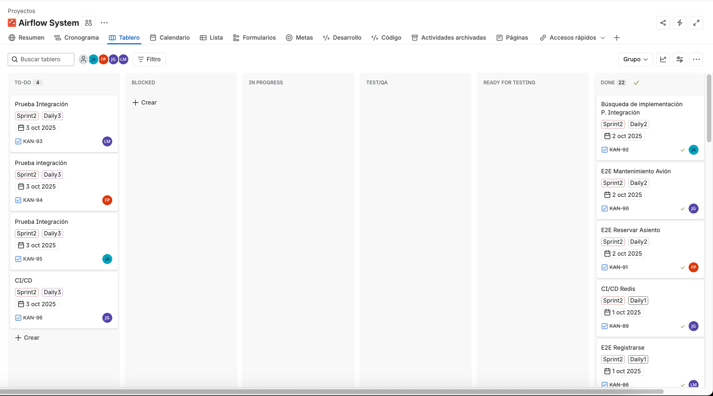

### José Leonel López Ajvix

- Qué hice el día de ayer: El día de ayer se hizo la prueba E2E para crear vuelos con sus respectivas pruebas de errores.
- Qué haré el día de hoy: Hoy se buscará información sobre como implementar las pruebas de estrés en el proyecto, y qué framework usar.
- Se tiene algún de impedimento: No hay ningún impedimento para poder realizar mi tarea

### José Manuel López Lemus

- Qué hice el día de ayer: Ayer realice la prueba E2E para el apartado de registro de los usuarios, siguiendo lo acordado que fue hacer uso de la tecnología de cypress
- Qué haré el día de hoy: Hoy comenzare a elaborar la prueba de integración, primer investigare como realizarla correctamente, para luego implementarla
- Se tiene algún de impedimento: De momento no tengo ningún impedimento para realizar la tarea

### Franklin Orlando Noj Perez

- Qué hice el día de ayer: Realice la prueba e2e del login, me documente mas porque si me llevo tiempo poder realizarla
- Qué haré el día de hoy: Realizare la prueba e2e de Editar Perfil de usuario
- Se tiene algún de impedimento: Por el momento ninguno, puedo seguir trabajando con normalidad.

### José David Góngora Olmedo

- Qué hice el día de ayer: Ayer hice lo que es la implementacion de redis a CI/CD para que funcione al momento que se haga el deploy.
- Qué haré el día de hoy: Lo que hare hoy es la prueba e2e para el mantenimiento del avion.
- Se tiene algún de impedimento: No, todo ha estado bien.

# Daily 3:

## Link de la Grabación:

https://drive.google.com/file/d/15meP68BGGxDvYcag56atyXAbCNJTs2IP/view?usp=drive_link

## Captura del Meet:

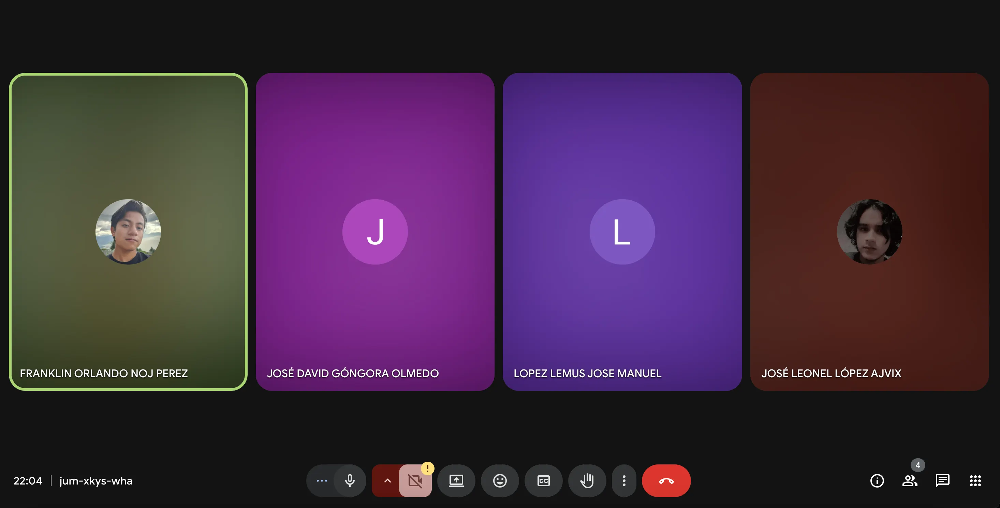

## Kanban Durante el Daily:

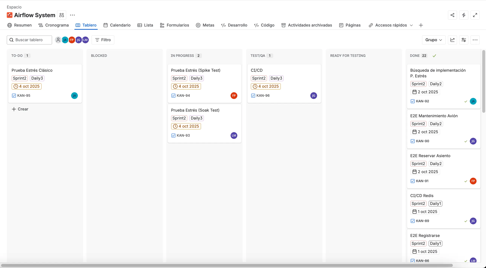

## Kanban Después del Daily:

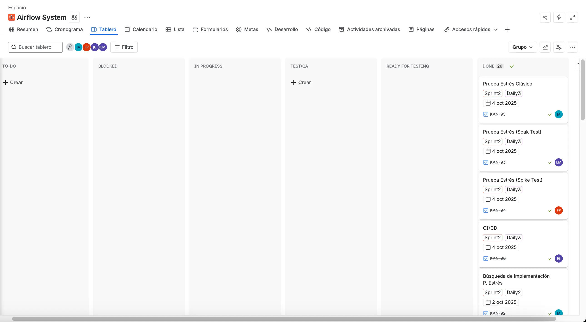

### José David Góngora Olmedo

- Qué hice el día de ayer: Ayer lo que hice fue la prueba E2E para el mantenimiento del avión, lo que ya comprueba que funcione correctamente el flujo de esa parte.
- Qué haré el día de hoy: Lo que hare hoy es comprobar que el CI/CD siga funcionando correctamente despues de los cambios y que las 3 etapas sean ejecutadas correctamente.
- Se tiene algún de impedimento: No, todo ha estado bien.

### Franklin Orlando Noj Perez

- Qué hice el día de ayer: Realice la prueba e2e de Editar Perfil, me documente mas porque si me llevo tiempo poder realizarla, especialmente tuve problemas con el toke, solicite la ayuda del companero de Jose Leonel y su ayuda me aporto bastante.
- Qué haré el día de hoy: Realizare la prueba de estres Spike Test.
- Se tiene algún de impedimento: Por el momento ninguno, puedo seguir trabajando sin ningun problema.

### José Leonel López Ajvix

- Qué hice el día de ayer: Ayer se buscó información para hacer las pruebas de Estrés. Se concluyó que se trabajará con Locust
- Qué haré el día de hoy: Lo que se hará el día de hoy es trabajar la prueba de estrés clásico con Locust.
- Se tiene algún de impedimento: No, todo está bien por el momento.

### José Manuel López Lemus

- Qué hice el día de ayer: Ayer realice las correciones de la prueba E2E y ahora si esta correctamente
- Qué haré el día de hoy: Hoy realizare la prueba de estrés o bien soak test que también se le conoce como prueba de remojo
- Se tiene algún de impedimento: No tengo ningún impedimento para realizar la tarea.

# Sprint Retrospective:

## Link de la Grabación:

https://drive.google.com/file/d/1YvutMEG6N_bg1nQLEMbkpz1oX2zxrtT-/view?usp=sharing

## Captura del Meet:

## Kanban al Final del Sprint:

### José Leonel López Ajvix:

- **¿Qué se hizo bien durante el sprint a nivel arquitectónico?:** Este sprint se logró mantener una buena arquitectura como ibamos trabajando. Se logró completar y ver las pruebas a nivel arquitectónico, probando el flujo en las pruebas E2E.
- **¿Qué se hizo mal durante el sprint a nivel arquitectónico?:** Este sprint se vio afectado por el uso de una máquina virtual gratis. Esto hacía que hubiera problemas al levantar la máquina virtual y mantener una consistencia de datos. Sin embargo, se logró trabajar bien.
- **¿Qué mejoras arquitectónicas se deben mejorar para el próximo sprint?:** Se debe mejorar la consistencia de la máquina virtual, ver como se puede mejorar el uso de la capa gratuita en el proveedor de Hosts.

### José David Góngora Olmedo:

- **¿Qué se hizo bien durante el sprint a nivel arquitectónico?:** Durante el sprint, logramos mantener la estructura de capas en la aplicación, lo que facilitó integrar nuevas funcionalidades.
- **¿Qué se hizo mal durante el sprint a nivel arquitectónico?:** Faltó documentar algunos endpoints y la comunicación entre servicios, lo que complicó algunas cosas.
- **¿Qué mejoras arquitectónicas se deben mejorar para el próximo sprint?:** Para el próximo sprint, planeamos documentar mejor los endpoints y establecer convenciones claras de codificación

### Franklin Orlando Noj Perez

- **¿Qué se realizó correctamente durante el sprint a nivel arquitectónico?:** En este sprint conseguimos preservar la organización por capas dentro de la aplicación, lo que permitió incorporar nuevas funcionalidades de forma ordenada y eficiente.
- **¿Qué aspectos se manejaron de forma deficiente durante el sprint a nivel arquitectónico?:** No se registraron adecuadamente algunos endpoints ni se detalló del todo la comunicación entre servicios, lo que generó ciertas dificultades.
- **¿Qué ajustes arquitectónicos se deben implementar en el próximo sprint?:** En el siguiente sprint se buscará mejorar la documentación de los endpoints y definir normas claras de codificación para todo el equipo.

### José Manuel López Lemus

- **¿Qué se hizo bien durante el sprint a nivel arquitectónico?:** Durante el sprint, arquitectonicamente hablando, hubo mucho apoyo por parte del equipo en investigar la manera adecuada de implementar las nuevas tecnologías
- **¿Qué se hizo mal durante el sprint a nivel arquitectónico?:** Es complejo saber en que se falló, debido a que realizamos las implementaciones en base a lo que investigamos, y aún no sabemos si como lo trabajamos es la manera adecuada.
- **¿Qué mejoras arquitectónicas se deben mejorar para el próximo sprint?:** Acesorarnos más o indagar más en las tecnologias a utilizar para saber si son las mejores opciones en base a la estructura del proyecto

| ID | Story Points | Finalizado | Justificación |
| --- | --- | --- | --- |
| 1 | 3 | Sí |  |
| 2 | 5 | Sí |  |
| 3 | 3 | Sí |  |
| 4 | 3 | Sí |  |
| 5 | 5 | Sí |  |
| 6 | 5 | Sí |  |
| 7 | 2 | Sí |  |
| 8 | 3 | Sí |  |
| 9 | 5 | Sí |  |
| 10 | 5 | Sí |  |
| 11 | 3 | Sí |  |

**Total:** 42 Story Points.

