# Sprint Planning:

## Link de la Grabación:

https://drive.google.com/file/d/1dVN2HCOODBfCz2QV8WvGX55G-RGq1kD7/view?usp=sharing

## Captura del Meet:

## Kanban al inicio del Sprint:
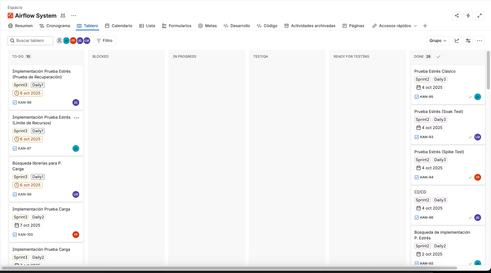

Escala de Puntuación

**Fibonacci:** 1,2,3,5,8

| ID | Caso de uso | Prioridad |  Estimación (Story Points) |
| --- | --- | --- | --- |
| 1 | Implementación Prueba Estrés (Prueba de Recuperación) | Alta | 5 |
| 2 | Implementación Prueba Estrés (Prueba Recuperación) | Alta | 5 |
| 3 | Búsqueda Pruebas Carga | Media | 2 |
| 4 | Implementación Prueba Carga | Media |  |
| 5 | Implementación Prueba Carga | Media |  |
| 6 | Implementación Prueba Carga | Media |  |
| 7 | Implementación Prueba Carga | Media |  |
| 8 | Implementación Prueba Carga | Media |  |
| 9 | Búsqueda Pruebas Integración | Media |  |
| 10 | CI-CD | Baja | 3 |

# Daily 1:

## Link de la Grabación:

https://drive.google.com/file/d/1hbnFvS-WnQikE2AqTcwvHmKTOT2FHvfO/view?usp=sharing

## Captura del Meet:

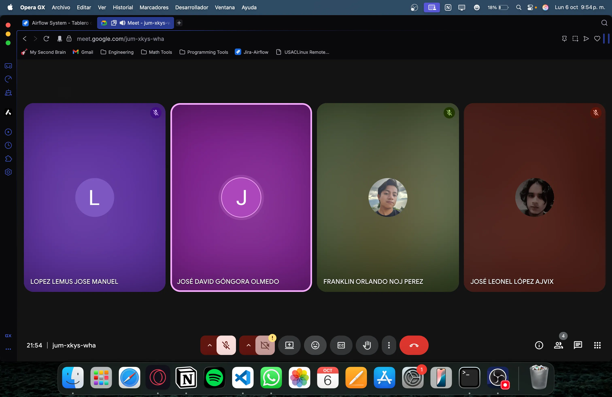

## Kanban durante el Daily:

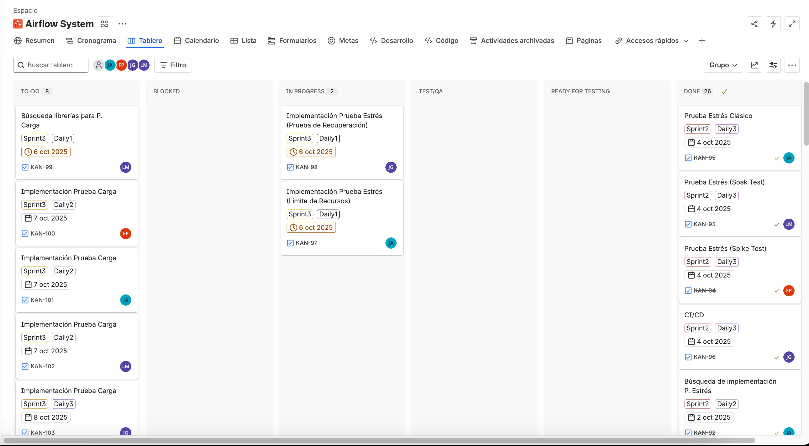

## Kanban Después del Daily:

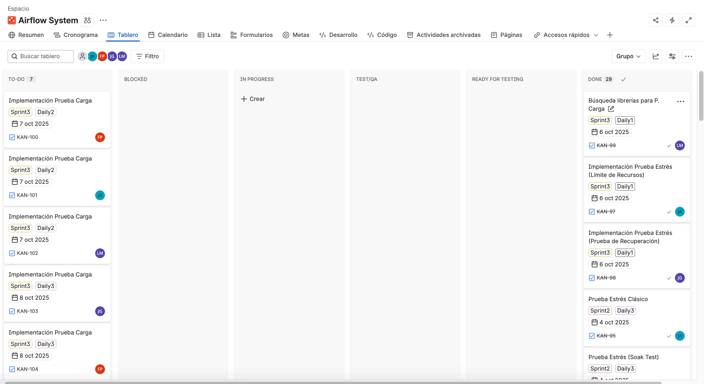

### José Leonel López Ajvix:

- **¿Qué hice el día de ayer?** El día de ayer se preparó todo para empezar el Sprint 3.
- **¿Qué haré el día de hoy?** El día de hoy se trabajará en la prueba de Estrés  que ve el límite de recursos de la aplicación. Se implementará Locust en Python.
- **¿Existe algún impedimento?** Por el momento todo bien. Puedo seguir avanzando.

### José David Góngora Olmedo:

- **¿Qué hice el día de ayer?** El día de ayer se preparó todo para empezar el Sprint 3.
- **¿Qué haré el día de hoy?** El día de hoy se trabajará en la prueba de Estrés, para ser especificos la prueba de recuperacion.
- **¿Existe algún impedimento?** Por el momento todo bien.

### Franklin Orlando Noj Perez

- **¿Qué hice el día de ayer? Documentarme para poder posteriormente iniciar a realizar las pruebas de stres.**
- **¿Qué haré el día de hoy? Realizar las pruebas de stres juntamente con el companero Jose Leonel**
- **¿Existe algún impedimento? No tengo ningun incoveniente para poder seguir avanzando**

### José Manuel López Lemus:

- **¿Qué hice el día de ayer?** Ayer fue el Sprint Planning y se distribuyeron todas las tareas para este sprint
- **¿Qué haré el día de hoy?** Hoy investigare acerca de las librerias para realizar las pruebas de carga y cual nos será mas util acomplandose a nuestra arquitectura
- **¿Existe algún impedimento?** Por el momento todo bien.

# Daily 2:

## Link de la Grabación:

https://drive.google.com/file/d/1AVE0VWo8q8zPZLeuDFwttqSXDGklMCRu/view?usp=sharing

## Captura del Meet:

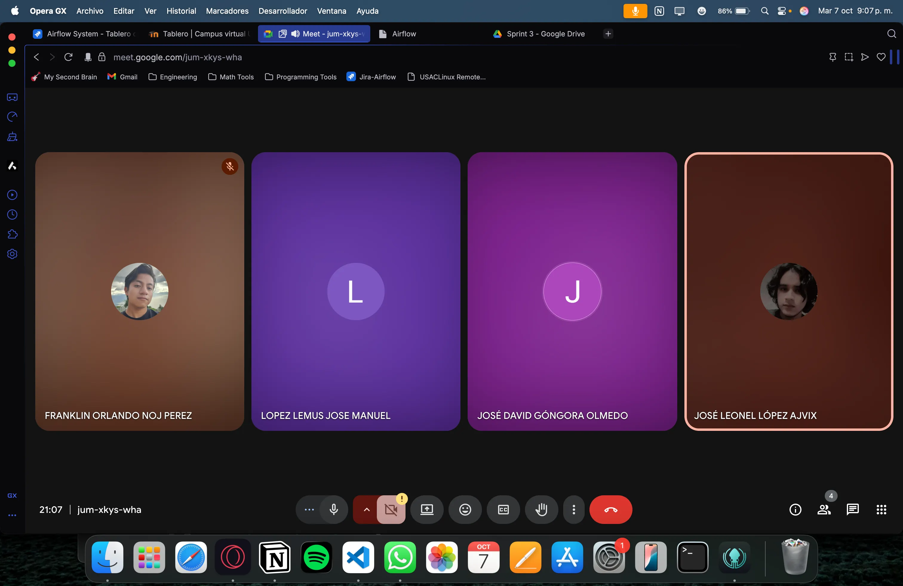

## Kanban Durante el Daily:

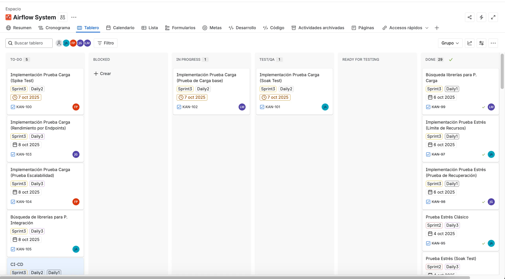

### José Manuel López Lemus:

- **¿Qué hice el día de ayer?** El día de ayer realice la investigación acerca de las librerias que podriamos usar para realizar la prueba de carga
- **¿Qué haré el día de hoy?** El día de hoy trabaje la prueba de carga clasica con locust simulando 500 usuarios en 10 minutos.
- **¿Existe algún impedimento?** Por el momento todo bien.

### Franklin Orlando Noj Perez

- **¿Qué hice el día de ayer? Apoyar al amigo Jose Leonel a realizar la prueba de estres en locust.**
- **¿Qué haré el día de hoy? Voy a realizar la prueba de carga de Spike Test, tambien lo realizare con ayuda de locust**
- **¿Existe algún impedimento? No tengo ningun incoveniente puedo continuar sin problema**

### José David Góngora Olmedo:

- **¿Qué hice el día de ayer?** El dia de ayer hice la prueba de estrés, la de recuperacion.
- **¿Qué haré el día de hoy?** El día de hoy apoyaré a Franklin a hacer su prueba de carga.
- **¿Existe algún impedimento?** Por el momento todo bien.

### José Leonel López Ajvix:

- **¿Qué hice el día de ayer?** El día de ayer se hizo la prueba de estrés de límite de recursos en Locust.
- **¿Qué haré el día de hoy?** El día de hoy se hará la prueba de Carga asignada. Me tocó la Soak Test o prueba de Remojo.
- **¿Existe algún impedimento?** Por el momento todo bien. Puedo seguir avanzando sin ningún problema.

## Kanban después del Daily:

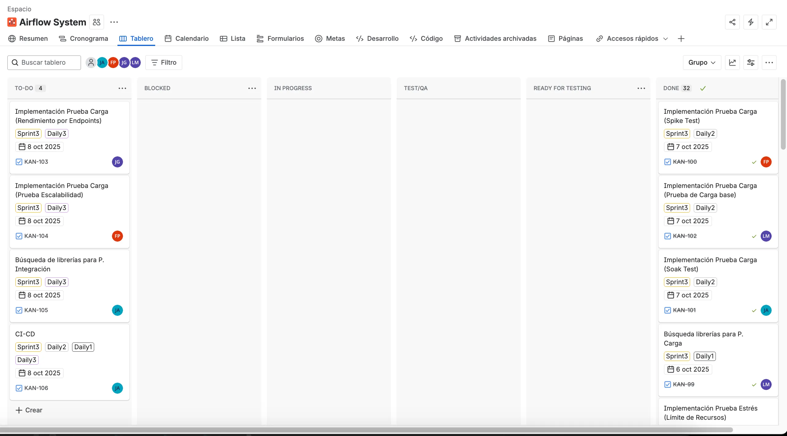

# Daily 3:

## Link de la Grabación:

https://drive.google.com/file/d/1HtZmmQR6RUUHYJ6rBvjITS8X6chr9f24/view?usp=sharing

## Captura del meet:

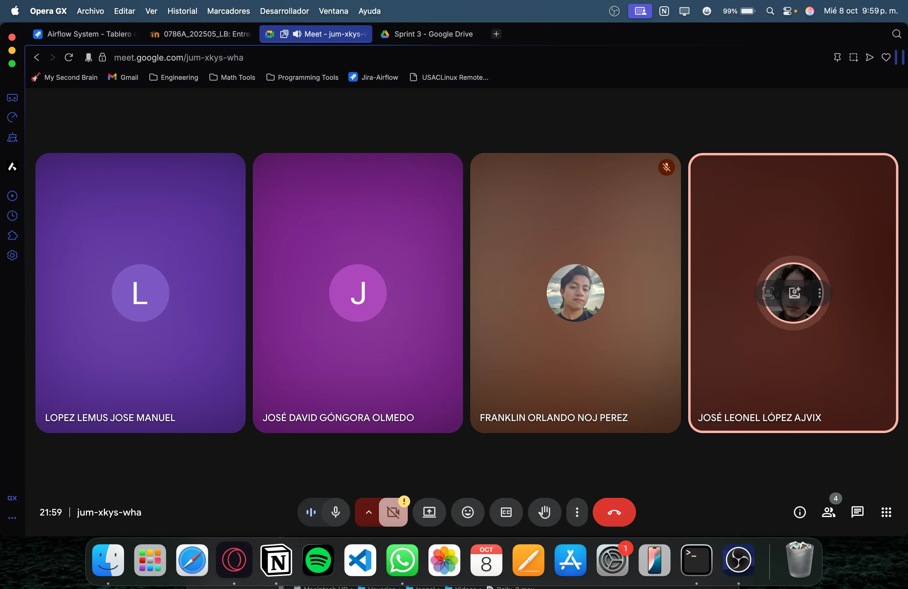

## Kanban Durante el Daily:

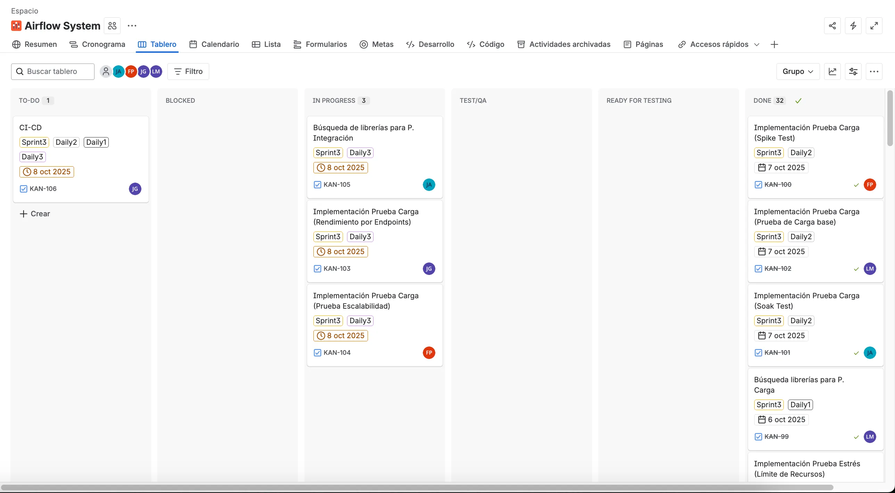

### José David Góngora Olmedo:

- **¿Qué hice el día de ayer?** El dia de ayer apoyé a Franklin a realizar su prueba, ya que no tenia nada asignado.
- **¿Qué haré el día de hoy?** El día de hoy haré la prueba de carga, la de rendimiento por endpoints para cargar algunos endpoints del backend.
- **¿Existe algún impedimento?** Por el momento todo bien.

### Franklin Orlando Noj Perez

- **¿Qué hice el día de ayer? Realice la prueba de carga, especificamente la  prueba de spike test.**
- **¿Qué haré el día de hoy? Tengo planeado realizar la prueba de carga, exactamente la prueba de escalabilidad.**
- **¿Existe algún impedimento? Hasta el momento ninguno, puedo seguir avanzando.**

### José Manuel López Lemus:

- **¿Qué hice el día de ayer?** El día de ayer hice la prueba clasica  de carga co locust simulando 500 usuarios en 10 minutos
- **¿Qué haré el día de hoy?** Ya no tengo tareas, por lo cual si alguien necesita mi ayuda o apoyo estoy disponible
- **¿Existe algún impedimento?** Por el momento no

### José Leonel López Ajvix:

- **¿Qué hice el día de ayer?** El día de ayer hice la prueba de remojo o soak test.
- **¿Qué haré el día de hoy?** El día de hoy buscaré información para implementar pruebas de integración.
- **¿Existe algún impedimento?** Por el momento todo bien. Puedo avanzar

## Kanban después del Daily:

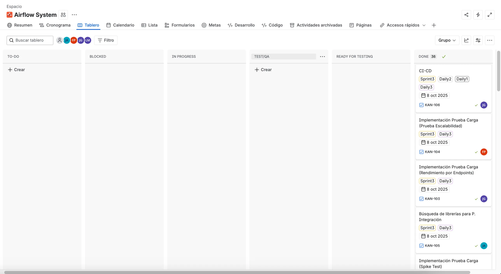

# Sprint Retrospective:

## Link de la Grabación:

https://drive.google.com/file/d/1VRKoK2MElMQxwa0jLSr8iZUO9hgTa5yG/view?usp=sharing

## Captura del Meet:

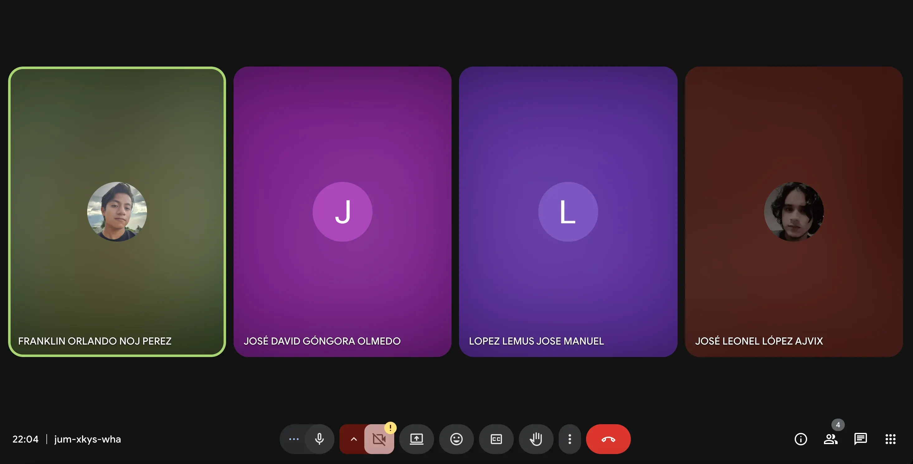

## Kanban al final del Sprint:

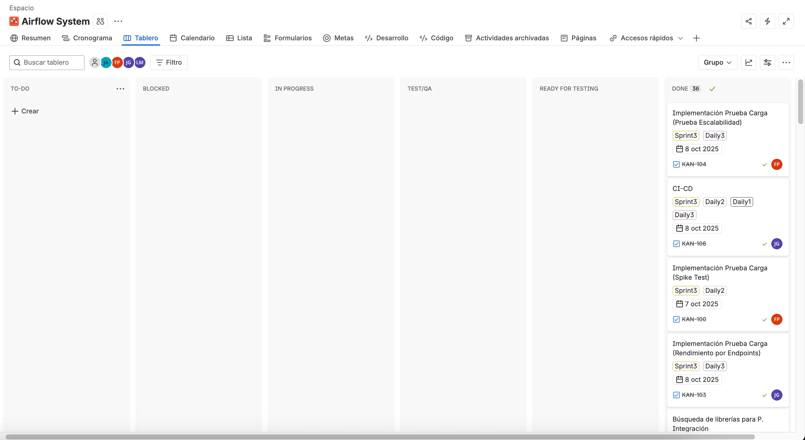

### José Manuel López Lemus:

- **¿Qué se hizo bien durante el Sprint?:** Realizamos correctamente la investigación de las tecnologias y librerias, y la que escogimos que fue locust lo implementamos correctamente, con resultados esperados y graficas acordes a lo que necesitabamos
- **¿Qué se hizo mal durante el Sprint?:** No hicimos algo mal especificamente, pero nos fuimos por el camino facil, usamos las librerias más comunes
- **¿Qué mejoras se deben implementar para el próximo sprint?:** Podriamos implementar alguna libreria mas sofisticada para probar nuevas tecnologias

### Franklin Orlando Noj Perez:

- **¿Qué se realizó de manera positiva durante el Sprint?:** Se llevó a cabo una investigación adecuada sobre las herramientas y librerías disponibles. La opción seleccionada, *Locust*, fue implementada correctamente, obteniendo resultados satisfactorios y gráficos que reflejaron los objetivos planteados.
- **¿Qué aspectos no fueron del todo correctos durante el Sprint?:** No se cometieron errores importantes, pero el equipo optó por soluciones más convencionales, sin explorar alternativas más complejas o innovadoras.
- **¿Qué se puede mejorar para el próximo Sprint?:** Sería conveniente analizar e integrar librerías más avanzadas con el fin de ampliar el conocimiento técnico y experimentar con nuevas tecnologías.

### José David Góngora Olmedo:

- **¿Qué se hizo bien durante el Sprint?:** La arquitectura respondió bien a las pruebas de carga. El sistema se mantuvo estable y pudimos identificar fácilmente qué partes consumían más recursos.
- **¿Qué se hizo mal durante el Sprint?** Se detectaron algunos cuellos de botella en la comunicación entre módulos y faltó tener métricas más detalladas para analizar mejor el rendimiento.
- **¿Qué mejoras se deben implementar para el próximo sprint?** Para el próximo sprint, queremos optimizar los módulos más exigidos, agregar herramientas de monitoreo y mejorar la gestión de recursos para soportar más carga.

### José Leonel López Ajvix:

- **¿Qué se hizo bien durante el Sprint?:** Se entendió correctamente como funcionan las pruebas, y se detectaron los puntos débiles de la aplicación y la arquitectura.
- **¿Qué se hizo mal durante el Sprint?:** No se hizo nada malo, solamente podríamos mejorar las pipelines para hacer las pruebas de límites de recursos de una manera más rápida.
- **¿Qué mejoras se deben implementar para el próximo sprint?:** Deberíamos trabajar de la misma manera, terminaríamos muy bien el Sprint.

| ID | Story Points | Finalizado | Justificación |
| --- | --- | --- | --- |
| 1 | 5 | Sí |  |
| 2 | 5 | Sí |  |
| 3 | 2 | Sí |  |
| 4 | 3 | Sí |  |
| 5 | 3 | Sí |  |
| 6 | 3 | Sí |  |
| 7 | 3 | Sí |  |
| 8 | 3 | Sí |  |
| 9 | 3 | Sí |  |
| 10 | 3 | Sí |  |

**Total: 33 Story Points.**