# Sprint Planning

## Link de la Grabación:

https://drive.google.com/file/d/15qllu3VTSusMZtR5Ge1jXLTQJHxodv7J/view?usp=sharing

## Captura del Meet:

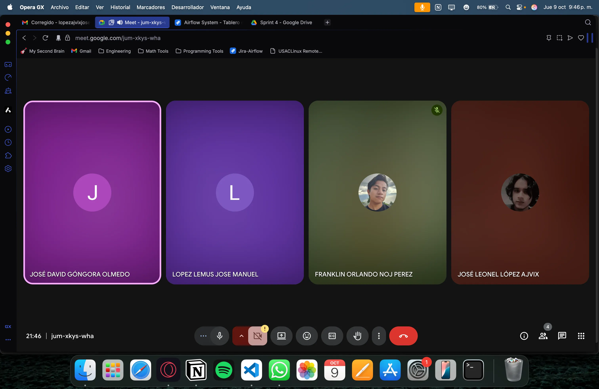

## Kanban al Inicio del Sprint:

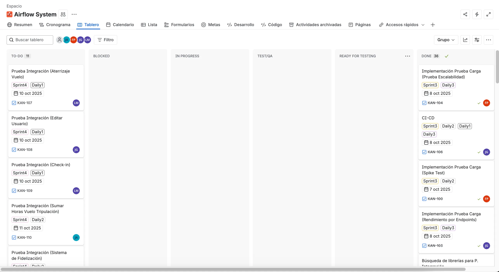

**Escala de Puntuación:**

**Escala de Fibonacci:** 1,2,3,5,8

| ID | Caso de Uso | Prioridad | Estimación |
| --- | --- | --- | --- |
| 1 | Prueba de Integración (Aterrizaje de Vuelo) | Alta | 5 |
| 2 | Prueba de Integración (Editar Usuario) | Alta | 5 |
| 3 | Prueba de Integración (Check In) | Alta | 8 |
| 4 | Prueba Integración (Sumar Horas Vuelo) | Alta | 5 |
| 5 | Prueba de Integración (Sistema Fidelización) | Alta | 5 |
| 6 | CI/CD | Media | 3 |
| 7 | Vídeo CI/CD | Baja | 2 |
| 8 | Modificar Formato Informe | Baja | 3 |

**Total: 86 puntos**

# Daily 1:

## Link de la Grabación

https://drive.google.com/file/d/1xDiQUtT-ZdLVqJBL-Sp5lR5R0xwPzh1T/view?usp=sharing

## Captura del Meet:

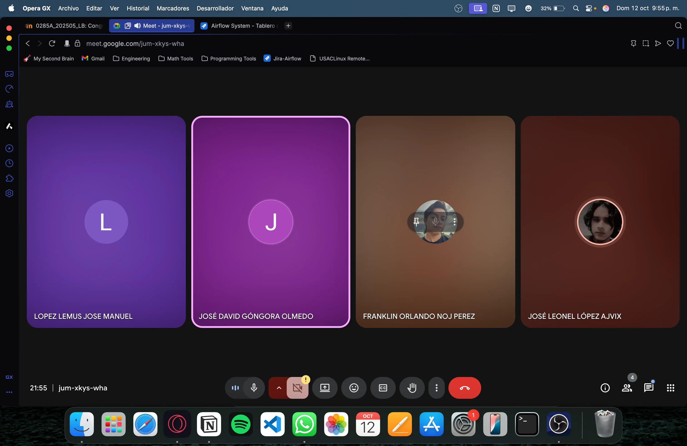

## Kanban durante el Daily:

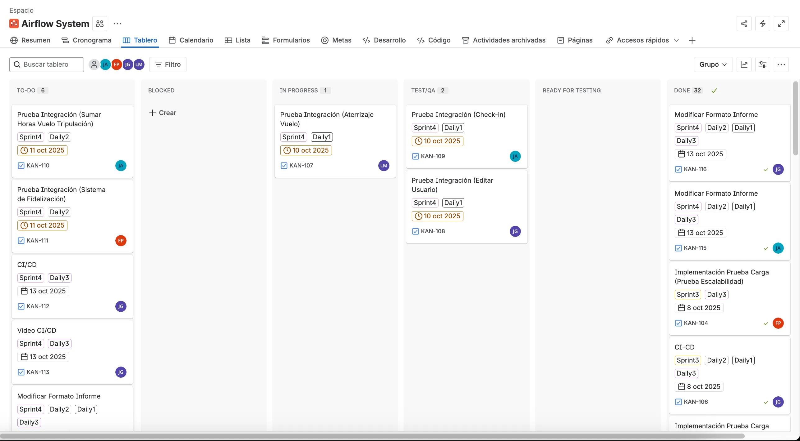

## Kanban Después del Daily:

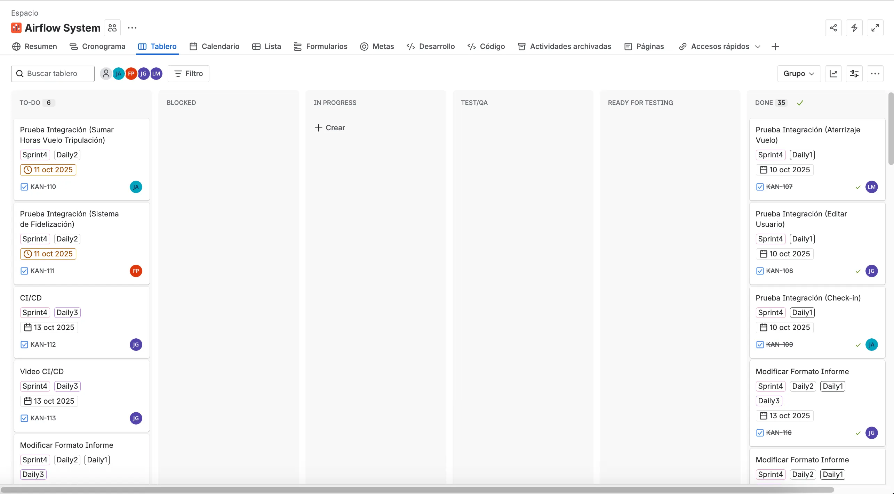

### José Leonel López Ajvix:

- **¿Qué hice el día de ayer?:** El día de ayer se dividió las tareas para este cuarto y último sprint.
- **¿Qué se hará el día de hoy?:** El día de hoy se trabajará la prueba de integración relacionado al check-in.
- **¿Hay algún impedimento?** Por el momento no, todo bien.

### Franklin Orlando Noj Perez:

- **¿Qué hice el día de ayer?: Participe en el sprint planning, ayude en la reparticion de tareas.**
- **¿Qué se hará el día de hoy?:** Hoy realizare la tarea de modificar el informe, agregando lo faltante de cada prueba que ya se hizo.
- **¿Hay algún impedimento? No tengo ningun problema para poder seguir avanzando.**

### José Manuel López Lemus:

- **¿Qué hice el día de ayer?:** Ayer fue el sprint plannig, nos dividimos las tareas para poder a comenzar a trabajr
- **¿Qué se hará el día de hoy?:** Hoy realizare la prueba de integración del aterrizaje y vuelo, siguiendo los lineamientos acordados
- **¿Hay algún impedimento?** No tengo ningún inconveniente en realizar la tarea

### José David Góngora Olmedo:

- **¿Qué hice el día de ayer?:** Como ayer realizamos el sprint planning, solo se asignaron tareas, asi que eso fue lo que hicimos.
- **¿Qué se hará el día de hoy?:** Hoy haré la prueba de integracion para editar el perfil de un usuario.
- **¿Hay algún impedimento?** No, todo bien

# Daily 2:

## Link de la Grabación:

https://drive.google.com/file/d/1lUYV09atW7P0gJ4-3IRXC8aYP3TtyXvl/view?usp=sharing

## Captura del Meet:

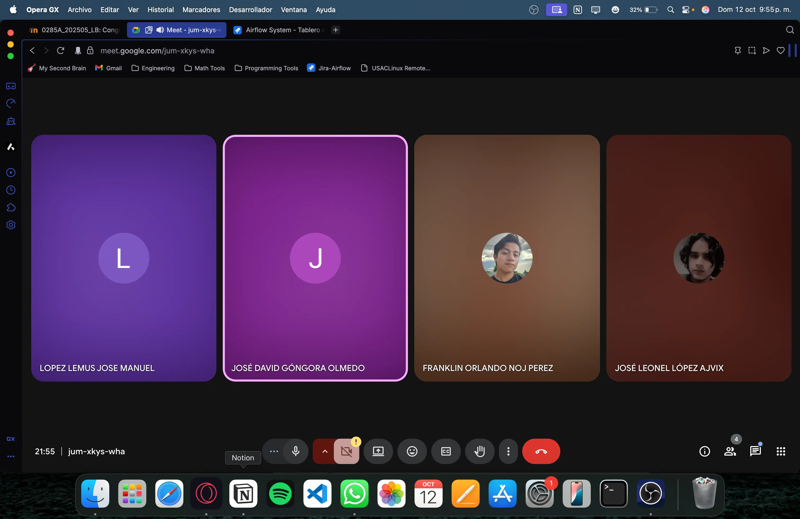

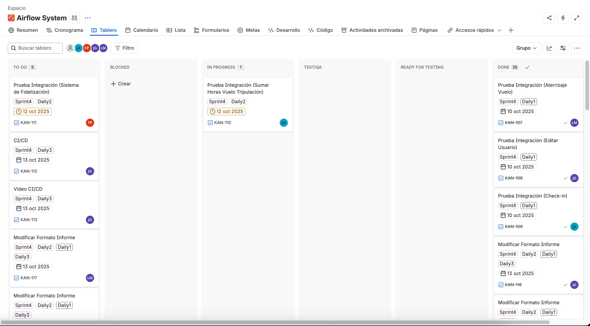

## Kanban Después del Daily:

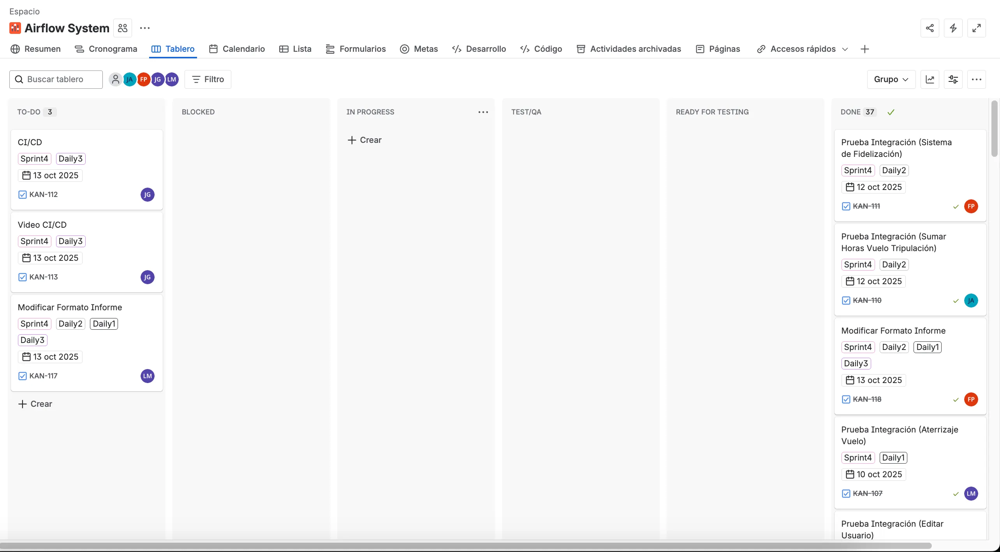

### José Manuel López Lemus:

- **¿Qué hice el día de ayer?:** Ayer realice la prueba de integración del aterrizaje y vuelo, totalmente funcional
- **¿Qué se hará el día de hoy?:** Hoy comenzare a realizar la modificación del formato del informe
- **¿Hay algún impedimento?** No tengo ningún impedimento para poder realizar mi tarea

### José Leonel López Ajvix:

- **¿Qué hice el día de ayer?:** El día de ayer se hizo la prueba de integración para Check-In
- **¿Qué se hará el día de hoy?:** El día de ayer se realizará la prueba de integración para sumar horas de vuelo a la tripulación
- **¿Hay algún impedimento?** Por el momento no, todo bien.

### Franklin Orlando Noj Perez

- **¿Qué hice el día de ayer?: Realice la modificacion del formato del Informe**
- **¿Qué se hará el día de hoy?: Crear la prueba de integracion de fidelizacion**
- **¿Hay algún impedimento?: Ninguno, puedo seguir avanzando.**

### José David Góngora Olmedo:

- **¿Qué hice el día de ayer?: Ayer hice la prueba de integración para el flujo de editar el perfil desde un usuario, eso fue lo que hice hoy y comprobé que las pruebas se ejecutan correctamente.**
- **¿Qué se hará el día de hoy?:** Ya que realmente no se me fue asignada ninguna tarea, pues estaré disponible por si necesitan mi ayuda, pero estare trabajando lo que son los casos de prueba, es decir cambiar los informes que ya teníamos de las pruebas realizadas al formato que nos compartió la auxiliar
- **¿Hay algún impedimento?** No, todo bien

# Daily 3:

## Link de la Grabación:

https://drive.google.com/file/d/1t01ElV-eRS66s7Xzt96E5wMpqsEuDD4_/view?usp=sharing

## Captura del Meet:

## Kanban Durante del Daily:

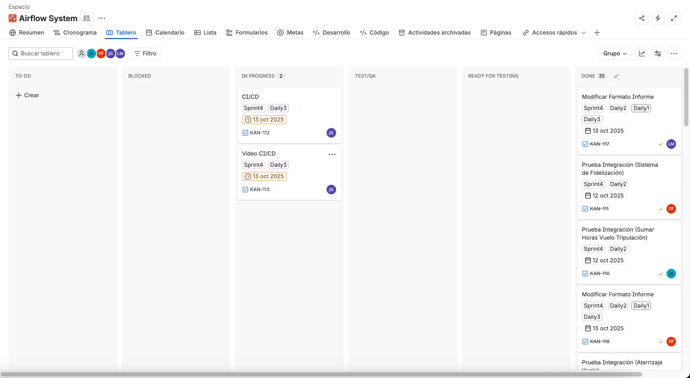

## Kanban Después del Daily:

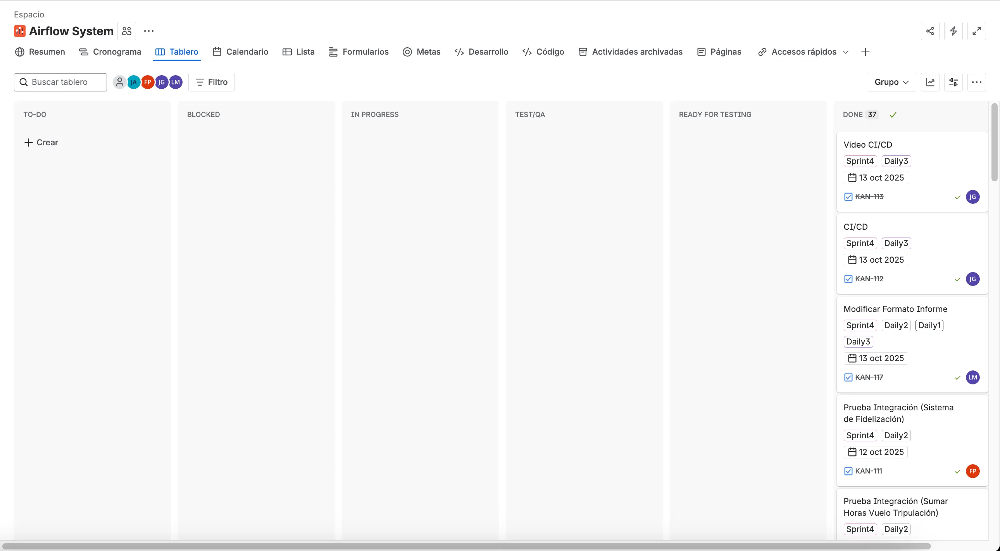

### José Manuel López Lemus:

- **¿Qué hice el día de ayer?:** Ayer comencé a realizar las modificaciones del formato del informe, y de una vez termine
- **¿Qué se hará el día de hoy?:** Para el día de hoy no tengo tareas asignadas, por lo que si alguien necesita ayuda o apoyo en alguna tarea me puede solicitar ayuda
- **¿Hay algún impedimento?** Por el momento no tengo ningún impedimento

### Franklin Orlando Noj Perez

- **¿Qué hice el día de ayer?: Realice la prueba de integracion de fidelizacion**
- **¿Qué se hará el día de hoy?: Mejorar la documentacion de las pruebas**
- **¿Hay algún impedimento?: Ninguno, puedo seguir avanzando.**

### José David Góngora Olmedo:

- **¿Qué hice el día de ayer?:** Ayer cambie el formato de los casos de prueba de las pruebas que hice en todo este sprint.
- **¿Qué se hará el día de hoy?:** Hoy hare la ultima tarea que tengo asignada en este sprint, que es grabar el video sobre CI/CD, eso es lo que estare haciendo.
- **¿Hay algún impedimento?** Pues tengo una duda con lo del video, pero la auxiliar no ha habilitado el foro de esta semana para hacerle la pregunta.

### José Leonel López Ajvix:

- **¿Qué hice el día de ayer?:** Ayer se hizo la prueba de integración de sumar horas de vuelo y funciona correctamente.
- **¿Qué se hará el día de hoy?:** Hoy no tengo ninguna tarea asignada, así que puedo apoyar sin problemas a mis compañeros.
- **¿Hay algún impedimento?** No, por el momento no tengo nada asignado.

# Sprint Retrospective:

## Captura del Meet:

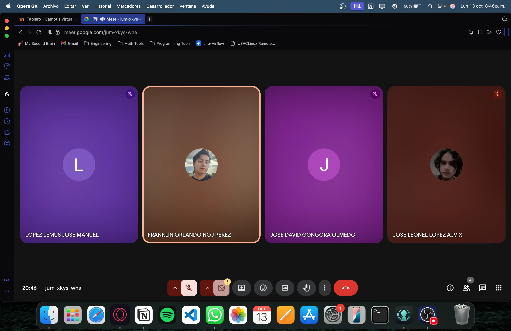

## Kanban al final del Sprint:

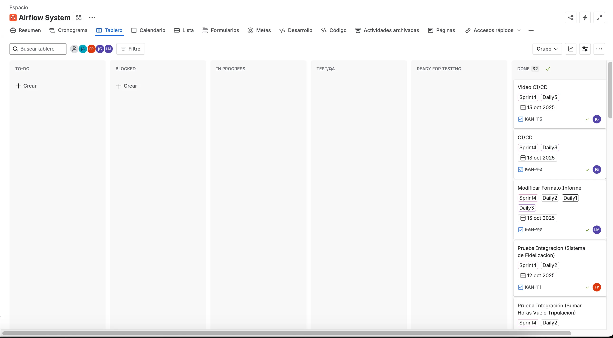

### José Manuel López Lemus:

- **¿Qué se hizo bien durante el Sprint?:** Durante este ultimo sprint, mejoramos bastante respecto a los sprints anteriores, las nuevas tecnologias y arquitecturas las supimos implementar de manera correcta y eficiente, y se demostraron en las pruebas que realizamos.
- **¿Qué se hizo mal durante el Sprint?:** No es que hayamos hecho algo mal como tal, pero si nos tardamos en estar investigando librerias para realizar por ejemplo las pruebas, y nos fuimos por las mas sencillas o basicas.
- **¿Qué mejoras se deben implementar para el próximo sprint?:** Para un proximo sprint algo que podriamos mejorar es salir de nuestra zona de confort y comenzar a explorar nuevas tecnologías más profesionales, aunque sea un reto el implementarlas correctamente debido a su complejidad

### Franklin Orlando Noj Perez:

- **¿Qué se hizo bien durante el Sprint?:** Durante este último sprint se logró mantener una arquitectura sólida y consistente. La integración entre los módulos fue exitosa y no se presentaron conflictos mayores. Además, la organización del código y la claridad en la asignación de responsabilidades facilitaron el avance del equipo.
- **¿Qué se hizo mal durante el Sprint?:** Se detectaron retrasos en algunas tareas relacionadas con módulos de alto procesamiento, lo que generó pequeños cuellos de botella. Además, se evidenció la falta de documentación técnica en ciertas partes del sistema, lo cual complicó la comprensión de algunos procesos para quienes no habían trabajado en ellos previamente.
- **¿Qué mejoras se deben implementar para el próximo sprint?:**En próximos proyectos sería recomendable optimizar las áreas con mayor carga operativa para mejorar el rendimiento general. También es importante fortalecer la documentación técnica desde etapas tempranas del desarrollo y añadir herramientas de seguimiento y monitoreo que permitan anticipar problemas antes de que impacten en el equipo o en producción.

### José David Góngora Olmedo:

- **¿Qué se hizo bien durante el Sprint?:** Durante este sprint final, la arquitectura mostró buena estabilidad y todos los módulos principales se integraron correctamente. La separación de responsabilidades y los patrones de diseño usados facilitaron cerrar las funcionalidades sin generar conflictos.
- **¿Qué se hizo mal durante el Sprint?** Todavía se notaron algunos cuellos de botella en los módulos que manejan más carga, y faltó algo más de documentación en ciertos servicios, lo que dificultó entender algunas interacciones rápidamente.
- **¿Qué mejoras se deben implementar para el próximo sprint?** Para futuros proyectos, sería útil optimizar los módulos más críticos, reforzar la documentación de servicios y endpoints, y dejar implementadas herramientas de monitoreo que faciliten detectar problemas antes de llegar a producción.

### José Leonel López Ajvix:

- **¿Qué se hizo bien durante el Sprint?:** Este Sprint logramos mejorar muchas cosas, desde probar la funcionalidad hasta las pruebas funcionales.
- **¿Qué se hizo mal durante el Sprint?:** Logramos mejorar muchos nuestros puntos débiles, no veo algo malo que se haya hecho
- **¿Qué mejoras se deben implementar para el próximo sprint?:** Creo que se podría seguir trabajando de la misma manera.

| ID | Story Points | Finalizado | Justificación |
| --- | --- | --- | --- |
| 1 | 5 | Sí |  |
| 2 | 5 | Sí |  |
| 3 | 8 | Sí |  |
| 4 | 5 | Sí |  |
| 5 | 5 | Sí |  |
| 6 | 3 | Sí |  |
| 7 | 2 | Sí |  |
| 8 | 3 | Sí |  |

**Total: 86 Story Points.**

