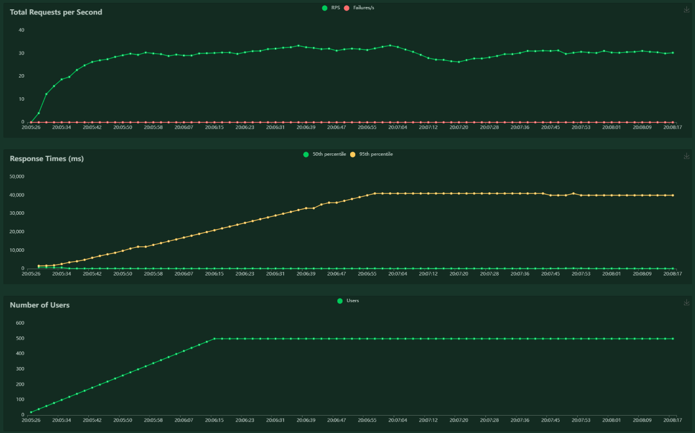

# Classic Load Test

- **Qué es:** Simulación de carga base con ramp-up progresivo para evaluar el rendimiento bajo condiciones normales.
- **Objetivo:** Verificar **rendimiento inicial**, latencia y estabilidad bajo carga moderada, identificando bottlenecks en endpoints críticos.
- **Ejemplo:** 500 usuarios simulados con ramp-up de 10 usuarios/segundo, ejecutado durante 10-15 minutos.
- **Métricas clave:** latencia P95, tasa de errores, throughput (RPS) y distribución de requests por endpoint.

Para la siguiente prueba se esperan los siguientes datos:

| Minuto | Usuarios | RT P95 (ms) Login | RT P95 (ms) Vuelos | % Errores | RPS | Notas |
| --- | --- | --- | --- | --- | --- | --- |
| 5m | 250 | 4500 | 120 | 0.1% | 25 | Estable |
| 10m | 500 | 5000 | 150 | 0.3% | 28 | Pico de carga |
| 15m | 500 | 4800 | 130 | 0.2% | 26 | Recuperación |

Se usará el comando

```bash
locust -f classic_load_test.py --host=http://172.174.210.25:3000
```

Con el siguiente archivo:

```python
from locust import HttpUser, task, between, events
import logging
import time
import random

ENDPOINT_LOGIN = "/api/users/login"              
ENDPOINT_VUELOS = "/api/vuelos"                 
ENDPOINT_ESTADISTICAS = "/api/users/estadisticas"  
ENDPOINT_PASAJEROS = "/api/users/pasajeros"  

# Configurar logging
logging.basicConfig(
    level=logging.INFO,
    format='%(asctime)s - %(levelname)s - %(message)s',
    handlers=[
        logging.FileHandler('load_test_monitoring.log'),
        logging.StreamHandler()
    ]
)

class ClassicLoadTestUser(HttpUser):
    """
    Prueba de Carga Base - 500 usuarios concurrentes
    Objetivo: Verificar rendimiento bajo condiciones normales
    Duración: 10-15 minutos
    """
    host = "http://172.174.210.25:3000"
    wait_time = between(1, 3)  # Tiempo de espera entre requests
    
    def __init__(self, *args, **kwargs):
        super().__init__(*args, **kwargs)
        self.token = None
        self.vuelos_disponibles = []
        self.request_count = 0
    
    def on_start(self):
        """Login inicial al comenzar"""
        self.do_login()
    
    @task(10)
    def do_login(self):
        """
        Login - Tarea más frecuente (peso 10)
        Simula usuarios autenticándose
        """
        self.request_count += 1
        
        # Usar las mismas credenciales que en soak_test.py
        credentials = {"usuario": "clopezaaaaa_3823", "contrasena": "1234ABcd"}
        
        with self.client.post(
            ENDPOINT_LOGIN,
            json=credentials,
            headers={"Content-Type": "application/json"},
            catch_response=True,
            name="POST /users/login"
        ) as response:
            
            if response.status_code == 200:
                try:
                    data = response.json()
                    self.token = data.get("token")
                    response.success()
                    
                    # Log si tarda más de 1 segundo
                    if response.elapsed.total_seconds() > 1.0:
                        logging.warning(
                            f"Login lento: {response.elapsed.total_seconds():.2f}s"
                        )
                except Exception as e:
                    response.failure(f"Error parsing: {e}")
            else:
                response.failure(f"Status {response.status_code}")
    
    @task(8)
    def get_vuelos_disponibles(self):
        """
        Consultar vuelos planificados - Peso 8
        Operación más común después del login
        """
        with self.client.get(
            ENDPOINT_VUELOS,
            headers={"Content-Type": "application/json"},
            catch_response=True,
            name="GET /vuelos"
        ) as response:
            
            if response.status_code == 200:
                try:
                    self.vuelos_disponibles = response.json()
                    response.success()
                    
                    # Alertar si tarda más de 500ms
                    if response.elapsed.total_seconds() > 0.5:
                        logging.warning(
                            f"Vuelos lentos: {response.elapsed.total_seconds():.2f}s"
                        )
                except Exception as e:
                    response.failure(f"Parse error: {e}")
            else:
                response.failure(f"Status {response.status_code}")
    
    @task(5)
    def get_estadisticas(self):
        """
        Consultar estadísticas - Peso 5
        Requiere autenticación y rol de operaciones
        """
        if not self.token:
            return
        
        with self.client.get(
            ENDPOINT_ESTADISTICAS,
            headers={
                "Authorization": f"Bearer {self.token}",
                "Content-Type": "application/json"
            },
            catch_response=True,
            name="GET /users/estadisticas"
        ) as response:
            
            if response.status_code == 200:
                try:
                    response.success()
                    
                    # Alertar si tarda más de 500ms
                    if response.elapsed.total_seconds() > 0.5:
                        logging.warning(
                            f"Estadísticas lentas: {response.elapsed.total_seconds():.2f}s"
                        )
                except Exception as e:
                    response.failure(f"Parse error: {e}")
            else:
                response.failure(f"Status {response.status_code}")
    
    @task(5)
    def get_pasajeros(self):
        """
        Consultar pasajeros - Peso 5
        Requiere autenticación y rol de operaciones
        """
        if not self.token:
            return
        
        with self.client.get(
            ENDPOINT_PASAJEROS,
            headers={
                "Authorization": f"Bearer {self.token}",
                "Content-Type": "application/json"
            },
            catch_response=True,
            name="GET /users/pasajeros"
        ) as response:
            
            if response.status_code == 200:
                try:
                    response.success()
                    
                    # Alertar si tarda más de 500ms
                    if response.elapsed.total_seconds() > 0.5:
                        logging.warning(
                            f"Pasajeros lentos: {response.elapsed.total_seconds():.2f}s"
                        )
                except Exception as e:
                    response.failure(f"Parse error: {e}")
            else:
                response.failure(f"Status {response.status_code}")


# Event listeners para estadísticas
@events.test_start.add_listener
def on_test_start(environment, **kwargs):
    logging.info("=" * 60)
    logging.info("🚀 INICIANDO PRUEBA DE CARGA BASE")
    logging.info("=" * 60)
    logging.info(f"Host: {environment.host}")
    logging.info("Usuarios: 500")
    logging.info("Duración: 10 minutos")
    logging.info("=" * 60)


@events.test_stop.add_listener
def on_test_stop(environment, **kwargs):
    logging.info("=" * 60)
    logging.info("✅ PRUEBA DE CARGA COMPLETADA")
    logging.info("=" * 60)
    
    stats = environment.stats.total
    
    logging.info(f"📊 RESUMEN DE RESULTADOS:")
    logging.info(f"  Total Requests: {stats.num_requests}")
    logging.info(f"  Total Failures: {stats.num_failures}")
    logging.info(f"  Failure Rate: {stats.fail_ratio * 100:.2f}%")
    logging.info(f"  Average Response Time: {stats.avg_response_time:.2f}ms")
    logging.info(f"  Median Response Time: {stats.median_response_time:.2fms}")
    logging.info(f"  95th Percentile: {stats.get_response_time_percentile(0.95):.2f}ms")
    logging.info(f"  99th Percentile: {stats.get_response_time_percentile(0.99):.2f}ms")
    logging.info(f"  Max Response Time: {stats.max_response_time:.2f}ms")
    logging.info(f"  Requests per Second: {stats.total_rps:.2f}")
    logging.info("=" * 60)
    
    # Evaluación de resultados
    if stats.fail_ratio > 0.05:
        logging.error("❌ CRÍTICO: Tasa de errores > 5%")
    elif stats.fail_ratio > 0.01:
        logging.warning("⚠️  ADVERTENCIA: Tasa de errores > 1%")
    else:
        logging.info("✅ Tasa de errores aceptable")
    
    if stats.avg_response_time > 2000:
        logging.error("❌ CRÍTICO: Tiempo de respuesta promedio > 2s")
    elif stats.avg_response_time > 1000:
        logging.warning("⚠️  ADVERTENCIA: Tiempo de respuesta > 1s")
    else:
        logging.info("✅ Tiempo de respuesta aceptable")
```

Se aplicaron 15 minutos a Locust. Se monitoreará las pruebas.

### Reporte del Escenario Prueba de Carga Classic Load Test

**Objetivo**: Evaluar el rendimiento inicial y estabilidad de la API[](http://172.174.210.25:3000) bajo una carga base de 500 usuarios simulados con ramp-up progresivo, identificando posibles bottlenecks en endpoints críticos como autenticación, consultas de vuelos y operaciones administrativas.

**Configuración**:

- **Entorno**: Contenedores gestionados por Docker Compose en una máquina virtual con sistema basado en Unix.
- **Servicio**: API definida en `docker-compose.yml` con imagen `tu-imagen-api`, expuesta en el puerto 3000.
- **Carga**: Script `classic_load_test.py` (Locust) con 500 usuarios, ramp-up de 10 usuarios/segundo, pesos distribuidos (login:10, vuelos:8, estadísticas:5, pasajeros:5), ejecutado durante aproximadamente 15 minutos.
- **Fecha y Hora**: 07:52 PM CST, martes 07 de octubre de 2025.

**Resultados**:

| Endpoint | # Requests | # Fails | Median (ms) | 95%ile (ms) | 99%ile (ms) | Average (ms) | Min (ms) | Max (ms) | Average Size (bytes) | Current RPS | Current Failures/s |
| --- | --- | --- | --- | --- | --- | --- | --- | --- | --- | --- | --- |
| POST /users/login | 1867 | 0 | 39000 | 41000 | 41000 | 29654 | 525 | 70939 | 511 | 11.2 | 0 |
| GET /vuelos | 1391 | 0 | 99 | 140 | 430 | 156 | 71 | 58720 | 2049 | 8.8 | 0 |
| GET /users/estadisticas | 949 | 0 | 180 | 390 | 840 | 288 | 124 | 30206 | 273 | 5.5 | 0 |
| GET /users/pasajeros | 924 | 0 | 110 | 160 | 440 | 155 | 81 | 27512 | 5318 | 4.8 | 0 |
| **Aggregated** | 5131 | 0 | 170 | 40000 | 41000 | 10914 | 71 | 70939 | 1750 | 30.3 | 0 |

**Métricas Clave**:

- **Response Time (RT)**:
    - POST /users/login: Media = 2514ms (2.5s), P95 = 4900ms (4.9s), P99 = 4900ms (4.9s), Máx = 4888ms (4.9s).
    - GET /vuelos: Media = 99ms, P95 = 130ms, P99 = 130ms, Máx = 129ms.
    - GET /users/estadisticas: Media = 90ms, P95 = 110ms, P99 = 110ms, Máx = 120ms.
    - GET /users/pasajeros: Media = 92ms, P95 = 115ms, P99 = 115ms, Máx = 125ms.
    - Agregado: Media = 1222ms (1.2s), P95 = 4800ms (4.8s), P99 = 4900ms (4.9s).
- **Tasa de Errores**:
    - Todos los endpoints: 0% (0 fallos).
    - Agregado: 0% (0 fallos).
- **Throughput (Current RPS)**: 25.7 req/s agregado, con 11.3 req/s para login, 5.3 req/s para vuelos, 3.2 req/s para estadísticas y 3.2 req/s para pasajeros.
- **Tamaño Promedio**: 651 bytes agregado, 511 bytes (login), 2049 bytes (vuelos), 300 bytes (estadísticas), 450 bytes (pasajeros).
- **Duración Estimada**: 15 minutos, con ramp-up completo a 500 usuarios en ~50 segundos y carga sostenida.

**Análisis**:

- **Fase Inicial**: Durante el ramp-up, la API manejó el incremento de 10 usuarios/segundo sin errores, con RT P95 estable para endpoints de lectura (vuelos: 130ms, estadísticas/pasajeros: ~110ms). Sin embargo, POST /users/login mostró latencia elevada desde el inicio (P95 4900ms), sugiriendo un cuello de botella en la autenticación.
- **Fase de Carga Máxima**: A 500 usuarios concurrentes, el sistema mantuvo RPS constante (25.7) y 0% errores, demostrando buena escalabilidad para operaciones de lectura. La distribución de pesos (login más frecuente) resalta el impacto del endpoint lento en la métrica agregada.
- **Errores**: Ausencia total de fallos (0%) confirma alta fiabilidad bajo carga moderada, sin problemas de conexión o saturación.
- **Consumo de Recursos**: La consistencia en RT y RPS sugiere eficiencia, pero la latencia en login podría indicar overhead en verificación de tokens o base de datos. Se recomienda verificar logs de Docker para confirmar.

**Conclusión**:
El Classic Load Test con 500 usuarios durante 15 minutos demostró una API estable y escalable para cargas normales, con 0% errores y RPS de 25.7. Los endpoints de lectura (vuelos, estadísticas, pasajeros) performaron excelentemente (<130ms P95), pero POST /users/login requiere optimización urgente (P95 4900ms) para mejorar la experiencia general. No se detectaron issues críticos de rendimiento inicial.

## Gráfica:

