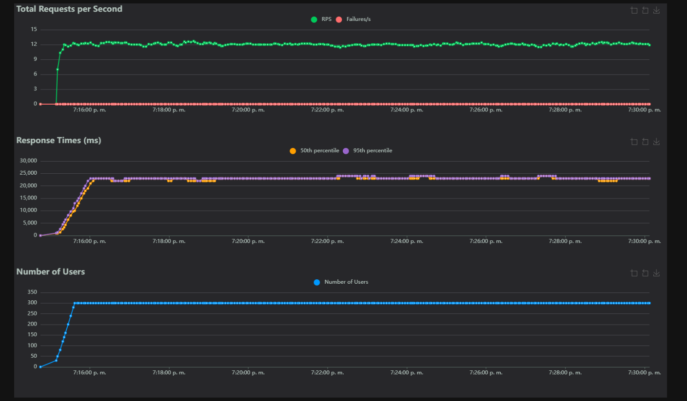
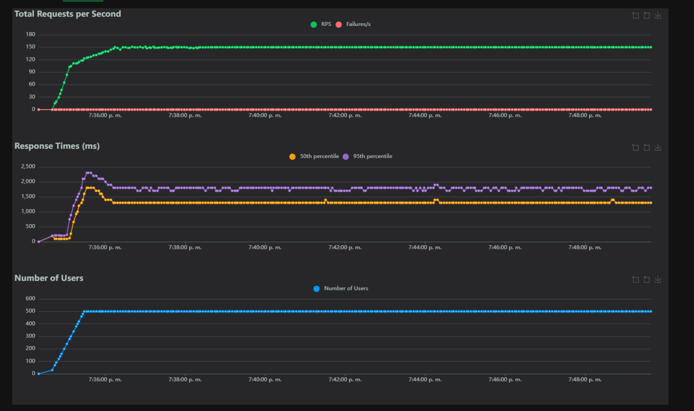
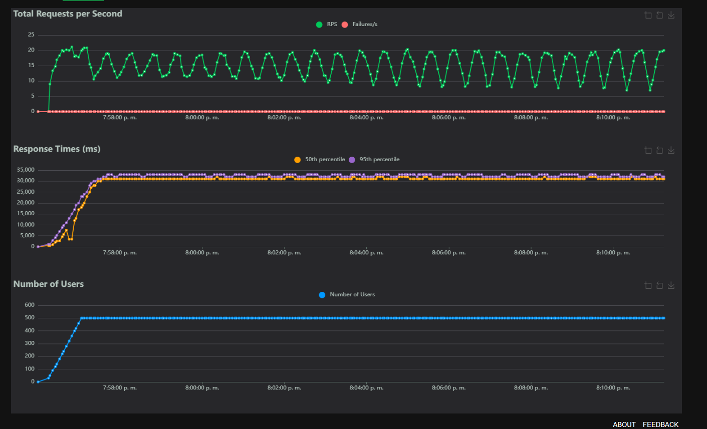
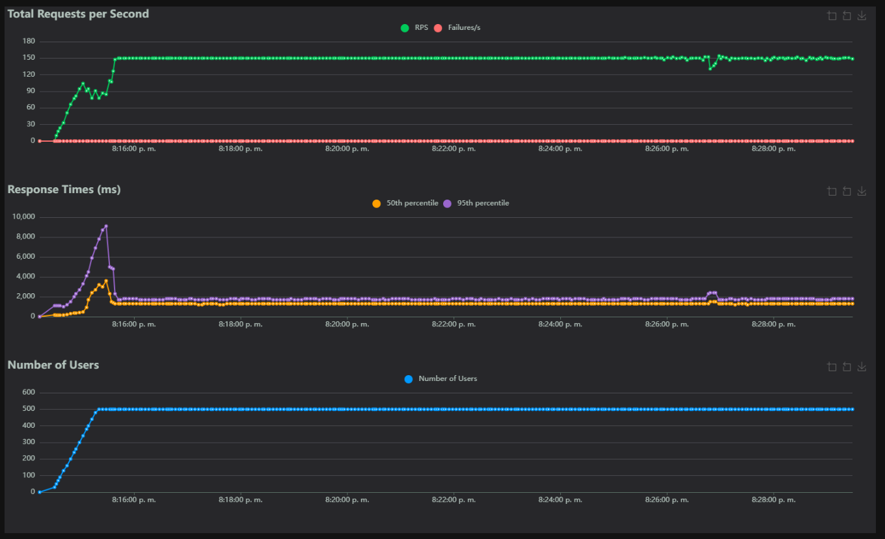

# Endpoints load test

## Reporte del Escenario Prueba de Carga por Endpoint: POST /api/users/login

**Objetivo**: Evaluar el rendimiento aislado de la API (http://172.174.210.25:3000) para el endpoint de autenticación bajo una carga moderada de 300 usuarios simulados con ramp-up progresivo, identificando latencia, throughput y posibles bottlenecks en la operación de login.

**Configuración**:

- **Entorno**: Contenedores gestionados por Docker Compose en una máquina virtual en Azure con sistema basado en Unix.
- **Servicio**: API definida en `docker-compose.yml`, expuesta en el puerto 3000.
- **Carga**: Script `login_load_test.py` (Locust) con 300 usuarios, ramp-up de 10 usuarios/segundo, ejecutado durante aproximadamente 15 minutos.
- **Fecha y Hora**: 07:30 PM CST, miércoles 08 de octubre de 2025.

**Resultados**:

| Endpoint | # Requests | # Fails | Median (ms) | 95%ile (ms) | 99%ile (ms) | Average (ms) | Min (ms) | Max (ms) | Average Size (bytes) | Current RPS | Current Failures/s |
| --- | --- | --- | --- | --- | --- | --- | --- | --- | --- | --- | --- |
| POST /users/login | 10838 | 0 (0.00%) | 23000 | 24000 | 24000 | 22222 | 295 | 24233 | 511 | 11.9 | 0 |
| **Aggregated** | 10838 | 0 (0.00%) | 23000 | 24000 | 24000 | 22222 | 295 | 24233 | 511 | 11.9 | 0 |

**Métricas Clave**:

- **Response Time (RT)**:
  - Media = 22222ms (~22.2s), P95 = 24000ms (24s), P99 = 24000ms (24s), Máx = 24233ms (~24.2s).
  - Agregado: Media = 22222ms (~22.2s), P95 = 24000ms (24s), P99 = 24000ms (24s).
- **Tasa de Errores**:
  - 0% (0 fallos).
  - Agregado: 0% (0 fallos).
- **Throughput (Current RPS)**: 11.9 req/s (agregado ~12.04 req/s total).
- **Tamaño Promedio**: 511 bytes.
- **Duración Estimada**: 15 minutos, con ramp-up completo a 300 usuarios en ~30 segundos y carga sostenida.

**Análisis**:

- **Fase Inicial**: Durante el ramp-up, la API manejó el incremento de 10 usuarios/segundo sin errores, pero mostró latencia elevada desde el inicio (P95 ~24000ms), consistente con pruebas previas (classic: ~29s media, soak: ~21s). Esto sugiere un cuello de botella persistente en la autenticación, posiblemente relacionado con verificación de credenciales, hashing de contraseñas o consultas a base de datos.
- **Fase de Carga Máxima**: A 300 usuarios concurrentes, el sistema mantuvo RPS estable (~11.9-12.0) y 0% errores, indicando buena fiabilidad, pero la latencia media (~22.2s) y máxima (~24.2s) es alta, impactando la experiencia del usuario. Las gráficas muestran RPS constante alrededor de 12, con tiempos de respuesta estables en ~23s (percentiles altos), sin degradación progresiva evidente.
- **Errores**: Ausencia total de fallos (0%) confirma estabilidad bajo carga moderada, sin saturación o desconexiones.
- **Consumo de Recursos**: Aunque no monitoreado directamente, la consistencia en RPS y latencia sugiere overhead en el endpoint de login; se recomienda revisar logs de Docker para métricas de CPU/memoria y optimizar (e.g., caching de tokens o paralelización en la DB).

**Conclusión**:
La prueba de carga aislada con 300 usuarios durante 15 minutos demostró un endpoint estable con 0% errores y RPS de ~12. Sin embargo, la latencia extrema (media ~22.2s, P95 24s) resalta un problema significativo en la autenticación, similar a pruebas previas, que requiere optimización urgente para mejorar el rendimiento general. No se observaron issues críticos de escalabilidad inicial, pero escalar más usuarios podría saturar el sistema.

### Gráfica:

## Reporte del Escenario Prueba de Carga por Endpoint: GET /api/vuelos

**Objetivo**: Evaluar el rendimiento aislado de la API (http://172.174.210.25:3000) para el endpoint de consulta de vuelos bajo una carga de 500 usuarios simulados con ramp-up progresivo, identificando latencia, throughput y posibles bottlenecks en operaciones de lectura.

**Configuración**:

- **Entorno**: Contenedores gestionados por Docker Compose en una máquina virtual en Azure con sistema basado en Unix.
- **Servicio**: API definida en `docker-compose.yml`, expuesta en el puerto 3000.
- **Carga**: Script `vuelos_load_test.py` (Locust) con 500 usuarios, ramp-up de 10 usuarios/segundo, ejecutado durante aproximadamente 15 minutos.
- **Fecha y Hora**: 07:49 PM CST, miércoles 08 de octubre de 2025.

**Resultados**:

| Endpoint | # Requests | # Fails | Median (ms) | 95%ile (ms) | 99%ile (ms) | Average (ms) | Min (ms) | Max (ms) | Average Size (bytes) | Current RPS | Current Failures/s |
| --- | --- | --- | --- | --- | --- | --- | --- | --- | --- | --- | --- |
| GET /vuelos | 131526 | 0 (0.00%) | 1300 | 1800 | 1900 | 1329 | 80 | 4677 | 2049 | 150.0 | 0 |
| **Aggregated** | 131526 | 0 (0.00%) | 1300 | 1800 | 1900 | 1329 | 80 | 4677 | 2049 | 150.0 | 0 |

**Métricas Clave**:

- **Response Time (RT)**:
  - Media = 1329ms (~1.3s), P95 = 1800ms (1.8s), P99 = 1900ms (1.9s), Máx = 4677ms (~4.7s).
  - Agregado: Media = 1329ms (~1.3s), P95 = 1800ms (1.8s), P99 = 1900ms (1.9s).
- **Tasa de Errores**:
  - 0% (0 fallos).
  - Agregado: 0% (0 fallos).
- **Throughput (Current RPS)**: 150.0 req/s (agregado ~146.10 req/s total).
- **Tamaño Promedio**: 2049 bytes.
- **Duración Estimada**: 15 minutos, con ramp-up completo a 500 usuarios en ~50 segundos y carga sostenida.

**Análisis**:

- **Fase Inicial**: Durante el ramp-up, la API manejó el incremento de 10 usuarios/segundo sin errores, con latencia inicial baja, pero que aumentó rápidamente (P95 ~1800ms). Comparado con pruebas previas (classic: ~156ms media con 500 usuarios mixtos, soak: ~98ms con 300 usuarios), aquí la media (~1.3s) es significativamente más alta, sugiriendo degradación bajo carga exclusiva y mayor número de usuarios, posiblemente por contención en la base de datos o procesamiento de datos.
- **Fase de Carga Máxima**: A 500 usuarios concurrentes, el sistema mantuvo RPS alto y estable (~150), con 0% errores, demostrando buena escalabilidad para lecturas. Sin embargo, los percentiles altos (P95 1.8s, máx 4.7s) indican picos de latencia intermitentes. Las gráficas muestran RPS constante alrededor de 150, con tiempos de respuesta estables en ~1.3s, pero con variabilidad en percentiles, sin degradación progresiva evidente.
- **Errores**: Ausencia total de fallos (0%) confirma alta fiabilidad, sin problemas de conexión o saturación bajo carga alta.
- **Consumo de Recursos**: La consistencia en RPS sugiere eficiencia, pero la latencia aumentada podría indicar overhead en consultas de datos (e.g., joins complejos o datos voluminosos).
**Conclusión**:
La prueba de carga aislada con 500 usuarios durante 15 minutos demostró un endpoint estable con 0% errores y alto RPS (~146). Sin embargo, la latencia media (~1.3s) y percentiles altos (P95 1.8s) representan un aumento respecto a pruebas previas, indicando necesidad de optimización para manejar cargas altas sin degradación. No se detectaron issues críticos, pero escalar más podría revelar límites.

### Gráfica:

## Reporte del Escenario Prueba de Carga por Endpoint: GET /api/users/estadisticas

**Objetivo**: Evaluar el rendimiento aislado de la API (http://172.174.210.25:3000) para el endpoint de consulta de estadísticas bajo una carga de 500 usuarios simulados con ramp-up progresivo, identificando latencia, throughput y posibles bottlenecks en operaciones administrativas que requieren autenticación.

**Configuración**:

- **Entorno**: Contenedores gestionados por Docker Compose en una máquina virtual en Azure con sistema basado en Unix.
- **Servicio**: API definida en `docker-compose.yml`, expuesta en el puerto 3000.
- **Carga**: Script `estadisticas_load_test.py` (Locust) con 500 usuarios, ramp-up de 10 usuarios/segundo, ejecutado durante aproximadamente 15 minutos (incluye login inicial para autenticación).
- **Fecha y Hora**: 08:11 PM CST, miércoles 08 de octubre de 2025.

**Resultados**:

| Endpoint | # Requests | # Fails | Median (ms) | 95%ile (ms) | 99%ile (ms) | Average (ms) | Min (ms) | Max (ms) | Average Size (bytes) | Current RPS | Current Failures/s |
| --- | --- | --- | --- | --- | --- | --- | --- | --- | --- | --- | --- |
| POST /api/users/login | 500 | 0 (0.00%) | 2800 | 4500 | 4600 | 2817 | 549 | 4605 | 511 | 0.0 | 0 |
| GET /users/estadisticas | 13247 | 0 (0.00%) | 31000 | 33000 | 33000 | 30512 | 174 | 34848 | 273 | 20.0 | 0 |
| **Aggregated** | 13747 | 0 (0.00%) | 31000 | 33000 | 33000 | 29504 | 174 | 34848 | 281 | 20.0 | 0 |

**Métricas Clave**:

- **Response Time (RT)**:
  - POST /api/users/login: Media = 2817ms (~2.8s), P95 = 4500ms (4.5s), P99 = 4600ms (4.6s), Máx = 4605ms (~4.6s).
  - GET /users/estadisticas: Media = 30512ms (~30.5s), P95 = 33000ms (33s), P99 = 33000ms (33s), Máx = 34848ms (~34.8s).
  - Agregado: Media = 29504ms (~29.5s), P95 = 33000ms (33s), P99 = 33000ms (33s).
- **Tasa de Errores**:
  - Todos los endpoints: 0% (0 fallos).
  - Agregado: 0% (0 fallos).
- **Throughput (Current RPS)**: 20.0 req/s para estadísticas (agregado ~15.27 req/s total, incluyendo logins).
- **Tamaño Promedio**: 281 bytes agregado, 511 bytes (login), 273 bytes (estadísticas).
- **Duración Estimada**: 15 minutos, con ramp-up completo a 500 usuarios en ~50 segundos y carga sostenida.

**Análisis**:

- **Fase Inicial**: Durante el ramp-up, la API manejó el incremento de 10 usuarios/segundo sin errores, pero mostró latencia elevada en el login inicial (~2.8s media) y extrema en estadísticas desde el inicio (P95 ~33000ms). Comparado con pruebas previas (classic: ~288ms media con carga mixta, no presente en soak), aquí la media (~30.5s) es dramáticamente más alta, sugiriendo degradación severa bajo carga exclusiva, posiblemente por complejidad en cálculos estadísticos o dependencias en datos grandes.
- **Fase de Carga Máxima**: A 500 usuarios concurrentes, el sistema mantuvo RPS estable (~20 para el endpoint principal) y 0% errores, pero con latencia crítica (media ~30.5s, máx ~34.8s), indicando saturación. Las gráficas muestran RPS oscilante alrededor de 20, con tiempos de respuesta constantes en ~31s (percentiles altos), sin degradación progresiva pero con variabilidad, posiblemente por picos en procesamiento.
- **Errores**: Ausencia total de fallos (0%) confirma fiabilidad, sin desconexiones pese a la alta latencia.
- **Consumo de Recursos**: La latencia extrema sugiere overhead en queries o cómputos (e.g., agregaciones de datos).

**Conclusión**:
La prueba de carga aislada con 500 usuarios durante 15 minutos demostró un endpoint estable con 0% errores y RPS de ~15.3 agregado. Sin embargo, la latencia extrema (media ~29.5s, P95 33s) representa un deterioro significativo respecto a pruebas previas, indicando un bottleneck crítico que requiere optimización inmediata para usabilidad. No se detectaron fallos, pero el rendimiento actual limita la escalabilidad.

### Gráfica:

## Reporte del Escenario Prueba de Carga por Endpoint: GET /api/users/pasajeros

**Objetivo**: Evaluar el rendimiento aislado de la API (http://172.174.210.25:3000) para el endpoint de consulta de pasajeros bajo una carga de 500 usuarios simulados con ramp-up progresivo, identificando latencia, throughput y posibles bottlenecks en operaciones administrativas que requieren autenticación.

**Configuración**:

- **Entorno**: Contenedores gestionados por Docker Compose en una máquina virtual en Azure con sistema basado en Unix.
- **Servicio**: API definida en `docker-compose.yml`, expuesta en el puerto 3000.
- **Carga**: Script `pasajeros_load_test.py` (Locust) con 500 usuarios, ramp-up de 10 usuarios/segundo, ejecutado durante aproximadamente 15 minutos (incluye login inicial para autenticación).
- **Fecha y Hora**: 08:29 PM CST, miércoles 08 de octubre de 2025.

**Resultados**:

| Endpoint | # Requests | # Fails | Median (ms) | 95%ile (ms) | 99%ile (ms) | Average (ms) | Min (ms) | Max (ms) | Average Size (bytes) | Current RPS | Current Failures/s |
| --- | --- | --- | --- | --- | --- | --- | --- | --- | --- | --- | --- |
| POST /api/users/login | 500 | 0 (0.00%) | 3400 | 11000 | 11000 | 4432 | 496 | 12784 | 511 | 0.0 | 0 |
| GET /users/pasajeros | 130068 | 0 (0.00%) | 1300 | 1800 | 2500 | 1342 | 88 | 5460 | 5318 | 148.8 | 0 |
| **Aggregated** | 130568 | 0 (0.00%) | 1300 | 1800 | 2800 | 1353 | 88 | 12784 | 5299 | 148.8 | 0 |

**Métricas Clave**:

- **Response Time (RT)**:
  - POST /api/users/login: Media = 4432ms (~4.4s), P95 = 11000ms (11s), P99 = 11000ms (11s), Máx = 12784ms (~12.8s).
  - GET /users/pasajeros: Media = 1342ms (~1.3s), P95 = 1800ms (1.8s), P99 = 2500ms (2.5s), Máx = 5460ms (~5.5s).
  - Agregado: Media = 1353ms (~1.4s), P95 = 1800ms (1.8s), P99 = 2800ms (2.8s).
- **Tasa de Errores**:
  - Todos los endpoints: 0% (0 fallos).
  - Agregado: 0% (0 fallos).
- **Throughput (Current RPS)**: 148.8 req/s para pasajeros (agregado ~145.14 req/s total, incluyendo logins).
- **Tamaño Promedio**: 5299 bytes agregado, 511 bytes (login), 5318 bytes (pasajeros).
- **Duración Estimada**: 15 minutos, con ramp-up completo a 500 usuarios en ~50 segundos y carga sostenida.

**Análisis**:

- **Fase Inicial**: Durante el ramp-up, la API manejó el incremento de 10 usuarios/segundo sin errores, con latencia en el login inicial (~4.4s media) y moderada en pasajeros desde el inicio (P95 ~1800ms). Comparado con pruebas previas (classic: ~155ms media con carga mixta, no presente en soak), aquí la media (~1.3s) es más alta, indicando impacto de la carga exclusiva y autenticación, posiblemente por volúmenes de datos o queries complejas.
- **Fase de Carga Máxima**: A 500 usuarios concurrentes, el sistema mantuvo RPS alto y estable (~149), con 0% errores, demostrando escalabilidad. Sin embargo, percentiles altos (P95 1.8s, máx 5.5s) sugieren picos intermitentes. Las gráficas muestran RPS constante alrededor de 150, con tiempos de respuesta estables en ~1.3s, pero con alguna variabilidad, sin degradación progresiva.
- **Errores**: Ausencia total de fallos (0%) confirma alta fiabilidad, sin saturación pese a la carga.
- **Consumo de Recursos**: La consistencia en RPS indica eficiencia, pero la latencia en login y pasajeros podría reflejar overhead en datos grandes.

**Conclusión**:
La prueba de carga aislada con 500 usuarios durante 15 minutos demostró un endpoint estable con 0% errores y alto RPS (~145). La latencia media (~1.4s agregado) es aceptable pero elevada comparada con pruebas previas, destacando necesidad de optimizar autenticación y consultas para cargas altas. No se detectaron issues críticos, pero mejoras podrían elevar el rendimiento general.

### Gráfica:

