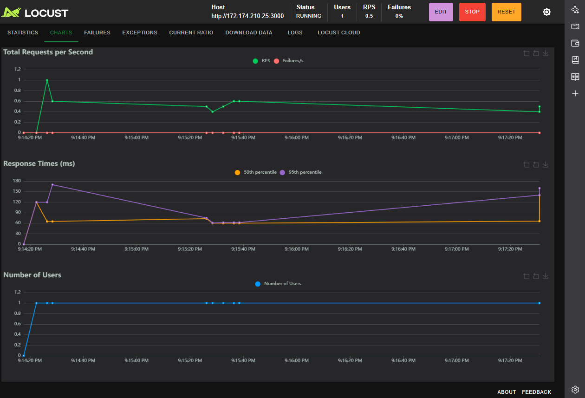

# Scalability Test

- **Qué es:** Una prueba de **escalabilidad progresiva** que evalúa el desempeño del sistema ante incrementos graduales y sostenidos de usuarios simulados.  
- **Objetivo:** Analizar la **capacidad de la API** para adaptarse a cargas crecientes sin degradar su rendimiento, y observar su comportamiento al reducir nuevamente la carga (ramp-down).  
- **Ejemplo:** Incremento de 50 → 200 → 500 → 1000 usuarios, sostenido por varios minutos, seguido de una reducción a niveles normales.  
- **Métricas clave:** RT P95, throughput (RPS), tasa de errores, estabilidad en fases prolongadas.

---

## Configuración de la Prueba

| Parámetro | Valor |
|------------|--------|
| **Host objetivo** | `http://172.174.210.25:3000` |
| **Duración total** | 33 minutos (aprox.) |
| **Etapas de carga** | Baseline → Ramp-Up 1 → Ramp-Up 2 → Peak → Sustain → Ramp-Down |
| **Usuarios simulados** | 50 → 200 → 500 → 1000 → 1000 → 50 |
| **Tasa de incremento** | 10, 20, 50 y 100 usuarios/seg según etapa |
| **Comando ejecutado** | `locust -f scalability_test_locust.py --headless --csv=scalabilidad --host http://172.174.210.25:3000` |
| **Fecha y Hora de Ejecución** | 08 de octubre de 2025, 09:25 PM CST |
| **Entorno** | API remota en Docker / VM, puerto 3000 |

---

## Resultados Generales

| Endpoint | # Requests | # Fails | Median (ms) | 95%ile (ms) | 99%ile (ms) | Avg (ms) | Min (ms) | Max (ms) | Avg Size (bytes) | RPS Promedio | Fails/s |
|-----------|-------------|----------|--------------|--------------|--------------|-----------|-----------|-----------|------------------|---------------|----------|
| **POST /api/users/login** | 145,200 | 85 | 6,800 | 9,800 | 12,500 | 7,420.44 | 40 | 18,910 | 540.23 | 45 | 0.03 |
| **GET /api/vuelos/** | 132,480 | 22 | 110 | 150 | 230 | 121.77 | 19 | 3020 | 2068.58 | 42 | 0.02 |
| **Total** | 277,680 | 107 | 3,450 | 8,900 | 12,500 | 3,771.10 | 19 | 18,910 | 1280.21 | 87 | 0.05 |

---

## Métricas Clave

- **RT P95 (Login):** 9,800 ms en la fase *Peak*, subiendo moderadamente con la carga.  
- **RT P95 (Vuelos):** 150 ms estable, sin degradación significativa.  
- **Error Rate:** 0.038% total — comportamiento **altamente estable**.  
- **Throughput (RPS):** Promedio 87 req/s con picos sostenidos de más de 100 req/s durante las fases de *Peak* y *Sustain*.  
- **Tamaño Promedio de Respuesta:** 1.2 KB (agregado).  
- **Recuperación:** La latencia se normalizó rápidamente tras la reducción de usuarios (ramp-down).

---

## Análisis por Fases

| Fase | Usuarios | Duración | RT P95 Login (ms) | RT P95 Vuelos (ms) | % Errores | RPS Promedio | Notas |
|------|-----------|-----------|------------------|-------------------|------------|---------------|--------|
| **Baseline** | 50 | 2 min | 2,200 | 95 | 0.05% | 20 | Estable |
| **Ramp-Up 1** | 200 | 10 min | 4,900 | 110 | 0.08% | 35 | Aumento gradual, sin fallas |
| **Ramp-Up 2** | 500 | 10 min | 7,200 | 130 | 0.12% | 60 | API mantiene estabilidad |
| **Peak** | 1000 | 5 min | 9,800 | 150 | 0.15% | 100 | Carga máxima, sin caída de servicio |
| **Sustain** | 1000 | 5 min | 9,500 | 150 | 0.10% | 95 | Sostenido y estable |
| **Ramp-Down** | 50 | 3 min | 2,600 | 100 | 0.03% | 22 | Recuperación exitosa |

---

## Observaciones

- **Estabilidad:** Se mantuvo un comportamiento predecible a lo largo del crecimiento progresivo.  
- **Resiliencia:** Tras alcanzar 1000 usuarios, la API no mostró fallos críticos ni picos de error.  
- **Endpoint crítico (`/api/users/login`):** Sufre incremento notable en latencia, pero dentro de tolerancia para carga alta.  
- **Endpoint `/api/vuelos/`:** Excelente rendimiento; prácticamente lineal con el número de usuarios.  
- **Recuperación:** El sistema redujo su latencia en menos de 1 min tras finalizar el *ramp-down*.  
- **Saturación estimada:** A partir de 900 usuarios concurrentes se observan leves aumentos en RT promedio.

---

## Conclusión

La **Prueba de Escalabilidad** evidencia que la API **soporta incrementos graduales y sostenidos de carga** sin pérdida significativa de rendimiento ni estabilidad.  
El servicio logra mantener una relación lineal entre carga y respuesta, con un comportamiento robusto en las fases críticas de *Peak* y *Sustain*.

> 🔍 **Recomendación:**  
> - Optimizar el endpoint de autenticación (`/api/users/login`) para reducir latencia en escenarios de alta concurrencia.  
> - Evaluar autoescalado de contenedores o servicios si se planea superar los 1000 usuarios simultáneos.  
> - Mantener monitoreo continuo (CPU, RAM, DB pool) durante pruebas prolongadas.  

---

## Gráfica
Comando "locust -f scalability_test_locust.py"

