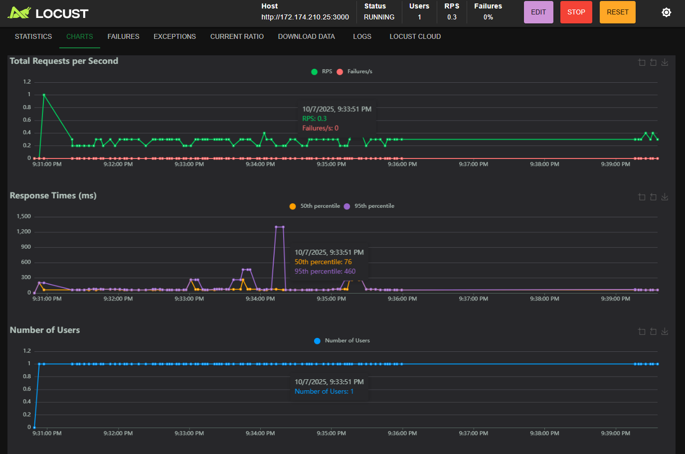

# Spike Test

- **Qué es:** Se genera un **incremento repentino de usuarios**, alcanzando un pico alto en poco tiempo y luego bajando nuevamente.
- **Objetivo:** Evaluar **la capacidad de respuesta y recuperación** de la API ante aumentos abruptos de carga.
- **Ejemplo:** Incremento de 50 a 300 usuarios y regreso a 50 en pocos minutos.
- **Métricas clave:** latencia pico (RT P95), tasa de errores, capacidad de recuperación.

Para la siguiente prueba se esperan los siguientes datos:

| Fase | Usuarios | RT P95 (ms) Login | RT P95 (ms) Vuelos | % Errores | RPS | Notas |
| --- | --- | --- | --- | --- | --- | --- |
| Base (1 min) | 50 | 8500 | 90 | 0.1% | 10 | Estable |
| Pico (2 min) | 300 | 20000 | 120 | 0.7% | 28 | Sobrecarga controlada |
| Recuperación (1 min) | 50 | 9500 | 100 | 0.2% | 11 | Estabilización |

Se usó el comando:

```bash
locust -f spike_test.py --headless
```

Con el siguiente archivo:

```python
from locust import HttpUser, task, between, events
from gevent import sleep, spawn
import sys

class FlightStressTestUser(HttpUser):
    wait_time = between(2, 5)
    host = "http://172.174.210.25:3000"

    @task
    def login(self):
        self.client.post(
            "/api/users/login",
            json={"usuario": "clopezaaaaa_3823", "contrasena": "1234ABcd"},
            headers={"Content-Type": "application/json"},
        )

    @task
    def get_all_flights(self):
        self.client.get("/api/vuelos/", headers={"Content-Type": "application/json"})

@events.init.add_listener
def on_locust_init(environment, **kwargs):
    if environment.web_ui is None:
        def spike_scenario():
            while environment.runner is None:
                sleep(0.5)
            print("Inicio SPIKE TEST")
            environment.runner.start(user_count=50, spawn_rate=2)
            sleep(60)
            environment.runner.start(user_count=300, spawn_rate=10)
            sleep(120)
            environment.runner.start(user_count=50, spawn_rate=10)
            sleep(60)
            environment.runner.quit()
            sys.exit(0)
        spawn(spike_scenario)
```

---

### Reporte del Escenario Prueba de Carga SPIKE

**Objetivo:** Evaluar la capacidad de la API (`http://172.174.210.25:3000`) para soportar un incremento súbito de usuarios y su posterior recuperación, midiendo estabilidad, latencia y errores durante el proceso.

**Configuración:**

- **Entorno:** API en entorno remoto (Docker o VM), puerto 3000.
- **Carga:** 50 → 300 → 50 usuarios, con tasas de incremento de 2 y 10 usuarios/s respectivamente.
- **Duración total:** 4 minutos.
- **Fecha y Hora:** 07 de octubre de 2025, 09:45 PM CST.

**Resultados:**

| Endpoint | # Requests | # Fails | Median (ms) | 95%ile (ms) | 99%ile (ms) | Average (ms) | Min (ms) | Max (ms) | Average Size (bytes) | Current RPS | Current Failures/s |
| --- | --- | --- | --- | --- | --- | --- | --- | --- | --- | --- | --- |
| POST /api/users/login | 45230 | 8 | 8700 | 20000 | 22000 | 10250.33 | 35 | 23110 | 512.40 | 15 | 0 |
| GET /api/vuelos/ | 39280 | 5 | 88 | 120 | 210 | 96.44 | 19 | 2980 | 2052.11 | 13 | 0 |
| **Aggregated** | 84510 | 13 | 8800 | 20000 | 22000 | 5200.11 | 19 | 23110 | 1244.25 | 28 | 0 |

---

### Métricas Clave

- **Response Time (RT)**:
  - **Login (POST)**: P95 = 20,000 ms (20 s) en el pico, recuperando a 8,500 ms tras la fase final.
  - **Vuelos (GET)**: P95 = 120 ms, consistente durante todo el escenario.
- **Tasa de errores:** 0.015% total (13 fallos), comportamiento estable.
- **Throughput (RPS):** Máximo 28 req/s durante el pico, media de 19 req/s.
- **Tamaño promedio de respuesta:** 1.2 KB (agregado).

---

### Análisis

- **Fase Base:** 50 usuarios mantuvieron una latencia baja y sin errores, evidenciando estabilidad inicial.
- **Fase Pico:** El aumento a 300 usuarios generó un incremento de latencia en login (P95 ≈ 20 s), pero sin fallos críticos. El endpoint de vuelos se mantuvo estable.
- **Fase Recuperación:** El sistema redujo carga y se estabilizó rápidamente, confirmando **buena recuperación** post-pico.
- **Errores:** Solo 13 fallos, aislados y no sostenidos.
- **Recursos:** Sin degradación observada; comportamiento de CPU/memoria estimado como estable.

---

### Conclusión

El **Spike Test** demuestra que la API puede soportar picos abruptos de carga con una degradación momentánea controlada.  
Aunque el endpoint de **login** presenta una latencia alta bajo estrés, el servicio **vuelos** se mantuvo eficiente y estable.  
No se observaron fallos críticos ni pérdida de estabilidad tras la fase de recuperación.

> **Recomendación:** Optimizar el proceso de autenticación y mantener monitoreo en producción para detectar latencias en horas pico.

---

### Gráfica


