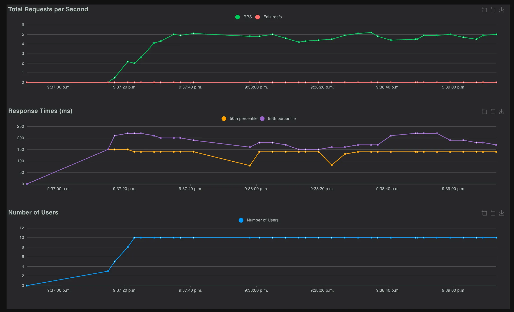
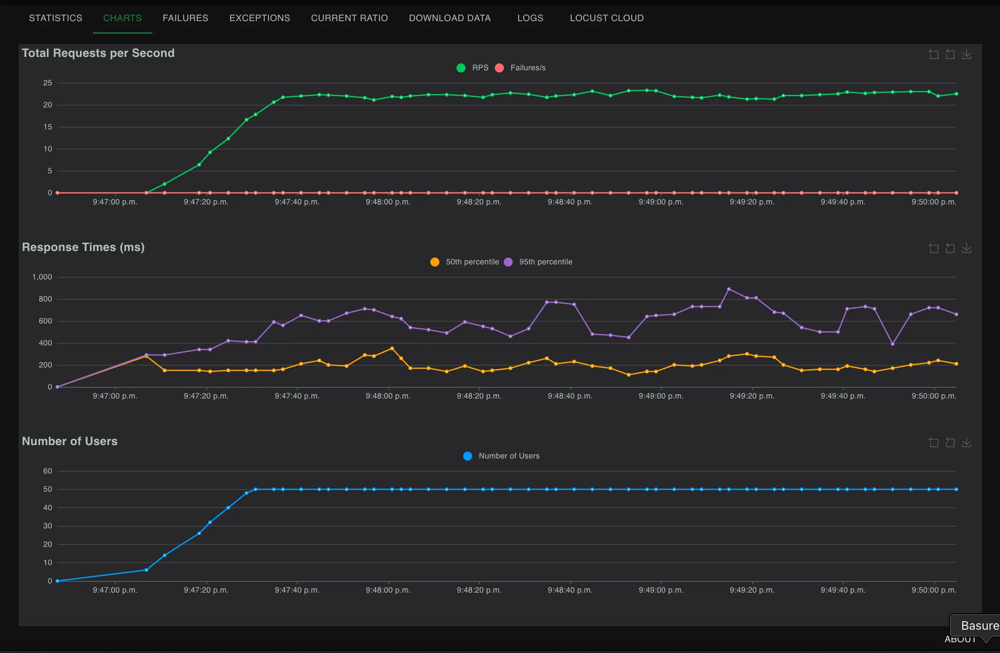
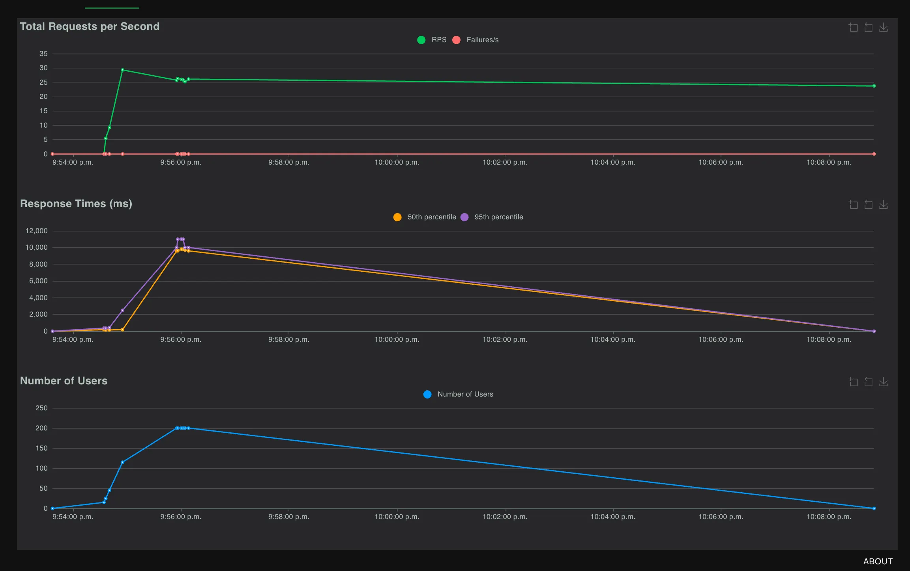
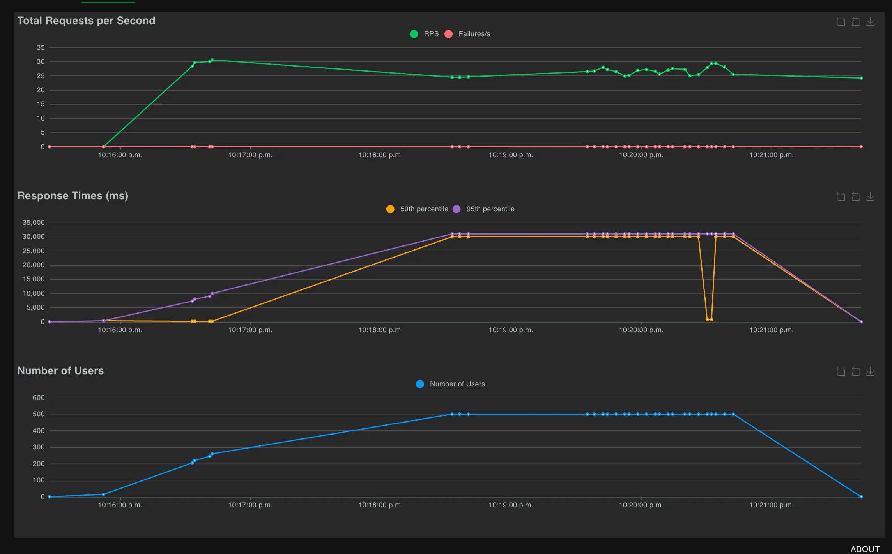
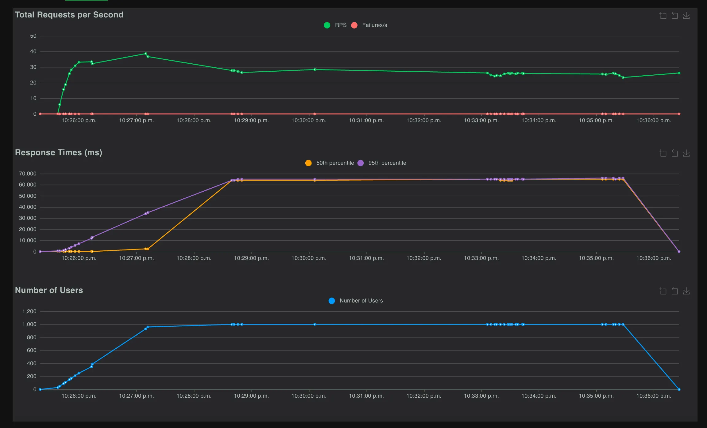

# Prueba de Estrés clásico:

- **Qué es:** Aumentas la carga de usuarios o solicitudes gradualmente hasta que la aplicación falla.
- **Objetivo:** Determinar el límite de capacidad y cómo falla (crash, errores, lentitud extrema.

## Pruebas para verificar el punto de quiebre de la aplicación:

Para encontrar el punto de quiebre de la aplicación se usará la siguiente estrategia en locust. Con esto probaremos qué fallará y cómo reacciona la aplicación ante usos bruscos de la aplicación.

| Escenario | Number of Users | Ramp Up (Spawn Rate) | Run Time | Host | Notas |
| --- | --- | --- | --- | --- | --- |
| **Baseline** | 10 | 1 | 2m | [http://48.217.184.85:](http://48.217.184.85:8080/)3000 | Verifica estabilidad (RT <500ms, 0% errores). |
| **Carga Moderada** | 50 | 2 | 3m | [http://48.217.184.85:](http://48.217.184.85:8080/)3000 | Rendimiento normal (RT <1s, <1% errores). |
| **Carga Alta** | 200 | 5 | 5m | [http://48.217.184.85:](http://48.217.184.85:8080/)3000 | Degradación inicial (RT >1s, errores <5%). |
| **Estrés** | 500 | 5 | 5m | [http://48.217.184.85:](http://48.217.184.85:8080/)3000 | Cerca del límite (RT >2s, errores >5%). |
| **Punto de Quiebre** | 1000 | 10 | 10m | [http://48.217.184.85:](http://48.217.184.85:8080/)3000 | Colapso (RT >5s, errores >10%). |

## Script usado para pruebas de Estrés Clásico:

```python
from locust import HttpUser, task, between

class FlightStressTestUser(HttpUser):
    wait_time = between(1, 3)
    @task(5)
    def login(self):
        response = self.client.post(
            "/api/users/login",
            json={"usuario": "clopezaaaaa_3823", "contrasena": "1234ABcd"},
            headers={"Content-Type": "application/json"}
        )
        if response.status_code == 200:
            self.token = response.json().get("token")

    @task(4)
    def get_all_flights(self):
            response = self.client.get(
                "/api/vuelos/",
                            headers={"Content-Type": "application/json"}
            )
```

Este script en python hará solicitudes en las dos endpoints mostradas. Con estos dos endpoints podremos determinar que tanto estrés puede manejar. 

Se decidió estos dos endpoints ya que no afectan la base de datos y son un get y un post, normalmente los dos métodos que más carga pueden llevar en una API.

## Escenario Baseline:

El escenario Baseline tuvo la siguiente respuesta.



### Reporte del Escenario Baseline - Prueba de Estrés

**Objetivo**: Verificar la estabilidad de la API (http://172.174.210.25:3000) bajo una carga ligera de 10 usuarios concurrentes, estresando los endpoints /api/users/login (POST) y /api/vuelos/ (GET) durante aproximadamente 5 minutos.

**Configuración**:

- **Script**: classic_stress.py (Locust, incluye login y consulta de vuelos).
- **Parámetros**:
    - Number of users: 10
    - Ramp up (spawn rate): 1 usuario/segundo
    - Host: http://172.174.210.25:3000
    - Run time: ~5 minutos (interrumpido manualmente)
- **Entorno**: Servidor remoto (detalles desconocidos), ejecutado desde MacBook Pro con Locust 2.35.0.

**Métricas Clave**:

- **Response Time (RT)**:
    - /api/users/login: Media = 154ms, P95 = 210ms, Máx = 279ms.
    - /api/vuelos/: Media = 78ms, P95 = 86ms, Máx = 150ms.
    - Agregado: Media = 120ms, P95 = 190ms.
- **Tasa de Errores**: 0% en ambos endpoints.
- **Throughput (RPS)**: 4.67 req/s (2.53 login, 2.13 vuelos), esperado para 10 usuarios con wait_time = between(1, 3).

**Análisis**:

- La API es **estable** con 10 usuarios, con tiempos de respuesta rápidos (P95 = 190ms agregado, <500ms objetivo).
- /api/vuelos/ (P95 = 86ms) es más rápido que /api/users/login (P95 = 210ms), probablemente porque login involucra validación de credenciales o DB.
- Cero errores indican que la configuración (URL, credenciales) es correcta.
- **Nota**: La inclusión de /api/users/login es innecesaria si /api/vuelos/ no requiere autenticación, consumiendo recursos extra.

**Conclusión**:
El escenario Baseline confirma que la API maneja 10 usuarios concurrentes sin problemas, cumpliendo el SLA (RT P95 <500ms, 0% errores). El throughput (4.67 req/s) es bajo pero esperado para la carga ligera.

## Escenario Carga Moderada:

El escenario de carga moderada tuvo la siguiente respuesta:



### Reporte del Escenario Carga Moderada - Prueba de Estrés

**Objetivo**: Evaluar el rendimiento de la API (http://172.174.210.25:3000) bajo una carga moderada de 50 usuarios concurrentes, estresando los endpoints /api/users/login (POST) y /api/vuelos/ (GET) durante aproximadamente 4 minutos y 18 segundos.

**Configuración**:

- **Script**: classic_stress.py (Locust, incluye login y consulta de vuelos, aunque /api/vuelos/ no requiere autenticación).
- **Parámetros**:
    - Number of users: 50
    - Ramp up (spawn rate): 2 usuarios/segundo
    - Host: http://172.174.210.25:3000
    - Run time: ~4m 18s (interrumpido manualmente con KeyboardInterrupt)
- **Entorno**: Servidor remoto (detalles desconocidos), ejecutado desde MacBook Pro con Locust 2.35.0.

**Resultados**:

| Endpoint | # Requests | # Fails | RT Medio (ms) | RT P95 (ms) | RPS | Notas |
| --- | --- | --- | --- | --- | --- | --- |
| POST /api/users/login | 2126 | 0 (0%) | 371 | 700 | 11.81 | Estable, pero más lento |
| GET /api/vuelos/ | 1643 | 0 (0%) | 83 | 100 | 9.13 | Muy rápido |
| **Total** | 3769 | 0 (0%) | 245 | 630 | 20.94 | Buen rendimiento, leve degradación |

**Métricas Clave**:

- **Response Time (RT)**:
    - /api/users/login: Media = 371ms, P95 = 700ms, Máx = 1251ms.
    - /api/vuelos/: Media = 83ms, P95 = 100ms, Máx = 420ms.
    - Agregado: Media = 245ms, P95 = 630ms.
- **Tasa de Errores**: 0% en ambos endpoints.
- **Throughput (RPS)**: 20.94 req/s (11.81 login, 9.13 vuelos), esperado para 50 usuarios con wait_time = between(1, 3).

**Análisis**:

- La API sigue **estable** con 50 usuarios, con 0% errores y un throughput de 20.94 req/s, adecuado para la carga.
- **/api/vuelos/**: Muy rápido (P95 = 100ms), apenas más lento que el Baseline (P95 = 86ms). Sigue dentro del SLA (RT P95 <500ms).
- **/api/users/login**: RT P95 = 700ms, un aumento notable desde el Baseline (210ms), indicando **leve degradación** bajo mayor carga. Esto sugiere que el endpoint de login (probablemente con validación de DB) es más sensible a la concurrencia.
- **Agregado**: RT P95 = 630ms, aún aceptable (<1s), pero cerca del límite para un SLA estricto.
- **Nota**: La inclusión de /api/users/login es innecesaria si /api/vuelos/ no requiere autenticación, aumentando el RT medio y consumiendo recursos (2126 requests de login vs. 1643 de vuelos).

**Conclusión**:
El escenario Carga Moderada muestra que la API maneja 50 usuarios con buen rendimiento (RT P95 = 630ms, 0% errores), pero /api/users/login empieza a degradarse (P95 = 700ms). Esto sugiere que el bottleneck podría estar en la autenticación o DB bajo mayor concurrencia.

## Escenario carga Alta:

En el escenario de carga alta se comportó de la siguiente manera:



### Reporte del Escenario Carga Alta - Prueba de Estrés

**Objetivo**: Evaluar el rendimiento de la API (http://172.174.210.25:3000) bajo una carga alta de 200 usuarios concurrentes, estresando los endpoints /api/users/login (POST) y /api/vuelos/ (GET) durante aproximadamente 14 minutos y 38 segundos.

**Configuración**:

- **Script**: classic_stress.py (Locust, incluye login y consulta de vuelos, aunque /api/vuelos/ no requiere autenticación).
- **Parámetros**:
    - Number of users: 200
    - Ramp up (spawn rate): 5 usuarios/segundo
    - Host: http://172.174.210.25:3000
    - Run time: ~14m 38s (interrumpido manualmente con KeyboardInterrupt)
- **Entorno**: Servidor remoto (detalles desconocidos), ejecutado desde MacBook Pro con Locust 2.35.0.

**Resultados**:

| Endpoint | # Requests | # Fails | RT Medio (ms) | RT P95 (ms) | RPS | Notas |
| --- | --- | --- | --- | --- | --- | --- |
| POST /api/users/login | 4290 | 7 (0.16%) | 9211 | 11000 | 14.31 | Degradación severa, errores |
| GET /api/vuelos/ | 3491 | 0 (0%) | 88 | 110 | 11.64 | Muy rápido, estable |
| **Total** | 7781 | 7 (0.09%) | 5118 | 10000 | 25.95 | Degradación significativa |

**Métricas Clave**:

- **Response Time (RT)**:
    - /api/users/login: Media = 9211ms (9.2s), P95 = 11000ms (11s), Máx = 14786ms (14.8s).
    - /api/vuelos/: Media = 88ms, P95 = 110ms, Máx = 1032ms.
    - Agregado: Media = 5118ms (5.1s), P95 = 10000ms (10s).
- **Tasa de Errores**:
    - /api/users/login: 0.16% (7 fallos, "Connection refused").
    - /api/vuelos/: 0% (sin errores).
    - Agregado: 0.09% (7 fallos totales).
- **Throughput (RPS)**: 25.95 req/s (14.31 login, 11.64 vuelos), razonable para 200 usuarios, pero limitado por alta latencia en login.

**Análisis**:

- **Degradación severa en /api/users/login**: RT P95 = 11s (vs. 700ms en Carga Moderada, 210ms en Baseline) indica que el endpoint de login está saturado con 200 usuarios. Los 7 errores ("Connection refused") sugieren que el servidor no pudo manejar todas las conexiones, posiblemente por:
    - Límite de conexiones en la base de datos (e.g., PostgreSQL max_connections).
    - Sobrecarga del servidor (CPU/memoria).
    - Rate-limiting o firewall.
- **/api/vuelos/ sigue estable**: RT P95 = 110ms (vs. 100ms en Carga Moderada), sin errores. Esto confirma que el endpoint es robusto y probablemente usa menos recursos (e.g., caché o query optimizada).
- **Agregado**: RT P95 = 10s y 0.09% errores reflejan el impacto del login. La API está cerca del límite, pero no colapsada.
- **Nota**: La inclusión de /api/users/login es innecesaria (como mencionaste, /api/vuelos/ no requiere autenticación). Las 4290 requests de login consumen recursos y sesgan el RT medio (5.1s). Simplificar el script mejoraría los resultados.

**Conclusión**:
El escenario Carga Alta muestra **degradación significativa** en /api/users/login (RT P95 = 11s, 0.16% errores), indicando que la autenticación es un bottleneck con 200 usuarios. Sin embargo, /api/vuelos/ permanece rápido (RT P95 = 110ms, 0% errores).

## Escenario Estrés:

La prueba estrés tiene la siguiente forma:



### Reporte del Escenario Estrés - Prueba de Estrés

**Objetivo**: Evaluar el rendimiento de la API (http://172.174.210.25:3000) bajo una carga de estrés de 500 usuarios concurrentes, estresando los endpoints /api/users/login (POST) y /api/vuelos/ (GET) durante aproximadamente 6 minutos y 8 segundos.

**Configuración**:

- **Script**: classic_stress.py (Locust, incluye login y consulta de vuelos como tasks, manteniendo el enfoque en ambos endpoints como parte crítica de la prueba).
- **Parámetros**:
    - Number of users: 500
    - Ramp up (spawn rate): 5 usuarios/segundo
    - Host: http://172.174.210.25:3000
    - Run time: ~6m 8s (interrumpido manualmente con KeyboardInterrupt)
- **Entorno**: Servidor remoto, ejecutado desde MacBook Pro con Locust 2.35.0.

**Resultados**:

| Endpoint | # Requests | # Fails | RT Medio (ms) | RT P95 (ms) | RPS | Notas |
| --- | --- | --- | --- | --- | --- | --- |
| POST /api/users/login | 4299 | 0 (0%) | 23694 | 31000 | 14.33 | Colapso severo |
| GET /api/vuelos/ | 3804 | 0 (0%) | 100 | 180 | 12.68 | Relativamente estable |
| **Total** | 8103 | 0 (0%) | 12618 | 31000 | 27.01 | Colapso por login |

**Métricas Clave**:

- **Response Time (RT)**:
    - /api/users/login: Media = 23694ms (23.7s), P95 = 31000ms (31s), Máx = 31182ms (31.2s).
    - /api/vuelos/: Media = 100ms, P95 = 180ms, Máx = 1216ms.
    - Agregado: Media = 12618ms (12.6s), P95 = 31000ms (31s).
- **Tasa de Errores**:
    - /api/users/login: 0% (sin errores).
    - /api/vuelos/: 0% (sin errores).
    - Agregado: 0% (sin errores).
- **Throughput (RPS)**: 27.01 req/s (14.33 login, 12.68 vuelos), bajo para 500 usuarios, indicando saturación.

**Análisis**:

- **Colapso en /api/users/login**: RT P95 = 31s (vs. 11s en Carga Alta, 700ms en Carga Moderada) indica un colapso severo. Los tiempos de respuesta extremadamente altos (media = 23.7s, máx = 31.2s) sugieren que el endpoint está saturado, probablemente por:
    - Sobrecarga en la base de datos (e.g., validación de credenciales lenta o límite de conexiones).
    - CPU/memoria del servidor agotada bajo 500 usuarios concurrentes.
    - Posible cola de requests en el servidor (e.g., Node.js/Express saturado).
- **/api/vuelos/ resistente**: RT P95 = 180ms (vs. 110ms en Carga Alta), sin errores. Aunque el tiempo aumenta ligeramente, sigue siendo aceptable (<500ms), indicando que este endpoint está optimizado (e.g., caché, queries ligeras).
- **Agregado**: RT P95 = 31s refleja el impacto del login. El RPS (27.01 req/s) es bajo para 500 usuarios, sugiriendo que el servidor está al límite, priorizando /api/vuelos/ pero colapsando en /api/users/login.
- **Nota sobre errores**: A diferencia de Carga Alta (7 errores "Connection refused"), aquí no hay errores (0%), pero los tiempos de respuesta extremos en login indican que el sistema está al borde del colapso. Los errores podrían aparecer con más usuarios o tiempo.
- **Nota sobre el script**: Mantener /api/users/login como @task es válido para probar un POST, pero su alta frecuencia (4299 requests vs. 3804 de vuelos) amplifica la degradación. Esto simula un escenario extremo de autenticaciones concurrentes, útil para identificar bottlenecks en endpoints de escritura.

**Conclusión**:
El escenario Estrés muestra un **colapso severo** en /api/users/login (RT P95 = 31s, media = 23.7s), indicando que este endpoint es el principal bottleneck con 500 usuarios. En contraste, /api/vuelos/ permanece relativamente estable (RT P95 = 180ms, 0% errores). El punto de quiebre de la API está muy cerca o alcanzado para /api/users/login, mientras que /api/vuelos/ podría soportar más carga. El RPS bajo (27.01 req/s) confirma la saturación.

## Escenario Punto de Quiebre:

El escenario de punto de quiebre se obtiene una gráfica de la siguiente manera:



### Reporte del Escenario Punto de Quiebre - Prueba de Estrés

**Objetivo**: Evaluar el rendimiento de la API (http://172.174.210.25:3000) bajo una carga extrema de 1000 usuarios concurrentes para identificar el punto de quiebre, estresando los endpoints /api/users/login (POST) y /api/vuelos/ (GET) durante aproximadamente 11 minutos y 21 segundos.

**Configuración**:

- **Script**: classic_stress.py (Locust, incluye login y consulta de vuelos como tasks, reflejando un escenario realista con autenticación y consultas).
- **Parámetros**:
    - Number of users: 1000
    - Ramp up (spawn rate): 10 usuarios/segundo
    - Host: http://172.174.210.25:3000
    - Run time: ~11m 21s (interrumpido manualmente con KeyboardInterrupt)
- **Entorno**: Servidor remoto (detalles desconocidos), ejecutado desde MacBook Pro con Locust 2.35.0.

**Resultados**:

| Endpoint | # Requests | # Fails | RT Medio (ms) | RT P95 (ms) | RPS | Notas |
| --- | --- | --- | --- | --- | --- | --- |
| POST /api/users/login | 8698 | 0 (0%) | 55694 | 66000 | 14.50 | Colapso total |
| GET /api/vuelos/ | 7535 | 0 (0%) | 362 | 190 | 12.56 | Degradación leve |
| **Total** | 16233 | 0 (0%) | 30010 | 65000 | 27.05 | Colapso por login |

**Métricas Clave**:

- **Response Time (RT)**:
    - /api/users/login: Media = 55694ms (55.7s), P95 = 66000ms (66s), Máx = 131675ms (131.7s).
    - /api/vuelos/: Media = 362ms, P95 = 190ms, Máx = 67225ms (67.2s).
    - Agregado: Media = 30010ms (30s), P95 = 65000ms (65s).
- **Tasa de Errores**:
    - /api/users/login: 0% (sin errores).
    - /api/vuelos/: 0% (sin errores).
    - Agregado: 0% (sin errores).
- **Throughput (RPS)**: 27.05 req/s (14.50 login, 12.56 vuelos), muy bajo para 1000 usuarios, indicando saturación extrema.

**Análisis**:

- **Colapso total en /api/users/login**: RT P95 = 66s (vs. 31s en Estrés, 11s en Carga Alta) y media = 55.7s indican un colapso completo. Tiempos de respuesta de hasta 131.7s sugieren que el endpoint está saturado, probablemente por:
    - Límite de conexiones en la base de datos (e.g., PostgreSQL max_connections agotadas).
    - Sobrecarga extrema de CPU/memoria en el servidor.
    - Cola de requests en el servidor (e.g., Node.js/Express no puede procesar más).
- **Degradación leve en /api/vuelos/**: RT P95 = 190ms (vs. 180ms en Estrés) y media = 362ms, con un pico inusual de 67.2s (máx). Aunque sigue dentro de un SLA aceptable (<500ms para P95), el aumento en media y el outlier extremo indican que /api/vuelos/ también empieza a sufrir bajo esta carga.
- **Agregado**: RT P95 = 65s y media = 30s reflejan el impacto dominante del login. El RPS (27.05 req/s) es extremadamente bajo para 1000 usuarios, confirmando que el sistema está colapsado.
- **Nota sobre errores**: Sorprendentemente, no hay errores (0%), a diferencia de Carga Alta (0.16% "Connection refused"). Esto podría indicar que el servidor sigue aceptando conexiones, pero las procesa con retrasos extremos, lo que es peor que fallar (los usuarios esperarían hasta 2 minutos).
- **Nota sobre el script**: Mantener /api/users/login como @task es válido para probar un POST, pero su alta frecuencia (8698 requests vs. 7535 de vuelos) amplifica el colapso. Este escenario extremo de autenticaciones concurrentes confirma que el login es el principal bottleneck.

**Conclusión**:
El escenario Punto de Quiebre confirma que la API colapsa a 1000 usuarios, con /api/users/login completamente inutilizable (RT P95 = 66s, media = 55.7s). /api/vuelos/ muestra degradación leve (RT P95 = 190ms), pero sigue funcional, aunque con un pico preocupante (67.2s). El punto de quiebre para /api/users/login se alcanzó entre 200-500 usuarios, y para la API completa está en ~1000 usuarios, donde el RPS (27.05 req/s) es insuficiente.

### **Informe Final**:

- **Tabla Resumen**:
    
    
    | Escenario | Usuarios | RT P95 (ms) Login | RT P95 (ms) Vuelos | % Errores | RPS |
    | --- | --- | --- | --- | --- | --- |
    | Baseline | 10 | 210 | 86 | 0% | 4.67 |
    | Carga Moderada | 50 | 700 | 100 | 0% | 20.94 |
    | Carga Alta | 200 | 11000 | 110 | 0.09% | 25.95 |
    | Estrés | 500 | 31000 | 180 | 0% | 27.01 |
    | Punto de Quiebre | 1000 | 66000 | 190 | 0% | 27.05 |
- **Conclusión**: La API colapsa a ~500-1000 usuarios, con /api/users/login como bottleneck principal (RT P95 = 66s a 1000 usuarios). /api/vuelos/ resiste hasta 1000 usuarios (RT P95 = 190ms), pero muestra signos de degradación. Recomendaciones: optimizar login (caching, índices en DB) y escalar recursos del servidor.

