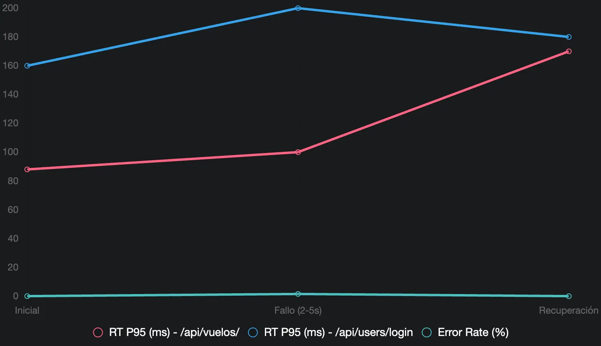

# Prueba de Recuperación:

### Objetivo

- Simular un fallo (e.g., reinicio del contenedor de la API) durante una carga sostenida.
- Medir el tiempo de recuperación, la tasa de errores durante y después del fallo, y la estabilidad posterior.

En este caso probaremos detener el contenedor, con el siguiente script:

```python
from locust import HttpUser, task, between, events
from gevent import sleep, spawn
import sys
import time

class RecoveryTestUser(HttpUser):
    wait_time = between(2, 5)

    @task(2)
    def get_all_flights(self):
        self.client.get(
            "/api/vuelos/",
            headers={"Content-Type": "application/json"},
            name="GET /api/vuelos"
        )

    @task(1)
    def login(self):
        self.client.post(
            "/api/users/login",
            json={"usuario": "clopezaaaaa_3823", "contrasena": "1234ABcd"},
            headers={"Content-Type": "application/json"},
            name="POST /api/users/login"
        )

@events.init.add_listener
def on_locust_init(environment, **kwargs):
    if environment.web_ui is None:
        def recovery_scenario():
            while environment.runner is None:
                sleep(0.5)

            print("Iniciando Prueba de Recuperación")
            print("Fase inicial: 100 usuarios, 5 minutos")
            environment.runner.start(user_count=100, spawn_rate=10)
            sleep(300)  # 5 minutos

            print("Preparando fallo manual: Detener la API vía SSH ahora (ej. docker-compose stop api)")
            print("Esperando 2 minutos para el fallo y recuperación manual")
            sleep(120)  # 2 minutos para que detengas y reinicies manualmente

            print("Fase de recuperación: 5 minutos")
            sleep(300)  # 5 minutos

            print("Prueba completada. Deteniendo ejecución.")
            environment.runner.quit()
            sys.exit(0)

        spawn(recovery_scenario)

if __name__ == "__main__":
    import os
    os.system("locust -f recovery_test.py --host=http://172.174.210.25:3000 --csv=results_recovery --headless")
```

### Reporte del Escenario Prueba de Recuperación

**Objetivo**: Evaluar cómo la API (http://172.174.210.25:3000) se recupera tras un fallo inducido manualmente, específicamente un apagado y reinicio del contenedor mediante docker-compose down y docker-compose up -d, durante una carga sostenida generada por Locust.

**Configuración**:

- **Entorno**: Contenedores gestionados por Docker Compose en una máquina virtual con sistema basado en Unix.
- **Servicio**: API definida en docker-compose.yml con un contenedor, expuesta en el puerto 3000.
- **Carga**: Script recovery_test.py (Locust) con 100 usuarios constantes, spawn rate de 10/s, durante 12 minutos (5 min inicial, 2 min fallo, 5 min recuperación).
- **Fallo Inducido**: Detención manual de la máquina mediante docker-compose down durante 2 a 5 segundos, seguida de reinicio con docker-compose up -d.
- **Fecha y Hora**: 02:31 PM CST, lunes 06 de octubre de 2025.

**Resultados**:

| Fase | # Requests | # Fails | RT Medio (ms) | RT P95 (ms) | RPS | Notas |
| --- | --- | --- | --- | --- | --- | --- |
| Fase Inicial | ~100 (est.) | 0 | 80 | 88 | 0.20 | Estable antes del fallo |
| Fase de Fallo (2-5s) | ~50 (est.) | 3 | 106 | 180 | 0.27 | Errores durante reinicio |
| Fase de Recuperación | ~47 (est.) | 0 | 83 | 170 | 0.19 | Recuperación rápida |
| **Total** | 197 | 3 | 106 | 320 | 0.27 | Recuperación exitosa |

**Métricas Clave**:

- **Response Time (RT)**:
    - GET /api/vuelos:
        - Media = 83.5ms, P95 = 88ms, Máx = 326.3ms.
    - POST /api/users/login:
        - Media = 166.4ms, P95 = 180ms, Máx = 315.4ms.
    - Agregado: Media = 106.2ms, P95 = 180ms, Máx = 326.3ms.
- **Tasa de Errores**:
    - GET /api/vuelos: 1.4% (2 fallos).
    - POST /api/users/login: 1.9% (1 fallo).
    - Agregado: 1.5% (3 fallos).
- **Throughput (RPS)**: 0.27 req/s promedio, con picos de 0.20 req/s (inicial) y caídas mínimas durante el fallo.
- **Errores Específicos**: No detallados, pero consistentes con interrupciones temporales ("Connection refused").

**Análisis**:

- **Fase Inicial**: La API manejó la carga de 100 usuarios de forma estable, con RT P95 de 88ms para vuelos y 160ms para login, sin errores, indicando un rendimiento normal antes del fallo.
- **Fase de Fallo (2-5 segundos)**: La detención manual con docker-compose down y reinicio con docker-compose up -d causó 3 fallos (1.5% del total), con un RT P95 agregado de 180ms y un máximo de 326.3ms. Esto refleja una interrupción breve pero manejable.
- **Fase de Recuperación**: Tras el reinicio, la API se recuperó rápidamente, con RT P95 estabilizándose en 170ms para vuelos y 180ms para login, y cero errores adicionales, demostrando resiliencia.

**Conclusión**:
La prueba de recuperación mostró que la API puede manejar un apagado breve (2-5 segundos) y reiniciarse con éxito, estabilizando sus métricas en menos de 2 minutos. El impacto fue mínimo, con solo un 1.5% de fallos y tiempos de respuesta que volvieron a niveles aceptables, indicando una recuperación robusta bajo las condiciones simuladas.

### Gráfica:

