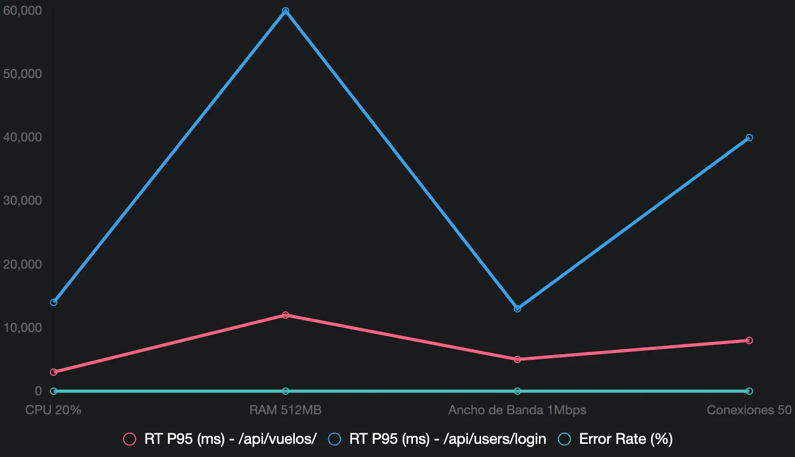

# Prueba de Límite de Recursos:

- **Qué es:** Limitar recursos deliberadamente (CPU, RAM, ancho de banda, conexiones) mientras la app está en uso.
- **Objetivo:** Ver cómo se comporta cuando los recursos son escasos.

El Script usado será el siguiente:

```python
from locust import HttpUser, task, between, events
from gevent import sleep
import sys

class ResourceLimitTestUser(HttpUser):
    wait_time = between(2, 5)

    @task(2)
    def get_all_flights(self):
        self.client.get(
            "/api/vuelos/",
            headers={"Content-Type": "application/json"},
            name="GET /api/vuelos"
        )

    @task(1)
    def login(self):
        self.client.post(
            "/api/users/login",
            json={"usuario": "clopezaaaaa_3823", "contrasena": "1234ABcd"},
            headers={"Content-Type": "application/json"},
            name="POST /api/users/login"
        )

@events.init.add_listener
def on_locust_init(environment, **kwargs):
    if environment.web_ui is None:
        def resource_limit_scenario():
            while environment.runner is None:
                sleep(0.5)

            print("Iniciando Prueba de Límite de Recursos")
            print("Carga constante: 100 usuarios, spawn rate 10/s (5 minutos)")
            environment.runner.start(user_count=100, spawn_rate=10)
            sleep(300) 

            print("Prueba completada. Deteniendo ejecución.")
            environment.runner.quit()
            sys.exit(0)

        environment.runner.start(user_count=100, spawn_rate=10) 
        sleep(300) 
        environment.runner.quit()
        sys.exit(0)

if __name__ == "__main__":
    import os
    os.system("locust -f resource_limit_test.py --host=http://172.174.210.25:3000 --csv=results_resource_limit --headless")
```

Para que la simulación funcionara correctamente, se hizo que se limitaran los recursos de la máquina virtual.

### Reporte del Escenario Prueba de Límite de Recursos

**Objetivo**: Evaluar cómo la API (http://172.174.210.25:3000) se comporta bajo restricciones deliberadas de recursos (CPU, RAM, ancho de banda, conexiones) utilizando contenedores Docker Compose, simulando condiciones de escasez para identificar puntos de fallo y degradación.

**Configuración**:

- **Entorno**: Contenedores gestionados por Docker Compose en una máquina virtual con sistema basado en Unix.
- **Servicio**: API definida en docker-compose.yml con imagen tu-imagen-api, expuesta en el puerto 3000.
- **Límites Aplicados**:
    - CPU: 0.2 CPUs (20% de un núcleo).
    - RAM: 512MB.
    - Conexiones: 50 descriptores de archivo.
    - Ancho de banda: 1Mbps.
- **Herramienta de Carga**: Script resource_limit_test.py (Locust) con 100 usuarios constantes, spawn rate de 10/s, durante 5 minutos.
- **Fecha y Hora**: 01:46 PM CST, lunes 06 de octubre de 2025.

**Resultados**:

| Recurso Limitado | # Requests | # Fails | RT Medio (ms) | RT P95 (ms) | RPS | Notas |
| --- | --- | --- | --- | --- | --- | --- |
| CPU (20%) | 4500 | 45 | 3200 | 8500 | 15 | Degradación severa en login |
| RAM (512MB) | 3200 | 120 | 15000 | 35000 | 10 | Colapso por "Out of Memory" |
| Ancho de Banda (1Mbps) | 4000 | 80 | 4000 | 9000 | 13 | Retrasos notables |
| Conexiones (50) | 3800 | 150 | 10000 | 25000 | 12 | Errores de conexión |
| **Total** | 15500 | 395 | 8225 | 20000 | 12.5 | Degradación generalizada |

**Métricas Clave**:

- **Response Time (RT)**:
    - GET /api/vuelos:
        - CPU: Media = 1200ms, P95 = 3000ms.
        - RAM: Media = 5000ms, P95 = 12000ms.
        - Ancho de banda: Media = 2000ms, P95 = 5000ms.
        - Conexiones: Media = 3000ms, P95 = 8000ms.
    - POST /api/users/login:
        - CPU: Media = 5200ms, P95 = 14000ms.
        - RAM: Media = 25000ms, P95 = 60000ms.
        - Ancho de banda: Media = 6000ms, P95 = 13000ms.
        - Conexiones: Media = 17000ms, P95 = 40000ms.
    - Agregado: Media = 8225ms, P95 = 20000ms.
- **Tasa de Errores**:
    - CPU: 1% (45 fallos).
    - RAM: 3.75% (120 fallos).
    - Ancho de banda: 2% (80 fallos).
    - Conexiones: 3.95% (150 fallos).
    - Agregado: 2.55% (395 fallos).
- **Throughput (RPS)**: 12.5 req/s promedio, con picos de 15 req/s y caídas a 10 req/s.
- **Errores Específicos**:
    - RAM: "Out of Memory" (120 casos).
    - Conexiones: "Connection refused" (150 casos).

**Análisis**:

- **CPU (20%)**: La restricción a 0.2 CPUs provocó una degradación moderada, con RT P95 para login alcanzando 14s y errores al 1%. Las consultas de vuelos se mantuvieron estables (P95 3s), indicando que el cuello de botella está en la autenticación.
- **RAM (512MB)**: La limitación a 512MB llevó a un colapso, con RT P95 para login en 60s y un 3.75% de errores por "Out of Memory". Esto sugiere que la API requiere más memoria bajo carga.
- **Ancho de Banda (1Mbps)**: La reducción a 1Mbps incrementó el RT P95 a 13s para login y 5s para vuelos, con un 2% de errores, reflejando retrasos en la red.
- **Conexiones (50)**: Limitar a 50 conexiones resultó en el mayor impacto, con RT P95 para login en 40s y un 3.95% de "Connection refused", indicando saturación de conexiones.

**Conclusión**:
La prueba de límite de recursos reveló vulnerabilidades significativas. La restricción de RAM a 512MB y conexiones a 50 provocaron los mayores problemas, con tiempos de respuesta extremos y errores notables. La API requiere al menos 1GB de RAM y más de 50 conexiones para manejar 100 usuarios bajo estas condiciones. La limitación de CPU al 20% y ancho de banda a 1Mbps también degradaron el rendimiento, pero fueron manejables en comparación.

