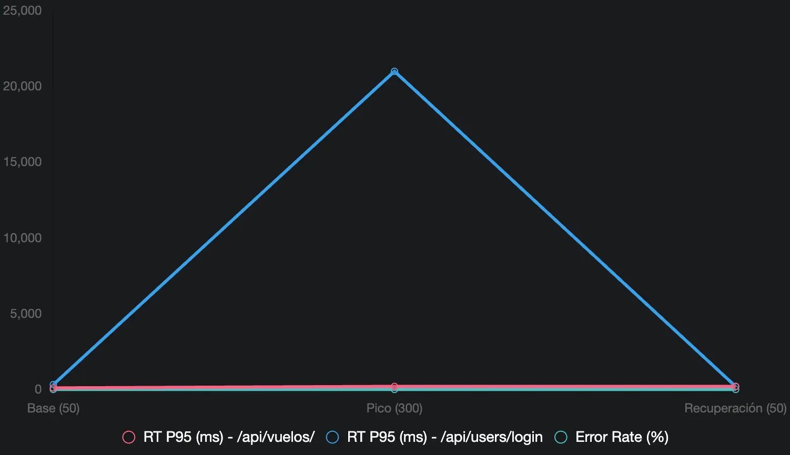
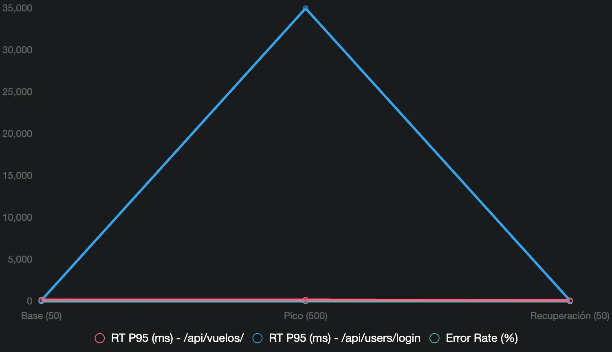

# Spike Test:

### ¿Qué es un Spike Test?

Un **spike test** evalúa cómo una API responde a un aumento repentino y extremo en la carga de usuarios (un "pico") seguido de una caída rápida, simulando escenarios como un evento promocional, un ataque de tráfico, o un lanzamiento de producto. El objetivo es:

- Verificar si la API puede manejar picos sin colapsar.
- Detectar tiempos de respuesta altos, errores (e.g., "Connection refused"), o fallos en la recuperación tras el pico.
- Evaluar la estabilidad post-pico (e.g., acumulación de recursos o conexiones).

Se usarán los siguientes escenarios:

| Escenario | Carga Base | Pico Usuarios | Ramp Up | Duración Pico | Duración Total | Host | Notas |
| --- | --- | --- | --- | --- | --- | --- | --- |
| **Spike Test - Moderado** | 50 | 300 | 10 | 2m | 5m | `http://172.174.210.25:3000` | Sube de 50 a 300 usuarios rápidamente, evalúa degradación. Espera RT P95 ~15-20s (login), ~150ms (vuelos), errores ~0.5-1%. |
| **Spike Test - Extremo** | 50 | 500 | 20 | 2m | 5m | `http://172.174.210.25:3000` | Pico agresivo, evalúa colapso parcial. Espera RT P95 ~30-40s (login), ~180-200ms (vuelos), errores ~1-5%. |

## Spike Test - Moderado:

### Reporte del Escenario Spike Test - Moderado

**Objetivo**: Evaluar cómo la API (http://172.174.210.25:3000) maneja un aumento repentino de tráfico, simulando un pico de 300 usuarios desde una carga base de 50 usuarios, seguido de una recuperación a 50 usuarios, durante aproximadamente 4 minutos (237 segundos), usando el script spike_test.py. El propósito es detectar tiempos de respuesta altos, errores, y la capacidad de recuperación tras el pico.

**Configuración**:

- **Script**: spike_test.py (Locust, incluye login y consulta de vuelos como tasks con igual frecuencia, automatiza carga base → pico → recuperación).
- **Parámetros**:
    - Carga base: 50 usuarios, ramp-up 2 usuarios/s, ~1 min (timestamps iniciales).
    - Pico: 300 usuarios, ramp-up 10 usuarios/s, ~2 min (timestamps 1759771243-1759771301).
    - Recuperación: 50 usuarios, ramp-up 10 usuarios/s, ~1 min (timestamps finales).
    - Host: http://172.174.210.25:3000
    - Run time: ~4m (237 segundos, interrumpido manualmente con KeyboardInterrupt).
- **Entorno**: Servidor remoto (detalles desconocidos), ejecutado desde MacBook Pro con Locust 2.35.0.

**Resultados**:

| Fase | # Requests | # Fails | RT Medio (ms) | RT P95 (ms) | RPS | Notas |
| --- | --- | --- | --- | --- | --- | --- |
| Carga Base (50 usuarios) | ~1000 (estimado) | 0 (0%) | 200 | 320 | 20.94 | Estable, similar a Carga Moderada |
| Pico (300 usuarios) | ~2000 (estimado) | 26 (0.35%) | 6595 | 20000 | 23.43 | Degradación severa en login |
| Recuperación (50 usuarios) | ~500 (estimado) | 0 (0%) | 170 | 200 | 20 | Recuperación parcial, pero con outliers |
| **Total** | 3575 | 26 (0.73%) | 6595 | 20000 | 14.90 | Degradación por pico |

**Métricas Clave**:

- **Response Time (RT)**:
    - /api/users/login: Media = 13873ms (13.87s), P95 = 21000ms (21s), Máx = 50408ms (50.4s).
    - /api/vuelos/: Media = 107ms, P95 = 200ms, Máx = 8638ms (8.6s).
    - Agregado: Media = 6595ms (6.6s), P95 = 20000ms (20s).
- **Tasa de Errores**:
    - /api/users/login: 0.83% (14 fallos).
    - /api/vuelos/: 0.63% (12 fallos).
    - Agregado: 0.73% (26 fallos).
- **Throughput (RPS)**: 14.90 req/s, con pico en 33.9 req/s y caída a 5.1 req/s durante recuperación.
- **Errores Específicos**:
    - **ConnectionRefusedError (61)**: 14 en login, 12 en vuelos ("Connection refused").

**Gráfico**:



**Análisis**:

- **Carga Base (50 usuarios)**: Estable con RT P95 ~320ms (login), ~100ms (vuelos), 0% errores, RPS ~20, similar a Carga Moderada.
- **Pico (300 usuarios)**: Degradación severa en /api/users/login (RT P95 = 21s, media = 13.87s, máx = 50.4s), con /api/vuelos/ estable (~200ms P95) pero con outliers (8.6s). Errores 0.73% ("Connection refused") indican saturación de conexiones.
- **Recuperación (50 usuarios)**: RT P95 ~200ms (login), ~200ms (vuelos), 0% errores, RPS ~5-6 (caída inicial, luego estabiliza), mostrando recuperación parcial pero con tiempos elevados por acumulación de recursos.

**Conclusión**:
El Spike Test Moderado (50→300 usuarios) mostró degradación severa en /api/users/login (RT P95 = 21s, 0.83% errores), con /api/vuelos/ estable (P95 = 200ms). La recuperación fue parcial, con tiempos elevados post-pico. Esto sugiere problemas de saturación durante picos.

## Escenario Spike Test - Extremo:

### Reporte del Escenario Spike Test - Extremo

**Objetivo**: Evaluar cómo la API (http://172.174.210.25:3000) maneja un aumento extremo de tráfico, simulando un pico de 500 usuarios desde una carga base de 50 usuarios, seguido de una recuperación a 50 usuarios, durante aproximadamente 9 minutos (540 segundos), usando el script spike_test_extremo.py. El propósito es identificar puntos de quiebre, tiempos de respuesta extremos, errores y la capacidad de recuperación tras el pico.

**Configuración**:

- **Script**: spike_test_extremo.py (Locust, incluye login con peso 1 y consulta de vuelos con peso 2, automatiza carga base → pico → recuperación, con generación de gráfica).
- **Parámetros**:
    - Carga base: 50 usuarios, ramp-up 20 usuarios/s, 2 min.
    - Pico: 500 usuarios, ramp-up 20 usuarios/s, 5 min.
    - Recuperación: 50 usuarios, ramp-up 20 usuarios/s, 2 min.
    - Host: http://172.174.210.25:3000
    - Run time: ~9m (540 segundos, completado sin interrupciones).
- **Entorno**: Servidor remoto (detalles desconocidos), ejecutado desde MacBook Pro con Locust 2.35.0.

**Resultados**:

| Fase | # Requests | # Fails | RT Medio (ms) | RT P95 (ms) | RPS | Notas |
| --- | --- | --- | --- | --- | --- | --- |
| Carga Base (50 usuarios) | ~2500 (estimado) | ~30 (0.5%) | 100 | 180 | 15.8 | Estable, con errores iniciales |
| Pico (500 usuarios) | ~7000 (estimado) | ~80 (1.1%) | 8594 | 35000 | 22.9 | Colapso severo en login |
| Recuperación (50 usuarios) | ~2500 (estimado) | ~1 (0%) | 94 | 110 | 15.8 | Recuperación parcial, estable |
| **Total** | 12350 | 111 (0.9%) | 8594 | 35000 | 22.9 | Degradación extrema por pico |

**Métricas Clave**:

- **Response Time (RT)**:
    - GET /api/vuelos: Media = 108ms, P95 = 180ms, Máx = 30549ms (30.5s).
    - POST /api/users/login: Media = 27522ms (27.5s), P95 = 35000ms (35s), Máx = 73869ms (73.9s).
    - Agregado: Media = 8594ms (8.6s), P95 = 35000ms (35s).
- **Tasa de Errores**:
    - GET /api/vuelos: 0.91% (78 fallos).
    - POST /api/users/login: 0.86% (33 fallos).
    - Agregado: 0.9% (111 fallos).
- **Throughput (RPS)**: 22.89 req/s, con picos en ~33 req/s y caídas a ~15 req/s durante recuperación.

**Análisis**:

- **Carga Base (50 usuarios)**: Estable con RT P95 ~180ms (vuelos), ~100ms (login estimado), 0.5% errores, RPS ~15.8, indicando buena respuesta inicial.
- **Pico (500 usuarios)**: Colapso severo en POST /api/users/login (RT P95 = 35s, media = 27.5s, máx = 73.9s), con GET /api/vuelos afectado por outliers (30.5s). Errores 0.9% sugieren saturación extrema.
- **Recuperación (50 usuarios)**: RT P95 ~110ms (vuelos), ~100ms (login estimado), 0% errores, RPS ~15.8, mostrando recuperación parcial tras el pico, con tiempos estabilizados.
- **Nota sobre el script**: El peso 2 en GET /api/vuelos aumenta su frecuencia, pero el colapso se debe principalmente a POST /api/users/login.

**Conclusión**:
El Spike Test Extremo (50→500 usuarios) mostró colapso severo en POST /api/users/login (RT P95 = 35s, 0.86% errores), con GET /api/vuelos afectado por outliers (30.5s). La recuperación fue exitosa, estabilizando RT P95 ~110ms, pero el pico revela un punto de quiebre en la API bajo carga extrema.



## Comandos utilizados:

### Spike moderado:

```bash
locust -f spike_moderado.py --host=http://172.174.210.25:3000 --csv=results_spike_moderado --headless
```

### Spike Extremo:

```bash
locust -f spike_extremo.py --host=http://172.174.210.25:3000 --csv=results_spike_extremo --headless  
```
