# Manual Técnico de Airflow System

A continuación, se presenta el manual técnico y las estrategias que se usarán para llevar a cabo la aplicación AirFlow System.

# Patrones de Diseño a Usar:

Para la aplicación AirFlow System se tendrá contemplado usar 5 patrones de diseño dependiendo de la necesidad de la aplicación. Los patrones de diseño a usar serán:

- Patrón Singleton
- Patrón Repository
- Patrón Factory
- Patrón Observer
- Patrón Facade

A continuación se explicará la forma de usar cada patrón y uso en la aplicación.

## Patrón Singleton:

El patrón Singleton es conocido por ser un patrón de diseño usado para solamente crear una instancia de un solo atributo, proporcionando  un punto de acceso global a esta misma.

### Justificación:

La selección del Patrón Singleton es debido al uso de una conexión de base de datos en vez de múltiples conexiones. Esto hace que el sistema solamente tenga una conexión compartida, esto hace que se optimicen recursos y se eviten conflictos posteriores.

### En la Aplicación:

Se tiene contemplado que en la Aplicación AirFlow System, se cree una clase especializada para poder conectar la base de datos, y solamente conectar la base de datos con una instancia global. 

### Ejemplo de Aplicación:

```jsx
const mongoose = require('mongoose');
class Database {
  constructor() {
    if (Database.instance) return Database.instance;
    this.connect();
    Database.instance = this;
  }
  async connect() {
    await mongoose.connect('mongodb://localhost/airflow', {
      useNewUrlParser: true,
      useUnifiedTopology: true,
    });
    console.log('Conectado a MongoDB');
  }
  static getInstance() {
    return Database.instance || new Database();
  }
}
Database.instance = null;
module.exports = Database.getInstance();
```

## Patrón Repository:

El Patrón Repository es un patrón de diseño que actúa como una capa intermedia entre la lógica de negocio y la capa de datos, en este caso que es mongoDB. Este patrón encapsula las operaciones de acceso de datos en una interfaz parecida a una colección. Hace que la aplicación sea modular y fácil en pruebas.

### Justificación:

Debido a que la aplicación Airflow maneja múltiples capas de operaciones, y operaciones complejas, el patrón repository centralizará la lógica del propio acceso de datos. Esto hará que la facilidad de cambiar a otra base de datos diferente de mongoDB sea más fácil. Esto hace que la arquitectura sea robusta y escalable. La combinación con el patrón Singleton es clave debido a que, si se desea en algún momento escalar la aplicación a otra base de datos, será mucho más fácil.

### En la aplicación:

Se tiene planeado usar en la aplicación como el intermedio entre las consultas y la implementación de la base de datos. Se crearán clases.repository para poder separar cada entidad de su lógica.

### Ejemplo de Aplicación:

```jsx
class FlightRepository {
  async getFlightById(id) {
    return await FlightModel.findById(id);
  }
  async createFlight(flightData) {
    return await FlightModel.create(flightData);
  }
  async updateFlightStatus(id, status) {
    return await FlightModel.findByIdAndUpdate(id, { status }, { new: true });
  }
}
module.exports = new FlightRepository();
```

## Patrón Factory:

El patrón Factory es conocido por tener una interfaz para crear objetos en base a ella. Esto permite que las subclases o configuraciones decidan que clase instanciar. Con el patrón Factory, se pueden crear objetos con interfaces similares pero implementaciones diferentes.

### Justificación:

En la aplicación AirFlow System se tienen diferentes roles en la tripulación, esto hace que no todos los integrantes tengan los mismos roles. El patrón Factory hará que se tengan centralizadas ciertas funciones globales para los miembros de la tripulación y, en base a eso, se podrán crear diferentes funciones que se desprenderán de la clase Padre.

### En la aplicación:

Se creará una classe Crew, la cual será el modelo para los distintos tipos de tripulación.

### Ejemplo de Aplicación:

```jsx
class Crew {
  static createCrew(type, data) {
    switch (type) {
      case 'pilot':
        return new Pilot(data.name, data.birthDate, data.flightHours);
      case 'copilot':
        return new Copilot(data.name, data.birthDate, data.flightHours);
      case 'flightAttendant':
        return new FlightAttendant(data.name, data.flightCount);
      default:
        throw new Error('Tipo de tripulante inválido');
    }
  }
}
module.exports = CrewFactory;
```

## Patrón Observer:

El patrón Observer es un patrón que establece una relación de uno a muchos entre objetos, de modo que cuando un objeto cambia de estado, todos sus dependientes son modificados y actualizados automáticamente.

### Justificación:

La aplicación requiere notificar a los pasajeros sobre cambios en el estado de los vuelos, y a la tripulación sobre asignaciones. El patrón Observer es ideal para gestionar las notificaciones en tiempo real, así se mejorará la experiencia del pasajero y reduce la carga del personal.

### En la Aplicación:

Se creará un EventEmitter en Nodejs, se usará para notificar a los pasajeros sobre cambios en el estado del vuelo o a la tripulación sobre asignaciones mediante correos electrónicos u otros canales. Esto hará que no desacople la lógica de notificaciones del negocio, volviéndola escalable y mejorando la experiencia de usuario:

### Ejemplo de Aplicación:

```jsx
const EventEmitter = require('events');
class Flight extends EventEmitter {
  constructor(id, status) {
    super();
    this.id = id;
    this.status = status;
  }
  updateStatus(newStatus) {
    this.status = newStatus;
    this.emit('statusChange', { flightId: this.id, status: newStatus });
  }
}
const flight = new Flight('FL123', 'Planificado');
flight.on('statusChange', ({ flightId, status }) => {
  // Enviar notificación por correo (por ejemplo, usando Nodemailer)
  console.log(`El vuelo ${flightId} cambió a estado ${status}`);
});
flight.updateStatus('Cancelado');
```

## Patrón Facade:

El patrón Facade proporciona una interfaz simplificada para un subsistema complejo, oculta sus detalles internos y facilita su uso.

### Justificación:

El sistema tiene múltiples subsistemas. El patrón Facade simplifica las interacciones entre el Frontend y el Backend. Ofrece una API unificada para operaciones complejas mejorando la usabilidad y el mantenimiento.

### En la Aplicación:

En el Frontend, React llamará a un endpoint el cual coordina la validación de los demás procesos. Se llevará a la reservación de asientos, esto hará que coordine la creación, gestión de reservas, entre otros. Esto simplifica el código del Frontend, mejora la mantenibilidad y mantiene las interfaces intuitivas y claras.

### Ejemplo de Aplicación:

```jsx
class BookingFacade {
  constructor(flightService, passengerService, notificationService) {
    this.flightService = flightService;
    this.passengerService = passengerService;
    this.notificationService = notificationService;
  }
  async bookFlight(passengerId, flightId, seat) {
    const isSeatAvailable = await this.flightService.checkSeatAvailability(flightId, seat);
    if (!isSeatAvailable) throw new Error('Asiento no disponible');
    const reservation = await this.flightService.createReservation(flightId, passengerId, seat);
    await this.passengerService.updatePassengerProfile(passengerId, { lastReservation: reservation.id });
    await this.notificationService.sendConfirmationEmail(passengerId, reservation);
    return reservation;
  }
}
module.exports = BookingFacade;
```

Como logramos ver, los cinco patrones, en base al análisis de la aplicación, son los mejores para poder trabajar. Los cinco patrones son compatibles, ya que trabajan en distintas capas del diseño de la aplicación y el modelo de negocio. Ambos se pueden trabajar sin necesidad de desacoplar o crear conflictos con los demás patrones de diseño elegidos.

# Diagrama de Bloques:
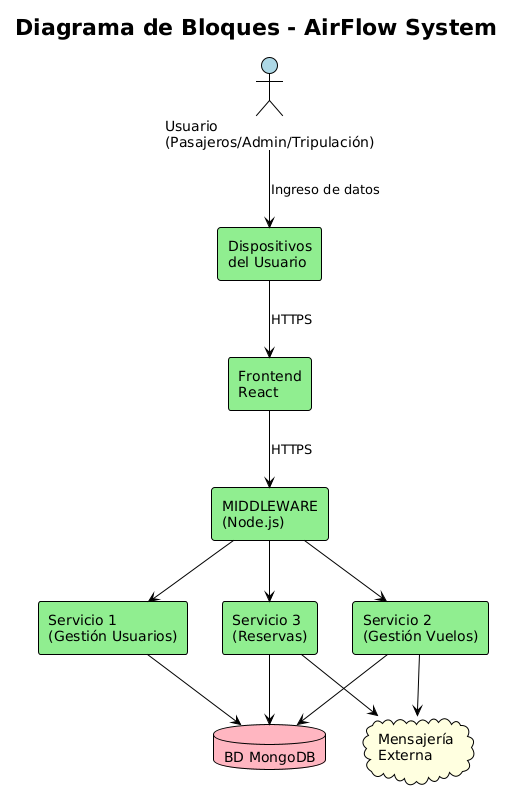

# Diagrama de Despliegue:
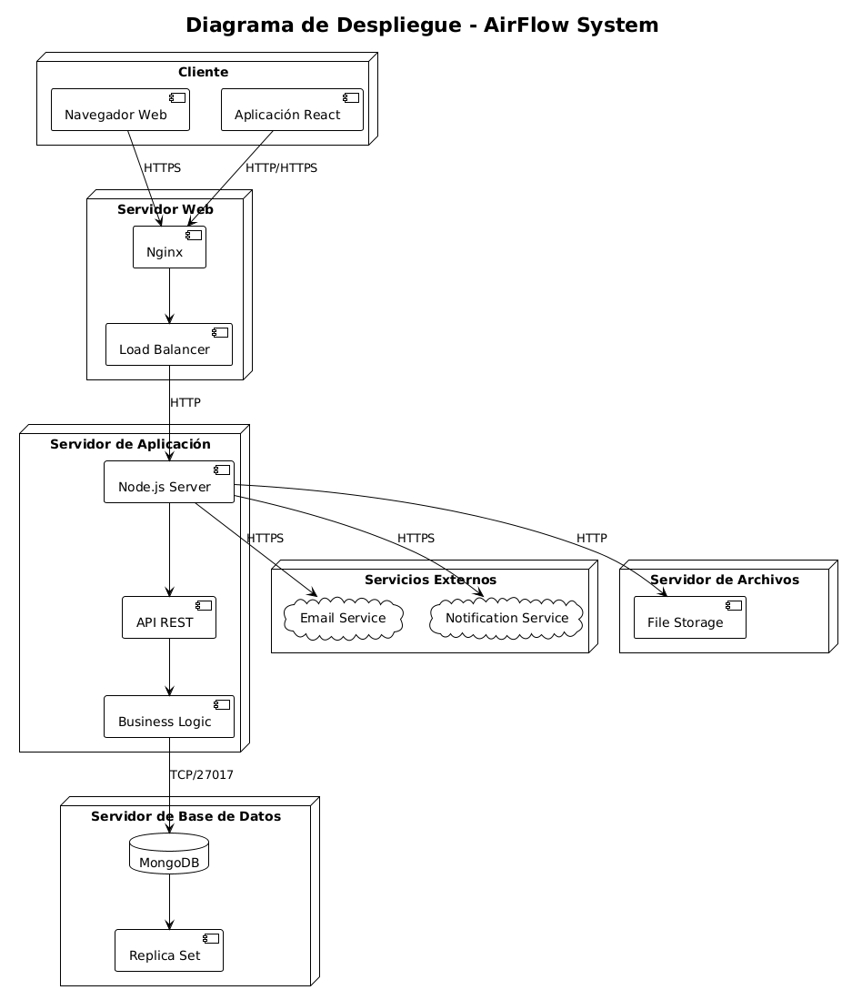

# Diagrama de Componentes:
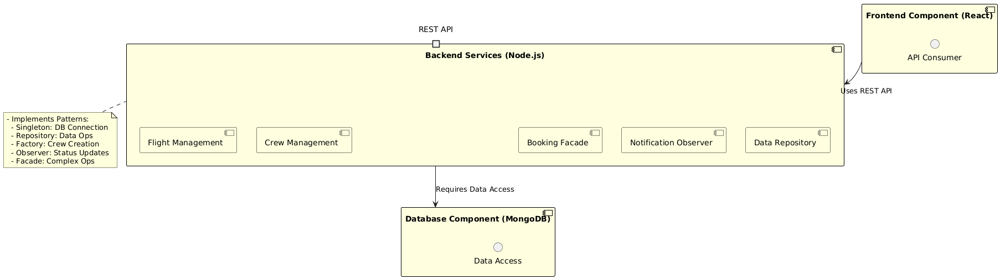

# Diagrama de Distribución:
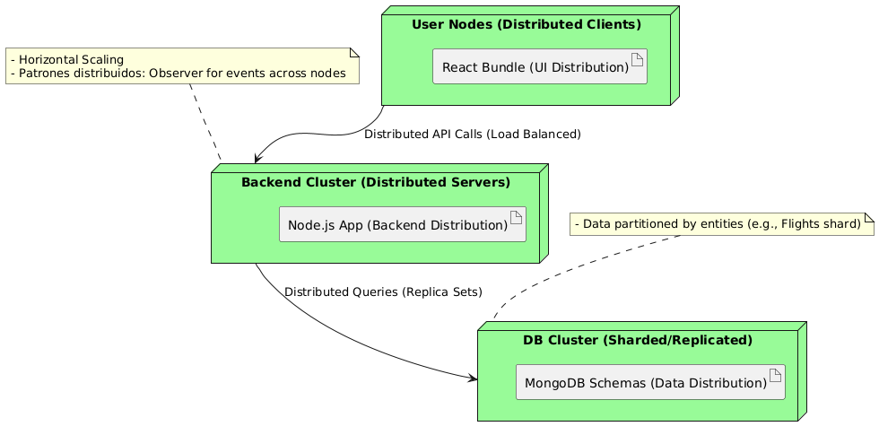

# Diagrama de Clases:
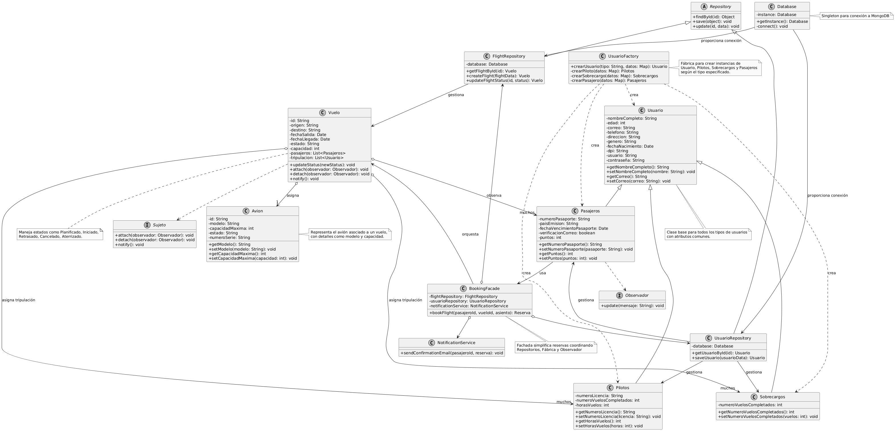

# Diagrama de Esquemas

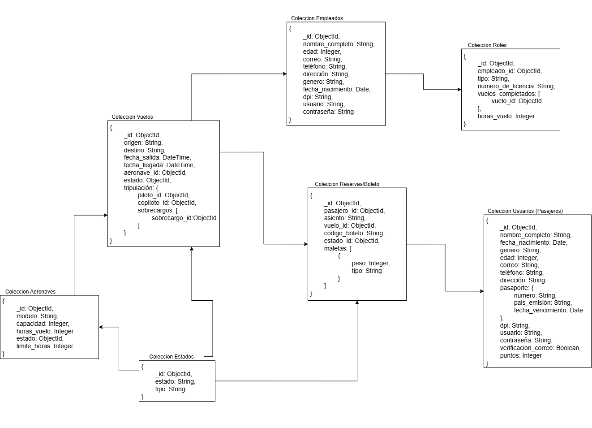

El modelo de datos presentado está diseñado para una base de datos NoSQL basada en MongoDB, utilizando un enfoque orientado a documentos y relaciones a través de referencias. A continuación, se detalla la estructura y las relaciones entre las colecciones:

1. **Colecciones Principales**:
    - **ColeccionAeronaves**: Almacena información sobre las aeronaves, incluyendo un identificador único (id_ObjectId), capacidad (capacidad), horas acumuladas (horas_acumuladas), estado (estado_vuelo), y un límite de horas (limite_horas). Esta colección sirve como fuente de datos para asignar aeronaves a vuelos.
    - **ColeccionVuelos**: Contiene detalles de los vuelos, como identificador único (id_ObjectId), origen, destino, fechas de salida y llegada (fecha_salida, fecha_llegada), estado (estado_vuelo), piloto (piloto_id), y sobrecargos (sobrecargos). Incluye referencias a ColeccionAeronaves y ColeccionEstados mediante sus respectivos id_ObjectId.
    - **ColeccionEstados**: Registra los estados posibles de los vuelos u otros elementos, con campos como id_ObjectId, estado, y tipo. Se utiliza como referencia para mantener consistencia en los estados a través de las colecciones.
    - **ColeccionUsuarios**: Almacena datos de los usuarios, incluyendo id_ObjectId, nombre completo, correo, teléfono, dirección, género, fecha de nacimiento, usuario, contraseña, tipo, y un array de vuelos completados (vuelos_completados). Incluye referencias a ColeccionVuelos.
    - **ColeccionReservasBoletos**: Gestiona las reservas y boletos, con campos como id_ObjectId, pasajero (pasajero_id), vuelo (vuelo_id), código, estado, maleta, peso, y tipo. Contiene referencias a ColeccionUsuarios y ColeccionVuelos.
2. **Relaciones y Referencias**:
    - Las relaciones entre colecciones se establecen mediante referencias usando el campo ObjectId de los documentos. Por ejemplo, ColeccionVuelos referencia a ColeccionAeronaves y ColeccionEstados para asociar una aeronave y su estado a un vuelo específico.
    - ColeccionUsuarios y ColeccionReservasBoletos mantienen referencias bidireccionales: los usuarios pueden tener múltiples reservas, mientras que cada reserva está vinculada a un usuario y un vuelo.
    - Esta estructura permite una flexibilidad típica de MongoDB, evitando la necesidad de un esquema relacional rígido, y facilita la denormalización cuando sea necesario.

# Matrices de trazabilidad

## Identificación de Stakeholders

| **Stakeholder** | **Descripción** |
| --- | --- |
| **SkyLink Technologies** | Empresa solicitante del sistema; interesada en mejorar la experiencia del pasajero y la eficiencia operativa. |
| **Aerolíneas** | Empresas que operan vuelos y utilizan la plataforma para gestionar tripulación, flota, reservas y check-in. |
| **Pasajeros** | Usuarios finales que registran perfiles, reservan vuelos, hacen check-in, abordan y reciben notificaciones del sistema. |
| **Pilotos y Copilotos** | Personal autorizado para iniciar/finalizar vuelos y registrar horas de vuelo acumuladas. |
| **Sobrecargos** | Tripulación encargada de la seguridad y atención a bordo; su asignación depende del número de pasajeros. |
| **Personal de Operaciones** | Encargados de planificar vuelos, asignar tripulación y gestionar la disponibilidad de aeronaves. |
| **Equipo de Mantenimiento** | Técnicos responsables de las revisiones y certificación de aeronaves tras alcanzar límites de horas de vuelo. |
| **Agentes de Seguridad/Aeropuerto** | Personal que asiste en check-in presencial y control en la puerta de embarque. |
| **Departamento de TI / Desarrolladores** | Encargados de diseñar, implementar y mantener el sistema AirFlow. |
| **Autoridades Aeronáuticas** | Entidades regulatorias que exigen el cumplimiento de normas de seguridad y operación aérea. |
| **Administradores del Programa de Fidelización** | Responsables de gestionar puntos, beneficios y notificaciones a pasajeros frecuentes. |

## Stakeholders vrs Requerimientos

### Stakeholders vrs Requerimientos funcionales

|  | RF1 | RF2 | RF3 | RF4 | RF5 | RF6 |
| --- | --- | --- | --- | --- | --- | --- |
| **SkyLink Technologies** | **X** | **X** | **X** | **X** | **X** | **X** |
| **Aerolíneas** | **X** | **X** | **X** | **X** | **X** | **X** |
| **Pasajeros** | **X** | - | - | **X** | **X** | **X** |
| **Pilotos y Copilotos** | **X** | **X** | - | - | - | - |
| **Sobrecargos** | - | **X** | - | - | - | - |
| **Personal de Operaciones** | **X** | **X** | **X** | - | - | - |
| **Equipo de Mantenimiento** | - | - | **X** | - | - | - |
| **Agentes de Seguridad/Aeropuerto** | - | - | - | - | **X** | - |
| **Departamento de TI / Desarrolladores** | - | - | - | - | **X** | - |
| **Autoridades Aeronáuticas** | **X** | **X** | **X** | **X** | **X** | - |
| **Administradores del Programa de Fidelización** | - | - | - | - | - | **X** |

### Stakeholders vrs Requerimientos No funcionales

|  | RNF - Rendimiento y Escalabilidad | RNF -Seguridad y Roles | RNF - Usabilidad y Accesibilidad | RNF - Disponibilidad y Recuperación | RNF - Arquitectura y Metodología | RNF - Integración Externa |
| --- | --- | --- | --- | --- | --- | --- |
| **SkyLink Technologies** | **X** | **X** | **X** | **X** | **X** | **X** |
| **Aerolíneas** | **X** | **X** | **X** | **X** | **X** | **X** |
| **Pasajeros** | **X** | **X** | **X** | **X** |  | **X** |
| **Pilotos y Copilotos** | **X** | **X** | **X** | **X** | - | - |
| **Sobrecargos** | **X** | **X** | - | - | - | - |
| **Personal de Operaciones** | **X** | **X** | **X** | **X** | **X** | **X** |
| **Equipo de Mantenimiento** | **X** | **X** | - | **X** | - | - |
| **Agentes de Seguridad/Aeropuerto** | - | **X** | **X** | **X** | - | - |
| **Departamento de TI / Desarrolladores** | **X** | **X** | **X** | **X** | **X** | **X** |
| **Autoridades Aeronáuticas** | **X** | **X** | **X** | **X** | **X** | **X** |
| **Administradores del Programa de Fidelización** | **X** | **X** | **X** | **X** | - | **X** |

## Stakeholders vrs CDU

|  | CDU001 | CDU002 | CDU003 | CDU004 | CDU005 | CDU006 |
| --- | --- | --- | --- | --- | --- | --- |
| **SkyLink Technologies** | **X** | **X** | **X** | **X** | **X** | **X** |
| **Aerolíneas** | **X** | **X** | **X** | **X** | **X** | **X** |
| **Pasajeros** | **X** | - | - | **X** | **X** | **X** |
| **Pilotos y Copilotos** | **X** | **X** | - | - | - | - |
| **Sobrecargos** | - | **X** | - | - | - | - |
| **Personal de Operaciones** | **X** | **X** | **X** | - | - | - |
| **Equipo de Mantenimiento** | - | - | **X** | - | - | - |
| **Agentes de Seguridad/Aeropuerto** | - | - | - | - | **X** | - |
| **Departamento de TI / Desarrolladores** | - | - | - | - | - | - |
| **Autoridades Aeronáuticas** | **X** | **X** | **X** | **X** | **X** | - |
| **Administradores del Programa de Fidelización** | - | - | - | - | - | **X** |

## Requerimientos vrs CDU

### Requerimientos Funcionales vrs CDU

|  | **CDU001** | **CDU002**  | **CDU003** | **CDU004**  | **CDU005** | **CDU006** |
| --- | --- | --- | --- | --- | --- | --- |
| **RF – Definir vuelo (origen, destino, fechas, tripulación, aeronave)** | X | X | X | - | - | - |
| **RF – Cancelar vuelo (anular reservas y notificar)** | X | - | - | X | - | - |
| **RF – Cambiar estados de vuelo**  | X | - | - | - | X | - |
| **RF – Pilotos marcan inicio y fin del vuelo** | X | X | X | - | - | - |
| **RF – Registro de tripulación (pilotos y sobrecargos)** | - | X | - | - | - | - |
| **RF – Asignación de tripulación a vuelo** | X | X | - | - | - | - |
| **RF – Actualizar experiencia post-vuelo** | - | X | - | - | - | - |
| **RF – Registro de aeronaves** | - | - | X | - | - | - |
| **RF – Acumular horas de vuelo aeronave** | X | - | X | - | - | - |
| **RF – Verificar límites y bloquear aeronave** | - | - | X | - | - | - |
| **RF – Certificación de mantenimiento** | - | - | X | - | - | - |
| **RF – Registro de pasajeros y perfiles** | - | - | - | X | - | - |
| **RF – Modificación de perfiles** | - | - | - | X | - | - |
| **RF – Reservar vuelo y asiento (boleto QR, 2 maletas)** | - | - | - | X | - | - |
| **RF – Check-in online o en aeropuerto** | - | - | - | - | X | - |
| **RF – Embarque (escaneo QR)** | - | - | - | - | X | - |
| **RF – Notificaciones a pasajeros** | X | - | - | X | X | X |
| **RF – Maletas extra (hasta 3)** | - | - | - | - | X | X |
| **RF – Programa de fidelización (puntos por vuelo, historial)** | - | - | - | - | - | X |

### Requerimientos No Funcionales vrs CDU

| **Requerimiento No Funcional** | **CDU001** | **CDU002** | **CDU003** | **CDU004** | **CDU005** | **CDU006** |
| --- | --- | --- | --- | --- | --- | --- |
| **RNF – Procesamiento rápido** | X | X | X | X | X | X |
| **RNF – Seguridad** | X | X | X | X | X | X |
| **RNF – Escalabilidad** | X | X | X | X | X | X |
| **RNF – Usabilidad y accesibilidad**  | X | X | X | X | X | X |
| **RNF – Disponibilidad 99.9% y recuperación de fallos** | X | X | X | X | X | X |
| **RNF – Arquitectura modular y patrones de diseño** | X | X | X | X | X | X |
| **RNF – Integración con externos**  | X | - | - | X | X | X |

#
#

# Requerimientos Funcionales

### RF1 - Gestión de Vuelos

- El sistema debe permitir al personal de operaciones definir origen, destino, fechas/horas de salida y llegada, asignar una aeronave específica (validando capacidad máxima de pasajeros) y designar tripulación. Precondición: Aeronave y tripulación no asignados a vuelos simultáneos, y aeronave ubicada en el aeropuerto de origen. Flujo alternativo: Rechazar planificación si hay conflictos.
- El sistema debe permitir cancelar un vuelo, anulando todas las reservas asociadas y notificando a pasajeros por correo electrónico. Precondición: Vuelo en estado "Planificado". Causa posible: Falta de tripulación o menos del 50% de capacidad ocupada.
- El sistema debe cambiar el estado del vuelo durante su ciclo: "Planificado" (antes del despegue), "Iniciado" (al marcar inicio por piloto/copiloto), "En tiempo" (en curso dentro del horario), "Retrasado" (excede hora de llegada), "Cancelado" (por condiciones específicas), "Aterrizado" (al marcar final por piloto/copiloto).
- Los pilotos/copilotos deben poder marcar el inicio y fin del vuelo a través de un panel de control. Postcondición: Actualización automática de horas de vuelo para aeronave, pilotos y sobrecargos.

### RF2 - Gestión de Pilotos y Tripulación

- El sistema debe registrar datos de pilotos/copilotos (nombre, fecha de nacimiento, ID, horas de vuelo acumuladas) y sobrecargos (datos personales, número de vuelos completados).
- Al finalizar un vuelo ("Aterrizado"), el sistema debe actualizar automáticamente las horas de vuelo de pilotos/copilotos y el número de vuelos de sobrecargos.
- El personal de operaciones debe asignar un piloto, un copiloto y sobrecargos (1 por cada 50 pasajeros) a un vuelo. Precondición: Tripulación calificada y disponible (sin asignaciones simultáneas). Flujo alternativo: Alertar si no hay suficientes sobrecargos para cumplir normativas de seguridad.

### RF3 - Gestión y Mantenimiento de la Flota Aérea

- El personal de operaciones debe registrar/modificar/dar de baja aeronaves, incluyendo modelo, capacidad de pasajeros y horas de vuelo acumuladas.
- Al estado "Aterrizado", el sistema debe sumar la duración del vuelo a las horas acumuladas de la aeronave.
- Tras aterrizaje, el sistema debe verificar si las horas acumuladas superan límites preestablecidos (ej. 200, 150 o 100 horas según capacidad). Si se supera, generar alerta y bloquear asignación a nuevos vuelos.
- Un técnico debe registrar la inspección y certificar el estado óptimo, actualizando el registro y levantando la restricción de vuelo.

### RF4 - Registro de Pasajeros y Reserva de Vuelos

- A través de la página web, el pasajero debe completar un formulario con datos obligatorios (nombre, fecha de nacimiento, pasaporte). El sistema valida datos, crea perfil y envía correo de verificación.
- Tras clic en enlace de verificación, el pasajero establece contraseña y accede al perfil para modificar datos personales.
- El pasajero selecciona vuelo y asiento específico. El sistema valida disponibilidad (asiento no ocupado, capacidad no excedida) y asigna derecho a 2 maletas de 50 libras por asiento. Postcondición: Generar boleto con QR y enviarlo por correo en estado "Pendiente de Check-in".

### RF5 - Check-in, Embarque y Seguimiento

- Pasajeros realizan check-in desde 24 horas antes (web) o con agente en aeropuerto, documentando equipaje. Postcondición: Cambiar estado de boleto a "Pendiente de abordaje".
- Agente escanea QR del boleto en puerta. Si no hay check-in, permitirlo en el momento. Postcondición: Cambiar estado a "Abordado" tras validación.
- El sistema notifica a pasajeros por correo sobre cambios en estado del vuelo o reserva, desde despegue hasta aterrizaje.

### RF6 - Servicios Adicionales y Fidelización

- Durante reserva o check-in, permitir comprar hasta 3 maletas extra de 50 libras.
- Al finalizar vuelo, otorgar 100 puntos por hora de vuelo al pasajero y registrar en su historial.
- El sistema mantiene historial de vuelos por pasajero y envía notificaciones por correo sobre cambios.

# Requerimientos No Funcionales

- El sistema debe procesar actualizaciones automáticas de estados de vuelo y horas acumuladas en menos de 5 segundos para evitar retrasos operativos. Soporte para al menos 1,000 reservas simultáneas durante picos (ej. optimización de algoritmos para validaciones de disponibilidad).
- Almacenamiento seguro de datos personales (pasaportes, perfiles) con encriptación y validación normativa. Acceso restringido por roles (ej. pilotos solo marcan estados, técnicos certifican mantenimiento). Notificaciones por correo deben usar protocolos seguros (HTTPS/TLS).
- El sistema debe escalar horizontalmente para manejar crecimiento en flota (hasta 100 aeronaves) y pasajeros (millones de reservas anuales), usando tecnologías como bases de datos distribuidas (NoSQL para historiales) y hardware escalable (cloud deployment).
- Interfaces intuitivas en web y paneles (ej. prototipos alineados con principios de usabilidad: navegación simple, soporte para dispositivos móviles). Cumplir con estándares WCAG para accesibilidad (ej. texto alternativo en QR, soporte para lectores de pantalla).
- El sistema debe tener una disponibilidad del 99.9% (downtime máximo 1 hora/mes), con recuperación automática de fallos (ej. backups de reservas). Validaciones robustas para evitar errores como asignaciones duplicadas.
- Arquitectura modular basada en patrones de diseño (mínimo 5 implementados), facilitando evolución. Uso de metodología ágil (Kanban, git-flow) para actualizaciones sin interrupciones.
- Integración con sistemas externos (ej. correo electrónico para notificaciones, posibles APIs para aeropuertos). Soporte para bases de datos relacionales o NoSQL según elección arquitectónica.

#
#
#
# Actores Principales

| Actor  | Descripcion |
| --- | --- |
| Pasajero | Persona que usa el sistema para registrarse, reservar vuelos, hacer check-in y comprar servicios adicionales |
| Personal de Operaciones | Encargado de planificar vuelos, asignar tripulación y flota. |
| Sobrecargo | Asignado a vuelos, actualiza experiencia. |
| Piloto/Tripulación | Registra inicio/fin de vuelo, horas de vuelo y estados del vuelo. |
| Agente de Seguridad/Embarque | Realiza check-in en aeropuerto y escanea boletos. |
| **Técnico de mantenimiento** | Inspecciona aeronaves y actualiza su estado. |

# Caso de uso de alto nivel

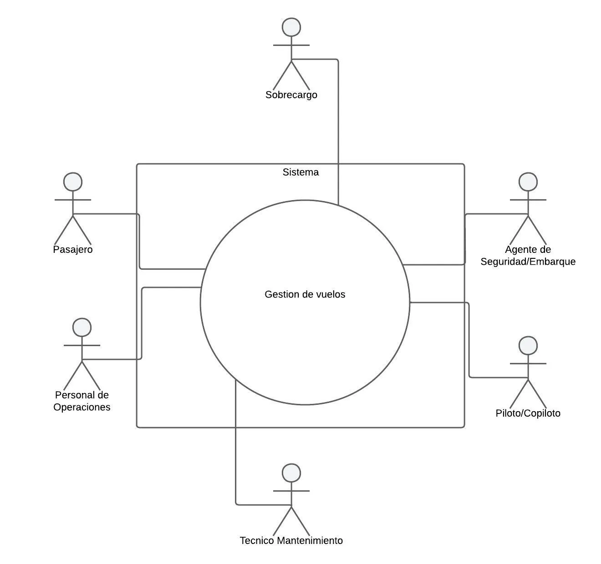

# Primera descomposición

- **CDU001: Gestión de Vuelos** (Incluye planificación, estados, cancelación y notificaciones).
- **CDU002: Gestión de Tripulación** (Registro, asignación y actualización de experiencia).
- **CDU003: Gestión de Flota Aérea** (Registro, mantenimiento y monitoreo).
- **CDU004: Gestión de Pasajeros y Reservas** (Registro de perfiles, reservas y boletos).
- **CDU005: Procesos de Check-in y Embarque** (Check-in, embarque y seguimiento).
- **CDU006: Servicios Adicionales y Fidelización** (Maletas extra, puntos y notificaciones).

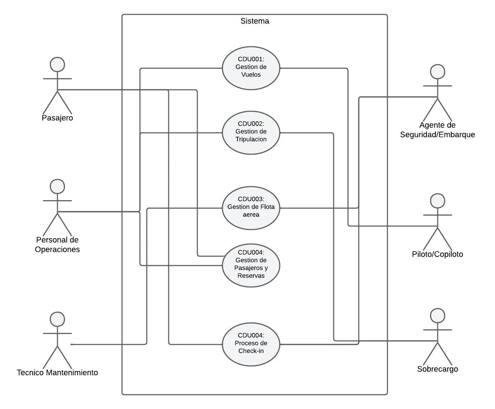

# Casos de uso expandidos

## Caso de Uso CDU001: Gestión de Vuelos

● CDU001.1: Planificar Vuelo

● CDU001.2: Actualizar Estado de Vuelo

● CDU001.3: Cancelar Vuelo

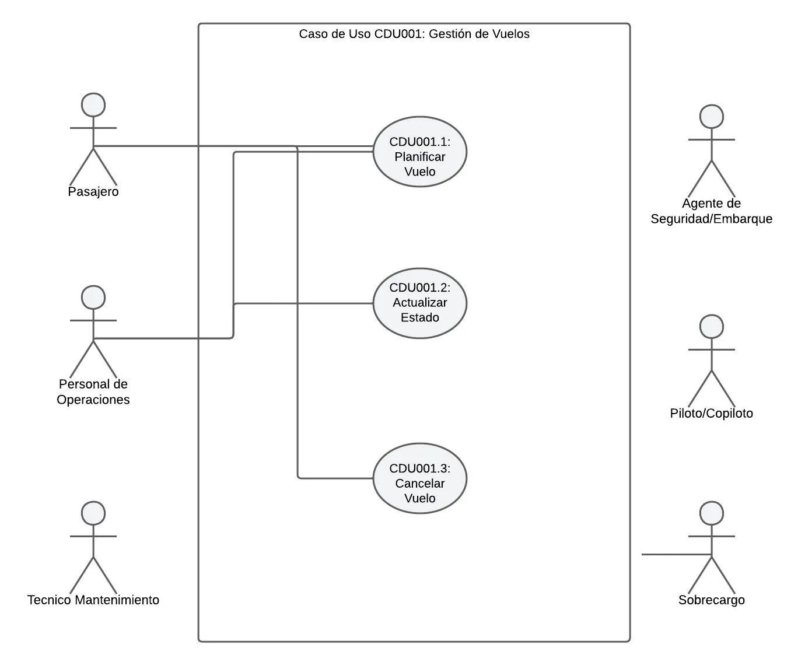

| **Campo** | **Detalle** |
| --- | --- |
| **Nombre** | Gestión de Vuelos (Un nombre descriptivo corto) |
| **Código** | CDU001 (Un código correlativo que lo identifique) |
| **Actores** | Personal de Operaciones, Piloto/Copiloto (Todos los actores que interactúan con el caso de uso) |
| **Descripción** | Administra la planificación, actualización de estados y cancelación de vuelos, asegurando operaciones seguras, notificaciones oportunas a pasajeros y gestión eficiente de recursos como aeronaves y tripulación para cumplir con normativas y horarios establecidos. (Descripción del caso de uso, describe su propósito, no es tan breve, es aceptable al menos 20 palabras) |
| **Precondiciones** | Aeronaves y tripulación disponibles, sistema autenticado para operaciones, vuelos en estados válidos para modificaciones o actualizaciones. (Son las condiciones que se deben cumplir para que se lleve a cabo el caso de uso y con esto nos aseguramos de que el caso de uso tenga sentido) |
| **Post Condiciones** | Vuelos planificados, estados actualizados (Planificado, Iniciado, En tiempo, Retrasado, Cancelado, Aterrizado), reservas anuladas si aplica, notificaciones enviadas. (Son las condiciones que buscamos obtener después de que se realiza el caso de uso, tanto en su flujo normal como en sus flujos alternos) |
| **Flujo principal** | 1. Personal planifica vuelo ingresando origen, destino, fechas, aeronave y tripulación.<br>2. Sistema valida disponibilidad.<br>3. Vuelo se marca como "Planificado".<br>4. Piloto/Copiloto actualiza estado (e.g., "Iniciado", "Aterrizado") durante el ciclo.<br>5. Personal cancela vuelo si es necesario.<br>6. Sistema notifica a pasajeros y actualiza recursos. |
| **Flujos alternos** | FA1: Conflicto de asignación (aeronave/tripulación) (FA = Flujo Alterno)<br>FA1.1 Notificación de error<br>FA1.2 Reasignar recursos<br>FA1.3 Se continúa con el flujo principal (2)<br>FA2: Estado inválido<br>FA2.1 Notificación<br>FA2.2 Seleccionar estado válido<br>FA2.3 Se continúa con el flujo principal (4)<br>FA3: Cancelación no permitida (vuelo iniciado)<br>FA3.1 Error<br>FA3.2 Fin del flujo |
| **Reglas de negocio** | ● Vuelo requiere piloto, copiloto y sobrecargos suficientes (1 por 50 pasajeros).<br>● Cancelable si <50% capacidad o sin tripulación.<br>● Notificar cambios por email. |
| **Reglas de calidad** | ● Procesos (planificación, actualización) no excedan 5 minutos.<br>● Interfaz responsive con indicadores visuales (verde #00FF00 para éxito, rojo #FF0000 para errores).<br>● Notificaciones en <30 segundos. |

## Caso de Uso CDU002: Gestión de Tripulación

● CDU002.1: Registrar Tripulación

● CDU002.2: Asignar Tripulación a Vuelo

● CDU002.3: Actualizar Experiencia Post-Vuelo

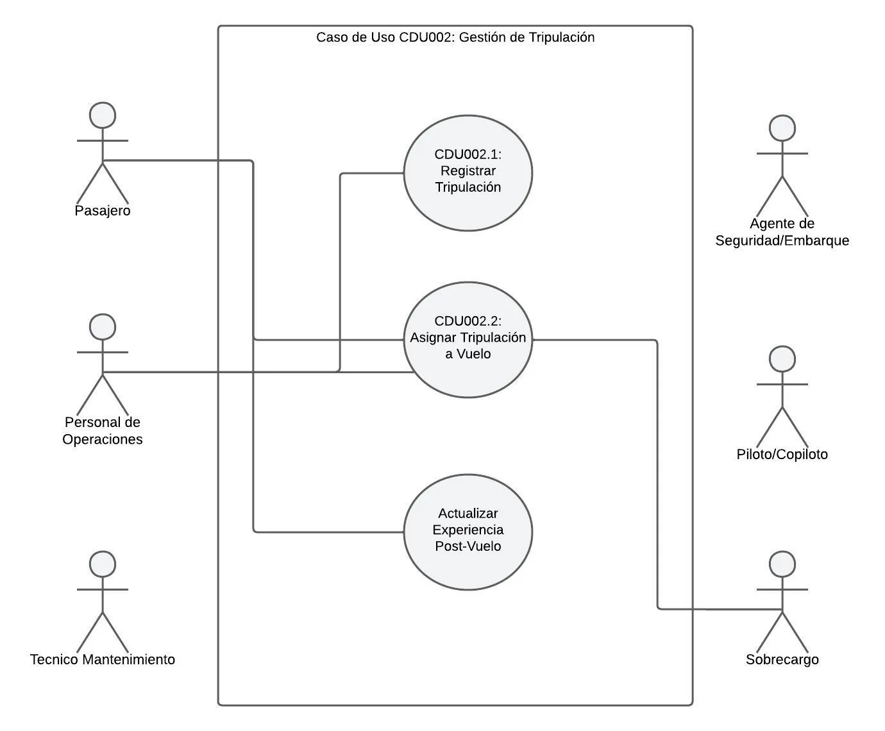

| **Campo** | **Detalle** |
| --- | --- |
| **Nombre** | Gestión de Tripulación (Un nombre descriptivo corto) |
| **Código** | CDU002 (Un código correlativo que lo identifique) |
| **Actores** | Personal de Operaciones, Piloto/Copiloto, Sistema (Todos los actores que interactúan con el caso de uso) |
| **Descripción** | Administra el registro, asignación y actualización de datos de la tripulación, incluyendo pilotos y sobrecargos, para garantizar asignaciones seguras y cumplimiento de normativas mediante un registro preciso de experiencia y disponibilidad. (Descripción del caso de uso, describe su propósito, no es tan breve, es aceptable al menos 20 palabras) |
| **Precondiciones** | Datos de tripulación válidos, vuelo planificado para asignaciones, sistema autenticado, vuelo aterrizado para actualizaciones automáticas. (Son las condiciones que se deben cumplir para que se lleve a cabo el caso de uso y con esto nos aseguramos de que el caso de uso tenga sentido) |
| **Post Condiciones** | Tripulación registrada, asignada a vuelos, experiencia actualizada (horas de vuelo para pilotos, conteo para sobrecargos), o proceso fallido. (Son las condiciones que buscamos obtener después de que se realiza el caso de uso, tanto en su flujo normal como en sus flujos alternos) |
| **Flujo principal** | 1. Personal registra datos de tripulación (nombre, identificación, tipo).<br>2. Asigna piloto, copiloto y sobrecargos a vuelo.<br>3. Sistema valida disponibilidad.<br>4. Asignación confirmada.<br>5. Sistema actualiza experiencia al aterrizar vuelo. |
| **Flujos alternos** | FA1: Datos inválidos/duplicados (FA = Flujo Alterno)<br>FA1.1 Notificación<br>FA1.2 Corregir datos<br>FA1.3 Se continúa con el flujo principal (1)<br>FA2: Tripulación no disponible<br>FA2.1 Buscar alternativas<br>FA2.2 Reasignar<br>FA2.3 Se continúa con el flujo principal (3)<br>FA3: Error en actualización automática<br>FA3.1 Ingreso manual por piloto<br>FA3.2 Se continúa con el flujo principal (5) |
| **Reglas de negocio** | ● Pilotos requieren horas de vuelo, sobrecargos conteo de vuelos.<br>● Un sobrecargo por 50 pasajeros.<br>● No asignaciones simultáneas. |
| **Reglas de calidad** | ● Registro <3 minutos, asignación <2 minutos.<br>● Actualizaciones automáticas <10 segundos.<br>● Botones en azul (#0000FF), campos obligatorios en rojo. |

## Caso de Uso CDU003: Gestión de Flota Aérea

● CDU003.1: Registrar Aeronave

● CDU003.2: Monitorear y Acumular Horas de Vuelo

● CDU003.3: Verificar y Certificar Mantenimiento

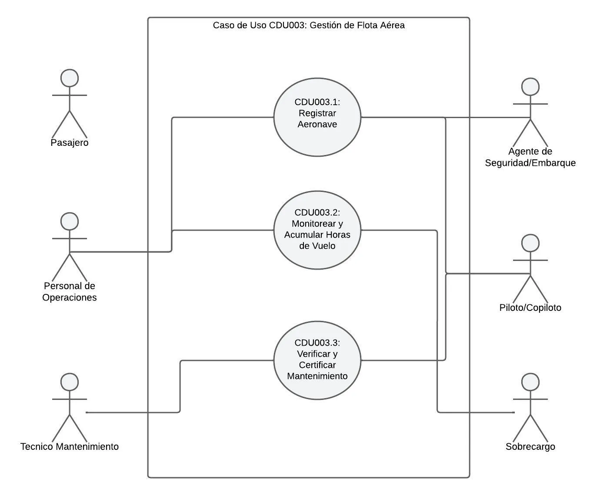

| **Campo** | **Detalle** |
| --- | --- |
| **Nombre** | Gestión de Flota Aérea (Un nombre descriptivo corto) |
| **Código** | CDU003 (Un código correlativo que lo identifique) |
| **Actores** | Personal de Operaciones, Sistema, Técnico de Mantenimiento (Todos los actores que interactúan con el caso de uso) |
| **Descripción** | Administra el registro, monitoreo de horas de vuelo y certificación de mantenimiento de aeronaves, asegurando su disponibilidad, seguridad operativa y cumplimiento de límites de mantenimiento para evitar riesgos. (Descripción del caso de uso, describe su propósito, no es tan breve, es aceptable al menos 20 palabras) |
| **Precondiciones** | Datos únicos para aeronaves, vuelos completados para monitoreo, inspección física para certificación, sistema autenticado. (Son las condiciones que se deben cumplir para que se lleve a cabo el caso de uso y con esto nos aseguramos de que el caso de uso tenga sentido) |
| **Post Condiciones** | Aeronaves registradas, horas acumuladas actualizadas, mantenimiento certificado o aeronave bloqueada, alertas generadas si aplica. (Son las condiciones que buscamos obtener después de que se realiza el caso de uso, tanto en su flujo normal como en sus flujos alternos) |
| **Flujo principal** | 1. Personal registra aeronave (modelo, capacidad, horas iniciales).<br>2. Sistema monitorea horas tras cada vuelo.<br>3. Genera alerta si excede límite.<br>4. Técnico inspecciona y certifica.<br>5. Aeronave liberada para vuelos. |
| **Flujos alternos** | FA1: Datos duplicados (FA = Flujo Alterno)<br>FA1.1 Editar datos<br>FA1.2 Se continúa con el flujo principal (1)<br>FA2: Inspección falla<br>FA2.1 Mantener bloqueo<br>FA2.2 Notificar operaciones<br>FA2.3 Fin del flujo<br>FA3: Límite no alcanzado<br>FA3.1 No acción<br>FA3.2 Fin del flujo |
| **Reglas de negocio** | ● Límites de mantenimiento: 200 horas grandes, 150 medianas, 100 pequeñas.<br>● Bloqueo si excede límite.<br>● Certificación obligatoria para liberar. |
| **Reglas de calidad** | ● Registro <3 minutos, certificación <15 minutos.<br>● Actualización horas <5 segundos.<br>● Botón "Certificar" verde (#00FF00). |

## Caso de Uso CDU004: Gestión de Pasajeros y Reservas

● CDU004.1: Registrar Perfil de Pasajero

● CDU004.2: Modificar Perfil de Pasajero

● CDU004.3: Reservar Vuelo y Asiento

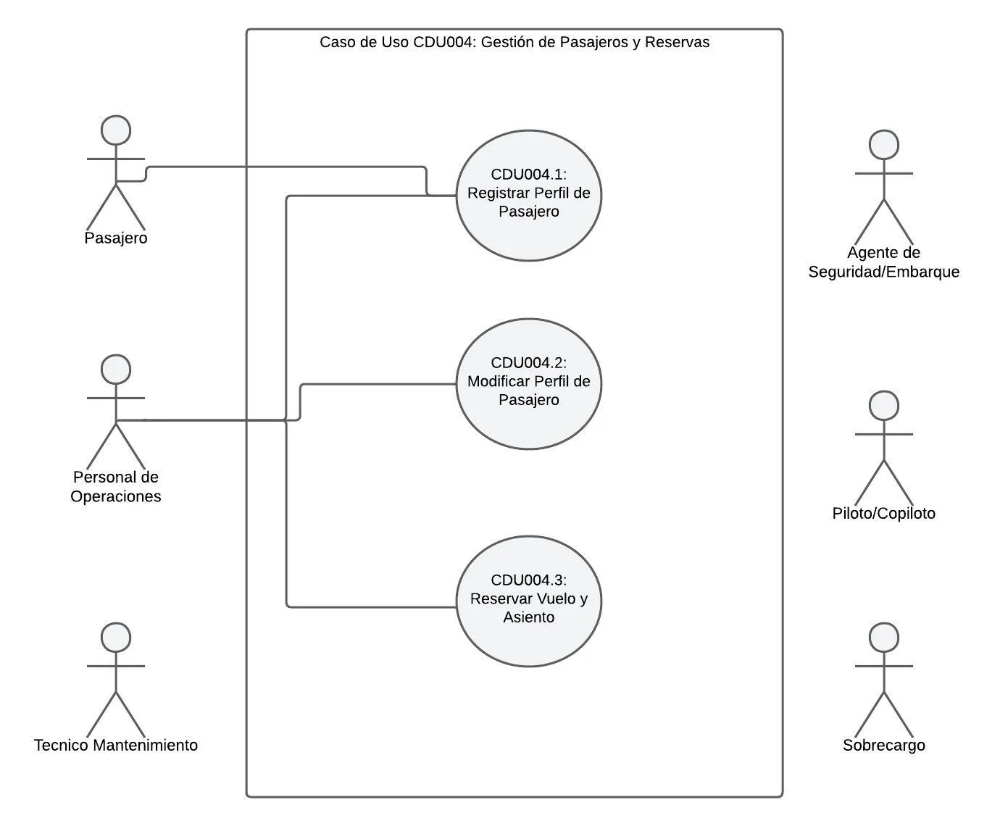

| **Campo** | **Detalle** |
| --- | --- |
| **Nombre** | Gestión de Pasajeros y Reservas (Un nombre descriptivo corto) |
| **Código** | CDU004 (Un código correlativo que lo identifique) |
| **Actores** | Pasajero (Todos los actores que interactúan con el caso de uso) |
| **Descripción** | Permite a los pasajeros crear y modificar perfiles, reservar vuelos y asientos, generando boletos con códigos QR, validando datos y disponibilidad para cumplir con regulaciones y mejorar la experiencia del usuario. (Descripción del caso de uso, describe su propósito, no es tan breve, es aceptable al menos 20 palabras) |
| **Precondiciones** | Acceso a la web, datos personales válidos, vuelos planificados con asientos disponibles, autenticación para modificaciones. (Son las condiciones que se deben cumplir para que se lleve a cabo el caso de uso y con esto nos aseguramos de que el caso de uso tenga sentido) |
| **Post Condiciones** | Perfil creado o modificado, reservas completadas con boletos QR en estado "Pendiente de Check-in", o proceso fallido. (Son las condiciones que buscamos obtener después de que se realiza el caso de uso, tanto en su flujo normal como en sus flujos alternos) |
| **Flujo principal** | 1. Pasajero registra perfil con datos (nombre, pasaporte).<br>2. Sistema valida y envía email de verificación.<br>3. Pasajero activa perfil.<br>4. Selecciona vuelo y asiento.<br>5. Sistema valida disponibilidad.<br>6. Genera boleto QR. |
| **Flujos alternos** | FA1: Datos inválidos (FA = Flujo Alterno)<br>FA1.1 Notificación<br>FA1.2 Corregir datos<br>FA1.3 Se continúa con el flujo principal (1)<br>FA2: Asiento ocupado<br>FA2.1 Mostrar alternativas<br>FA2.2 Re-elegir<br>FA2.3 Se continúa con el flujo principal (4)<br>FA3: Email no verificado<br>FA3.1 Reenviar<br>FA3.2 Timeout tras 24h |
| **Reglas de negocio** | ● Datos obligatorios: nombre, nacimiento, pasaporte.<br>● 2 maletas de 50 libras por asiento.<br>● Verificación por email. |
| **Reglas de calidad** | ● Registro/reserva <3 minutos.<br>● Formularios seguros (HTTPS).<br>● Botones en azul (#0000FF). |

## Caso de Uso CDU005: Procesos de Check-in y Embarque

● CDU005.1: Realizar Check-in

● CDU005.2: Realizar Embarque

● CDU005.3: Seguimiento de Vuelo

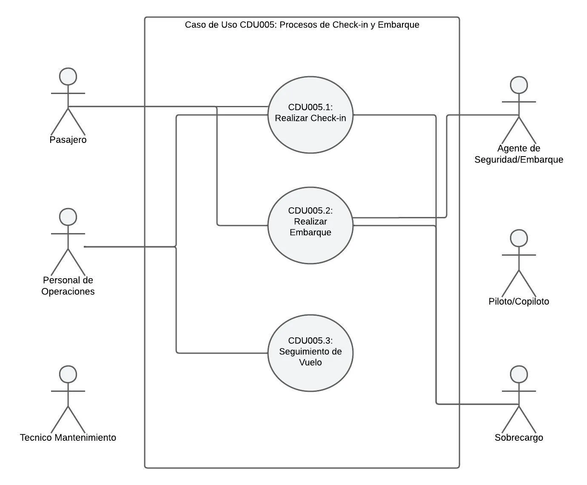

| **Campo** | **Detalle** |
| --- | --- |
| **Nombre** | Procesos de Check-in y Embarque (Un nombre descriptivo corto) |
| **Código** | CDU005 (Un código correlativo que lo identifique) |
| **Actores** | Pasajero, Agente de Seguridad, Agente de Embarque (Todos los actores que interactúan con el caso de uso) |
| **Descripción** | Gestiona el check-in de pasajeros (online o en aeropuerto), embarque mediante escaneo de QR y seguimiento de vuelos, asegurando una experiencia fluida y notificaciones oportunas sobre el progreso del vuelo. (Descripción del caso de uso, describe su propósito, no es tan breve, es aceptable al menos 20 palabras) |
| **Precondiciones** | Reserva activa, dentro de 24h antes del vuelo para check-in, QR generado para embarque, cambios de estado para seguimiento. (Son las condiciones que se deben cumplir para que se lleve a cabo el caso de uso y con esto nos aseguramos de que el caso de uso tenga sentido) |
| **Post Condiciones** | Check-in completado ("Pendiente de Abordaje"), pasajero abordado, notificaciones enviadas, o proceso fallido si no válido. (Son las condiciones que buscamos obtener después de que se realiza el caso de uso, tanto en su flujo normal como en sus flujos alternos) |
| **Flujo principal** | 1. Pasajero/Agente realiza check-in online o en aeropuerto.<br>2. Documenta maletas.<br>3. Estado cambia a "Pendiente de Abordaje".<br>4. Agente escanea QR en puerta.<br>5. Estado cambia a "Abordado".<br>6. Sistema notifica estado del vuelo. |
| **Flujos alternos** | FA1: Check-in fuera de tiempo (FA = Flujo Alterno)<br>FA1.1 Error, solo en aeropuerto<br>FA1.2 Fin del flujo<br>FA2: Sin check-in en puerta<br>FA2.1 Realizar check-in en sitio<br>FA2.2 Se continúa con el flujo principal (4)<br>FA3: Notificación fallida<br>FA3.1 Reintento automático<br>FA3.2 Se continúa con el flujo principal (6) |
| **Reglas de negocio** | ● Check-in obligatorio para equipaje, disponible 24h antes.<br>● Escaneo QR para embarque.<br>● Notificar todos los cambios. |
| **Reglas de calidad** | ● Check-in <5 minutos, embarque <2 segundos por QR.<br>● Interfaz mobile-friendly.<br>● Notificaciones <1 minuto. |

## Caso de Uso CDU006: Servicios Adicionales y Fidelización

● CDU006.1: Comprar Maletas Extra

● CDU006.2: Otorgar Puntos de Fidelización

● CDU006.3: Gestionar Historial y Notificaciones

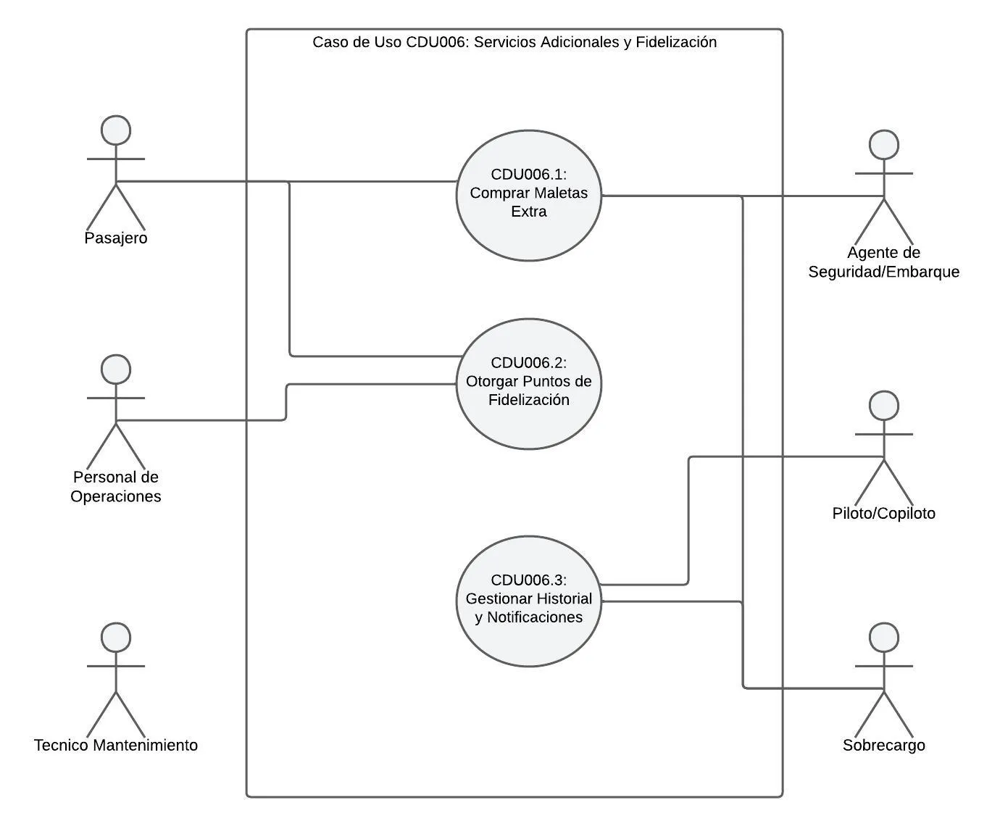

| **Campo** | **Detalle** |
| --- | --- |
| **Nombre** | Servicios Adicionales y Fidelización (Un nombre descriptivo corto) |
| **Código** | CDU006 (Un código correlativo que lo identifique) |
| **Actores** | Pasajero, Sistema (Todos los actores que interactúan con el caso de uso) |
| **Descripción** | Gestiona la compra de maletas extra, otorgamiento de puntos de fidelidad por vuelos y mantenimiento del historial de vuelos, enviando notificaciones para mejorar la lealtad y experiencia del pasajero. (Descripción del caso de uso, describe su propósito, no es tan breve, es aceptable al menos 20 palabras) |
| **Precondiciones** | Reserva activa para maletas, vuelo aterrizado para puntos, eventos de cambio para notificaciones, perfil autenticado. (Son las condiciones que se deben cumplir para que se lleve a cabo el caso de uso y con esto nos aseguramos de que el caso de uso tenga sentido) |
| **Post Condiciones** | Maletas agregadas, puntos sumados, historial actualizado, notificaciones enviadas, o proceso fallido si no válido. (Son las condiciones que buscamos obtener después de que se realiza el caso de uso, tanto en su flujo normal como en sus flujos alternos) |
| **Flujo principal** | 1. Pasajero compra maletas extra durante reserva/check-in.<br>2. Sistema procesa pago.<br>3. Actualiza reserva.<br>4. Sistema otorga 100 puntos por hora al aterrizar.<br>5. Actualiza historial y notifica cambios. |
| **Flujos alternos** | FA1: Límite de maletas excedido (FA = Flujo Alterno)<br>FA1.1 Error<br>FA1.2 Reducir cantidad<br>FA1.3 Se continúa con el flujo principal (2)<br>FA2: Error en cálculo de puntos<br>FA2.1 Ajuste manual<br>FA2.2 Se continúa con el flujo principal (4)<br>FA3: Notificación fallida<br>FA3.1 Reintento automático<br>FA3.2 Se continúa con el flujo principal (5) |
| **Reglas de negocio** | ● Máximo 3 maletas extra de 50 libras.<br>● 100 puntos por hora de vuelo.<br>● Notificar todos los cambios. |
| **Reglas de calidad** | ● Pago <2 minutos, notificaciones <1 minuto.<br>● Interfaz con dashboard de puntos.<br>● Botones verdes (#00FF00) para compras. |

# Tablero Kanban

Para la gestión del flujo de trabajo del proyecto se utilizó Jira Software, haciendo uso de la metodología Kanban. Esta herramienta nos permite organizar las tareas de manera visual, darles seguimiento y facilitar la colaboración del equipo.

El tablero Kanban del proyecto se encuentra dividido en las siguientes columnas:

- TO-DO: Contiene el backlog de tareas pendientes por realizar. Actualmente el tablero se encuentra en esta fase debido a que estamos en la etapa de documentación del proyecto.

- BLOCKED: Espacio destinado a registrar aquellas tareas que no pueden continuar por dependencias o impedimentos.

- IN PROGRESS: Aquí se colocarán las tareas que estén en desarrollo activo por parte del equipo.

- TEST/QA: Columna destinada a las actividades que están en fase de pruebas o validación de calidad.

- READY FOR TESTING: Indica que la tarea fue completada en desarrollo y está lista para ser evaluada.

- DONE: Representa las tareas finalizadas y aprobadas.

En la fase actual, se han registrado las tareas iniciales relacionadas con la definición de funcionalidades principales del sistema, como:

- Crear vuelos

- Conexión a la base de datos

- Creación de instancias en la nube

- Cancelación de vuelos y envío de notificaciones

- Ciclo de vida de los vuelos

- Registro de piloto y tripulación

Cada tarea está identificada con un código único (por ejemplo: KAN-5, KAN-6) que facilita su trazabilidad dentro de Jira.

El uso del tablero Kanban en Jira nos permitirá en futuras fases:

- Priorizar y organizar tareas según su importancia.

- Dar seguimiento al progreso en tiempo real.

- Identificar cuellos de botella en el flujo de trabajo.

- Garantizar transparencia y colaboración entre los miembros del equipo.

## Captura del tablero

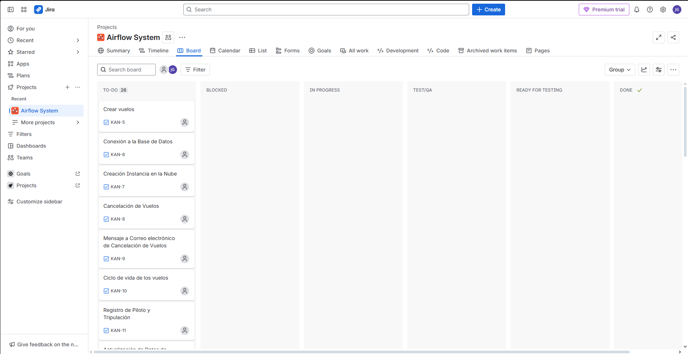

## Link

### [Tablero Kanban](https://ayd2fase1.atlassian.net/jira/software/projects/KAN/boards/1?atlOrigin=eyJpIjoiMzVhMGI3ODhhMTQ5NGYwZWFkMTA1NmUzOWEyNGZiZmMiLCJwIjoiaiJ9)

# Evidencias comunicacion efectiva
El dia 20 de agosto nos reunimos para terminar la documentacion
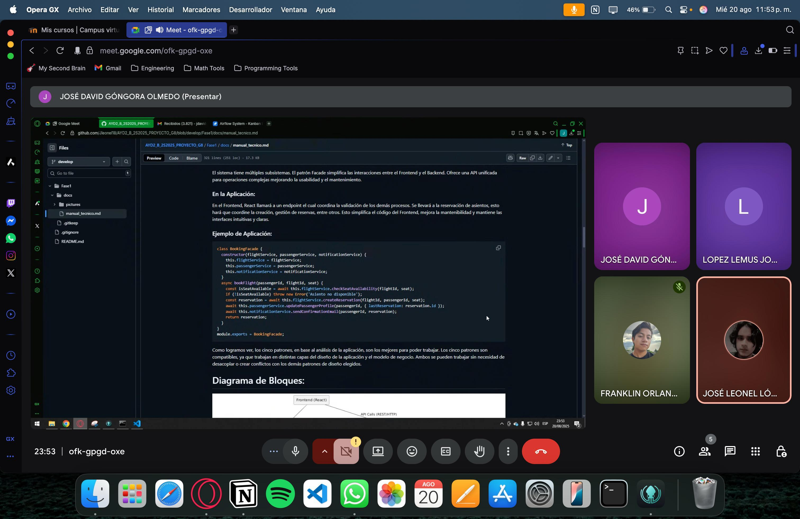


El dia 21 de agosto nos reunimos para corregir y agregar lo ultimo de la documentacion
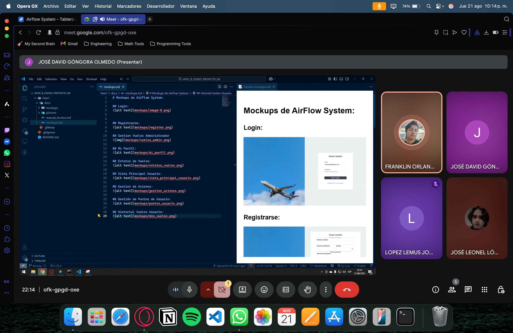